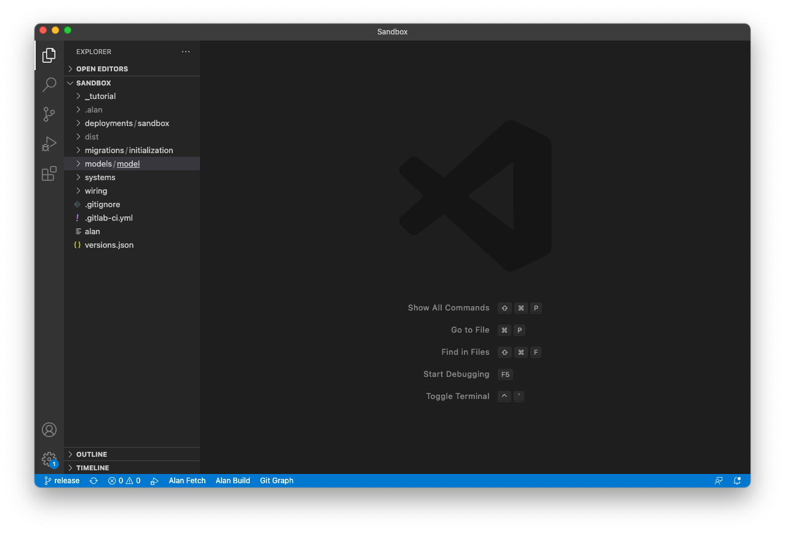
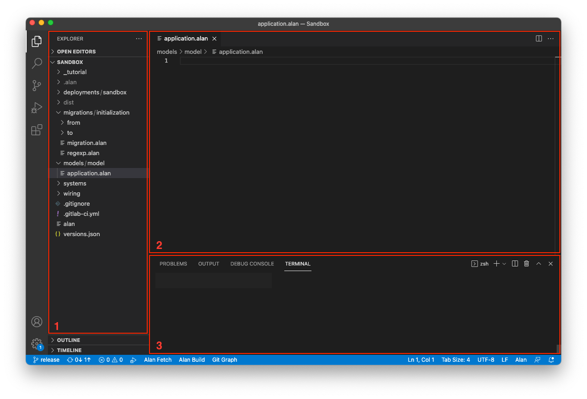
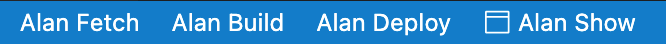
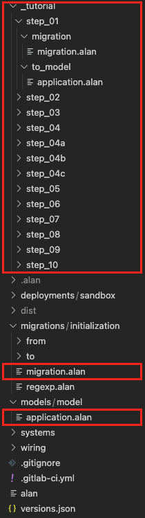

## Introduction
In this tutorial you'll get familiar with the environment in which application on the Alan platform are created.

## Application for building applications
To develop Alan applications, an application is used that provides the developer with a file and folder overview, a text editor that recognises the Alan language and all kinds of other tools. This is called an Integrated Development Environment, in short IDE.
Several IDE's exist. In this tutorial we'll use Visual Studio Code (VS Code) in a Chromium browser (for example Google Chrome or Microsoft Edge):

This screenshot shows the basic areas in the layout:

1. Explorer: overview of files and folders within your project
2. Text editor: content of open file can be edited here (on startup you'll see the readme.md file with additional info)
3. Terminal/Problems: 
    - Tab 'Terminal' for executing instructions (you probably won't be needing this, but is by default active) 
    - Tab 'Problems' for feedback about compiler issues (this is important when errors occur)

In the top left corner you'll find these icons:

These buttons determine what is seen in area 1. The top icon is for the explorer and the only one needed.

Bottom left you'll see these texts:

These are three buttons that will execute important tasks:
1. Alan Fetch
2. Alan Deploy
3. Alan Build

## Files and folders
Applications are developed on the Alan platform through building models, defining interfaces, creating migrations, configuring settings, etc. All these activities make use of specific files within specific folders. This structure of files and folders is needed to be able to build an application from it.
These files in their specific folders are mainly used during working on the tutorial:

The `application.alan` file in folder `models/model` will contain the model of your application.
The `migration.alan` file in folder `migration/initialization` is used when data used by your application needs to be migrated from the current to a next version of your application.
To not make things too difficult during working on the tutorial 'Model Language', we provide migration files for each topic of the tutorial. Location of the appropriate files within the folder `_tutorials` (available in your project) can be found at the end of each topic. By copying and pasting the migration file the data within the migration file becomes available within your app. With an empty migration file your app will not have any data to work with, which is also not a problem in the early topics.
Also a model file is provided for each topic in case you can't correct any errors that might occur during working through the tutorial.
In the tutorial 'Model Language', at the end of each topic information is provided on which folder to use (if needed) in that particular topic.

## Compile and deploy
Once you've written a model and want to see the result, computer readable files need to be created by translating (compiling) the content of your files. This requires two steps:
1. Click the button Alan Build: This will build your model and check for any inconsistencies. Errors occur if your model is not correct. Solve these problems first.
2. If your model 'builds', then click the button Alan Deploy: This will push your files to the server which will publish your application online (deploying)

What does Alan Fetch do? 
When building your app the compiler needs to work with his own correct files to compile your model. These files depend on the version of the platform and model language you use. In this online IDE the correct files for the compiler are loaded. In rare occasions it might be usefull to click Alan Fetch. This will load the correct versions of the compiler files.

## Application
When you deployed your work and want to see the result, please find the appropriate URL for your app in the README.md file.

More information on VS Code [here](https://code.visualstudio.com/).

## Next
Next up is the tutorial 'Model Language'. This can be found [here](https://alan-platform.com/pages/tutorials/model%20tutorial.html).
