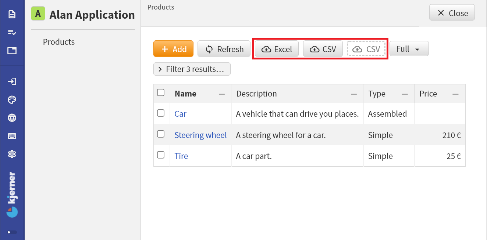

1. TOC
{:toc}

## Introduction

For each `collection`, Alan apps show buttons for downloading the data in Excel or CSV format.
In addition, collections have a drop zone for CSV files, for uploading data in CSV format.



## Excel download
The Excel download button gives you a `.xslx` file containing all data from the collection items, in the way that you see it in the app.
The `*.xslx` file includes derived data.

## CSV download/export
The CSV download button gives you a file containing the base data (no derived data) from the collection.

For example, for the application from the figure, a CSV download gives you a file with these contents:
```
Products,item_operation,Description:,Type?,Type_operation?,Price#Simple*Type?
Car,update,A vehicle that can drive you places.,Assembled,update,
Steering wheel,update,A steering wheel for a car.,Simple,update,209.99
Tire,update,A car part.,Simple,update,25
```

## CSV upload/import
To import data in CSV format, you can drop a CSV file at the drop zone.
The CSV file contents should adhere to a specific format.
The CSV file that you can [download](#csv-downloadexport), specifies this format.
Specifically, it shows you for which columns you need to provide values.
If you upload a CSV file that contains errors, you will get an error report explaining what should be fixed.

To explain the data format requirements, let's look at the CSV data from the `Products` collection.
The first column is for the key of `Products` items.
Keys of collection entries have to be *unique*: you cannot add multiple `Products` with the same key.

For the second column, the `item_operation`, you can choose from:
- `add` to add a new item
- `update` to update an existing item
- `remove` to remove an existing item

For the stategroup `Type` of the `Products`, you see a column `Type_operation?`.
Two different operations are supported for **stategroups**:
- `update` to update the existing state
- `set` to change from the existing state to a new state

For new `Products` (when the `item_operation` is `add`), you need a blank field.

The notation for **number** values is identical to the input format that the app expects. For example, if you can enter a price with two decimal places in your app then you should provide numbers with (at most) two decimal places in your CSV.
That is, unless numbers use a *dynamic* number of decimals in your app. In that case, you should provide number values without decimals.

Some examples of updates for the `Products` collection:
- add a new `Products` item called 'Seat':
	```
Seat,add,A car part for sitting.,Simple,,249.99
	```
- remove an item with key 'Car':
	```
Car,remove,,,,
	```
- update the `Type` of the 'Steering wheel' from `Simple` to `Assembled`:
	```
Steering wheel,update,A steering wheel for a car.,Assembled,set,
	```
- update the `Selling price` of a `Tire`
	```
Tire,update,A car part.,Simple,update,29.99
	```

