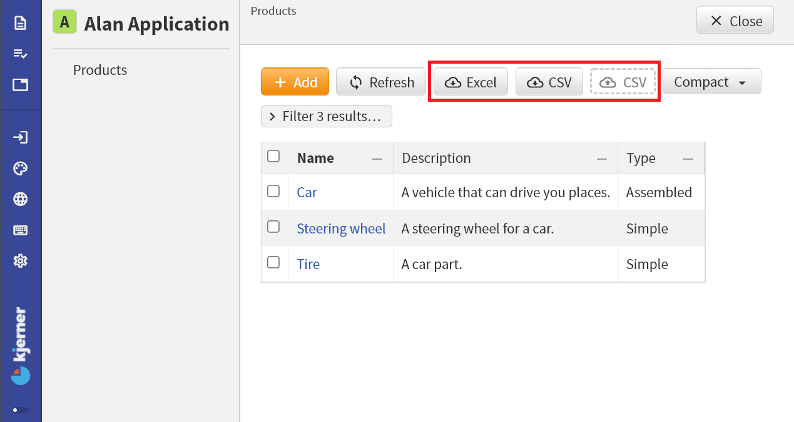

1. TOC
{:toc}

## Introduction

At every `collection`, Alan apps show buttons for downloading your data in Excel or CSV format.
In addition, collections have a drop zone for CSV files, that you can use to upload data in CSV format.



## Excel downloads
The Excel download button gives you an `.xslx` file containing all data from the collection items, in the way that you see it in the app.
The `*.xslx` file includes derived data.

## CSV downloads/export
The CSV download button gives you a file containing the base data (no derived data) from the collection.

For example, for the application from the figure, clicking the CSV download button gives a file with these contents:
```
Products,item_operation,Description:,Type?,Type_operation?,Price#Simple*Type?
Car,update,A vehicle that can drive you places.,Assembled,update,
Steering wheel,update,A steering wheel for a car.,Simple,update,"21,000"
Tire,update,A car part.,Simple,update,"2,500"
```
Note that we can immediately upload the downloaded CSV file again by dragging it to the drop zone.
This should always succeed and may not affect the application data.

## CSV uploads/import
To import data in CSV format, you have to drop a CSV file that adheres to a specific format.
The CSV file that you can download, specifies this format.
Specifically, it shows you for which columns you need to provide values.
Below we explain the specifics of the CSV format.
Note that if you drop a CSV file that contains errors, you will get a helpful error report explaining what should be fixed.

To explain the data format requirements, let's look at the CSV file from the `Products` collection.
The first column is for the key of `Products` items.
Note that keys have to be *unique*: you cannot add multiple `Products` with the same key.

For the second column, the `item_operation`, you can choose from:
- `add` to add a new item
- `update` to update an existing item
- `remove` to remove an existing item

For the stategroup `Type` of the `Products`, you see a column `Type_operation?`.
Two different operations are supported there:
- `update` to update the existing state
- `set` to change the existing state to a new state
For new `Products` (when the `item_operation` is `add`), you have to use a blank field.

Some examples of updates for the `Products` collection:
- add a new `Products` item called 'Seat':
	```
Seat,add,A car part for sitting.,Simple,,25000
	```
- remove an item with key 'Car':
	```
Car,remove,,,,
	```
- update the `Type` of the 'Steering wheel' from `Simple` to `Assembled`:
	```
Steering wheel,update,A steering wheel for a car.,Assembled,set,
	```
- update the `Selling price` of a `Tire`
	```
Tire,update,A car part.,Simple,update,"9,900"
	```
