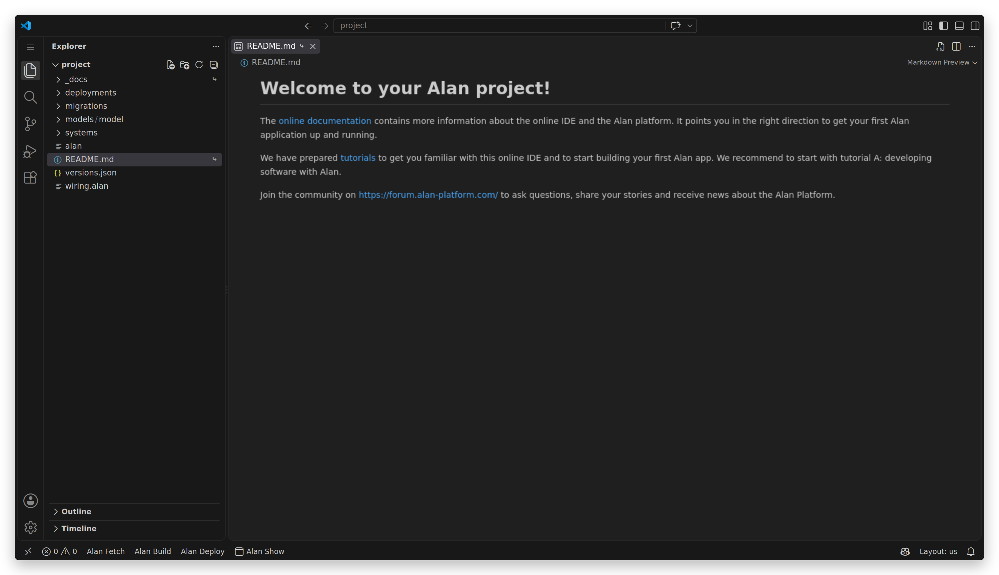
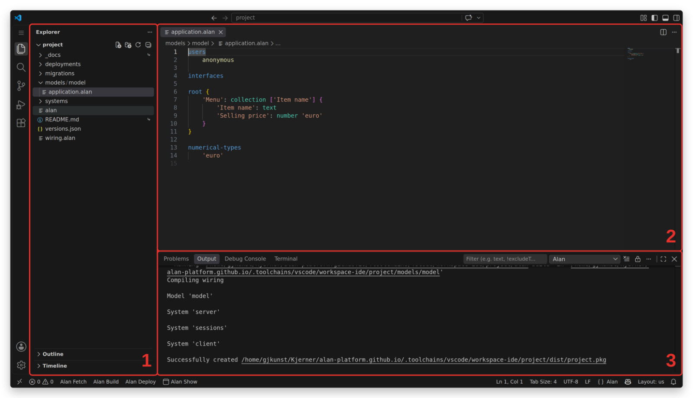
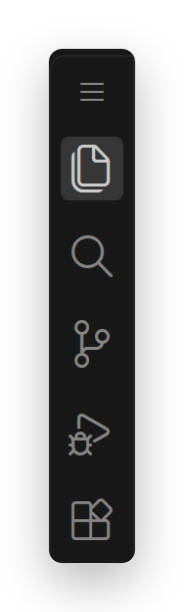
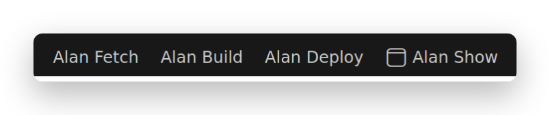
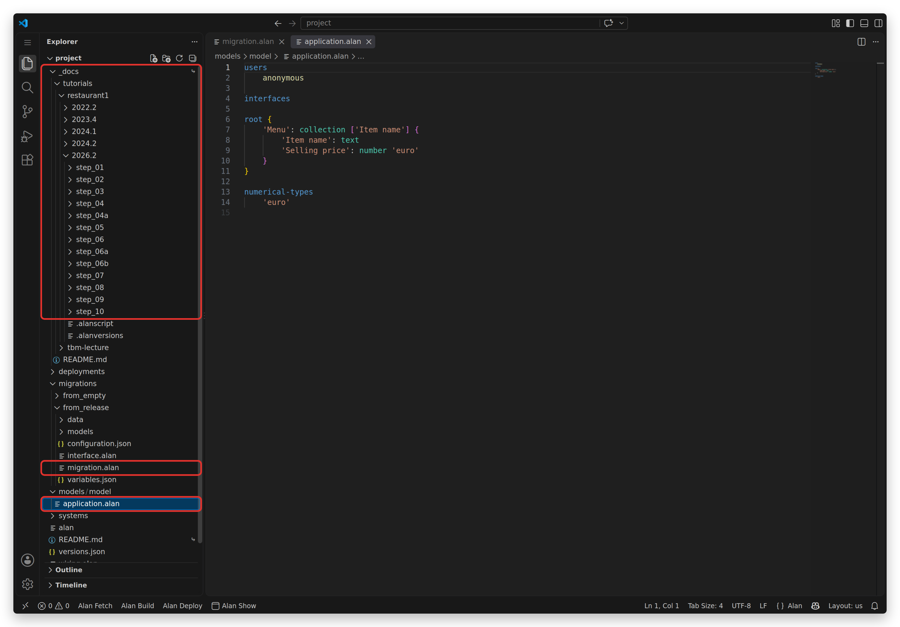
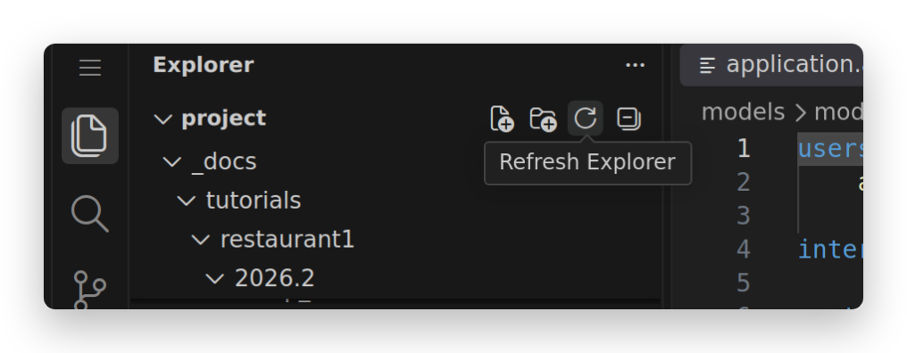

1. TOC
{:toc}

## Introduction
A computer application is a tool for a purpose: tracking orders and supplies, planning maintenance, exchanging information between people.
Whatever the purpose, the application gathers, manipulates, visualizes and exchanges data.
The Alan platform is built around that observation: describe the data and the rules that govern it, and the platform generates the application.
The aim is software that is correct by construction, flexible, and maintainable: **built to last**.

### Development process
Alan supports *agile* development, where each iteration produces a working part of the application.
Instead of writing a large design document first and discovering during implementation that it does not hold up, you **start building immediately** and refine as you learn.

You begin with the core structure of the data your application processes.
Deploying that first version already gives you a running app, so you and your stakeholders can enter real data and check that the structure matches what the organization actually does.
Once the structure holds, you add computations, custom screens, permissions, or exchange with other systems — in whichever order the project needs, and each time with something that runs at the end of it.

### Environment overview
An Alan environment is a fixed structure of files and folders, a set of languages that share one meta-language, and the tools that go with them — most importantly a compiler, which translates and validates your code.
Together the files describe a complete software system, and each file has its own role in building, updating or deploying it.
You write code in those files at *design time*.
To turn them into a system that runs on a server, all files are checked for errors and translated into a format the platform can execute.
Deploying the result puts the software in use: *runtime*.

This tutorial introduces the environment in which you create Alan applications.
For *version control* and *local editing* of Alan projects, read [this guide](/pages/tutorials/ide/ide-version-control.html).

## An application for building applications
Alan development happens in an Integrated Development Environment (IDE): an application that gives you an overview of files and folders, an editor that understands Alan code, and tools such as the compiler at your fingertips.
This tutorial uses Visual Studio Code (VS Code) in a Chromium-based browser, such as Google Chrome or Microsoft Edge.
Open a separate tab and sign in to your [online IDE account](https://coder.alan-platform.com/){:target="_blank"}, or create one:

<a class="button call-to-action" href="https://coder.alan-platform.com/signup/" target="_blank" rel="noopener noreferrer" style="display: inline-flex;align-items: center;">
    <svg fill="none" height="24" viewBox="0 0 24 24" width="24" stroke="currentColor" stroke-linecap="round" stroke-linejoin="round" stroke-width="2" xmlns="http://www.w3.org/2000/svg">
        <path d="M21 16V8a2 2 0 0 0-1-1.73l-7-4a2 2 0 0 0-2 0l-7 4A2 2 0 0 0 3 8v8a2 2 0 0 0 1 1.73l7 4a2 2 0 0 0 2 0l7-4A2 2 0 0 0 21 16z"/>
        <polyline points="7.5 4.21 12 6.81 16.5 4.21"/>
        <polyline points="7.5 19.79 7.5 14.6 3 12"/>
        <polyline points="21 12 16.5 14.6 16.5 19.79"/>
        <polyline points="3.27 6.96 12 12.01 20.73 6.96"/>
        <line x1="12" x2="12" y1="22.08" y2="12"/>
    </svg>
    Sign Up
</a>

After signing in, the IDE opens your project and shows its `README.md` as a welcome page:

The layout has three main areas:

1. **Explorer**: the files and folders of your project
2. **Editor**: the contents of the open file, which you edit here
3. **Problems/Output/Terminal** panel:
    - **Problems** lists what the Alan language server finds while you type, and the errors of a build
    - **Output** shows what a running task prints
    - **Terminal** is for command line instructions

The icons in the top left corner determine what area 1 shows:

The first icon is the Explorer, and the only one you need to get started.
The ≡ icon above them opens the menu with `File`, `Edit`, `View` and the other entries.

At the bottom left are four buttons:

1. `Alan Fetch` downloads and updates the Alan platform tools
2. `Alan Build` compiles your project
3. `Alan Deploy` deploys your project
4. `Alan Show` opens your application in a new browser tab

Each of them is also available from the [command palette](https://code.visualstudio.com/docs/getstarted/userinterface#_command-palette), as `Alan: Fetch`, `Alan: Build`, `Alan: Deploy` and `Alan: Show App`.

## Files and folders
Building an Alan application means writing application models, interfaces, migrations and settings.
Each of those lives in a specific file, in a specific folder; the compiler relies on that structure.
These are the files and folders that matter while you work through the `application` language tutorial:

`models/model/application.alan` holds the model of your application: the file you spend most of your time in.

`migrations/from_release/migration.alan`, which appears after your first deployment, describes how the data of the running app is carried over to the next version of your model.
Migrations are a subject of their own; the [migrations guide](/pages/tutorials/migrations/{{ site.data.versions.current }}/migrations.html) covers them.

So that the tutorial can stay on the `application` language, a ready-made migration is provided for each of its steps, in `_docs/tutorials/restaurant1/{{ site.data.versions.current }}`.
Each topic of the tutorial ends with the folder to use.
Copying that migration file into your project gives your app example data to work with.
The `to_model` folder of each step also contains a complete, valid `application.alan`, to compare with when your own model does not build.

When files or folders that the tutorial mentions do not appear in the Explorer, click the refresh button.
It appears in the header of area 1 when you move the cursor into it:

Save before you build: a tab with unsaved changes shows a dot instead of the close cross.
`Ctrl+S` (`Cmd+S` on a Mac) saves the open file, and `Auto Save` in the `File` menu — behind the ≡ icon in the top left corner — saves them for you.

## Compile and deploy
The *Alan language server* starts with your project and checks every `.alan` file in it — models, migrations, and the rest — while you edit.
Mistakes are underlined in the editor and listed in the **Problems** panel as you make them, so you rarely have to hunt for them afterwards.

Two steps turn a model into a running app.

1. Click `Alan Build`.
This compiles the whole project and reports every error it finds in the **Problems** panel.
Fix them until the build succeeds — a build that reports nothing is a project the platform can run.
2. Click `Alan Deploy`.
This sends the project to the server, which publishes your application.

> NOTE: run `Alan Fetch` from time to time, for example weekly.
It gives you the latest build of the platform tools for the version in your `versions.json` file.
A newer build of the same version never breaks a project that builds today.

To move to a new platform version or system type version, edit `versions.json`.
The [docs page](/docs/) lists the current official versions.
Run `Alan Fetch` afterwards, so that the tools match the versions you asked for.

## Your published application
After a deployment, click `Alan Show` to open the published version of your application in a new browser tab.

More information about Visual Studio Code is available in [its documentation](https://code.visualstudio.com/).

## Next up
You are set up to start with the `application` language tutorial, which builds a restaurant app step by step: [Part I](/pages/tutorials/model/{{ site.data.versions.current }}/application-tutorial.html).
