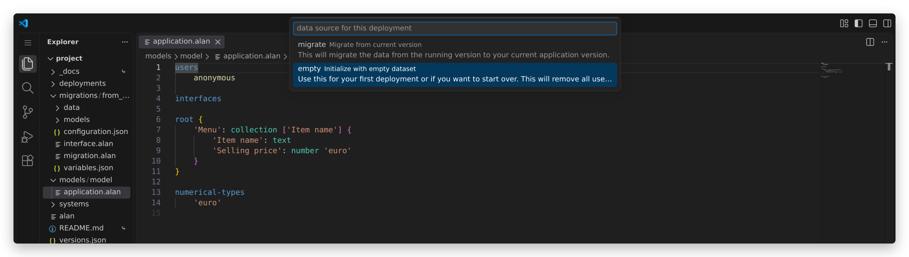
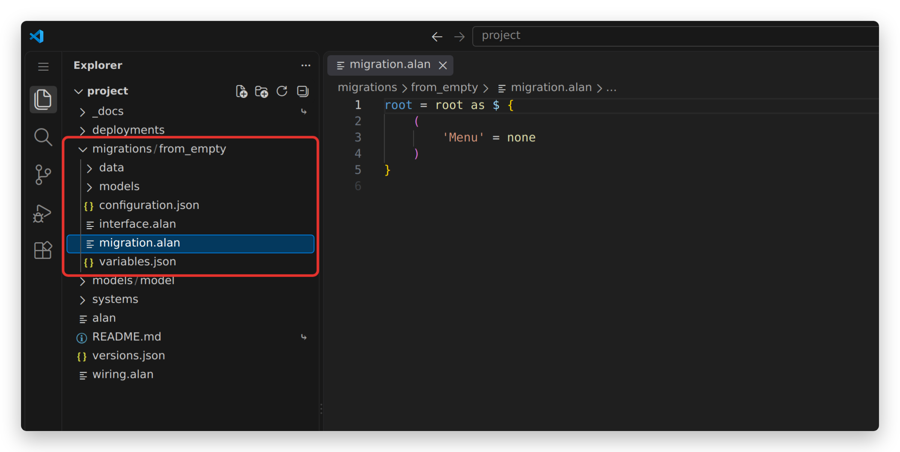
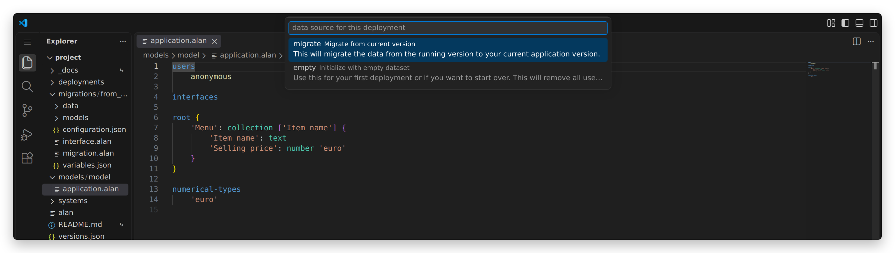


	The migration language is the connector's processor language. Its version for this platform version
	comes from _data/dist/<platform version>/versions.json (Jekyll drops the dot from that directory name).





1. TOC
{:toc}

## Introduction

The data of an Alan application always matches its model.
That is what makes the app dependable — and it is also what makes a model change interesting: as soon as `application.alan` changes, the data of the running app no longer matches it.

A **migration** bridges that gap.
It is a file that says, for every piece of data the new model expects, where that value comes from: copied from the running app, converted, or created new.
The compiler checks it against both models, so a deployment either carries the data over completely or does not happen at all.

Every deployment therefore starts from a dataset, and there are two ways to get one:

- **empty** — start with no data at all, or with data written by hand. This is what a first deployment uses.
- **migrate** — take the data of the running app into the new version of the model.

This guide covers both, and the language migrations are written in.
It assumes the project layout of the online Alan IDE, as described in the [IDE tutorial](/pages/tutorials/ide/ide-tutorial.html).

<sup>
Returning after a while? Since platform version 2026.1 a migration is written in the processor language of the Alan `connector`. The language changed completely: no typed declarations, no `map`, and no error annotations between `<!` and `!>`.
</sup>

## Starting with an empty dataset

`Alan Deploy` asks which data source the deployment should use.
A first deployment has nothing to migrate from, so pick **empty**:



That deployment creates the folder `migrations/from_empty`:



The folder is a complete migration project:

- `migration.alan` says where the data of the new dataset comes from. This is the file you read and edit.
- `models/source/application.alan` is the model of the source dataset — for `from_empty` an empty model (`root { }`).
- `models/target/application.alan.link` points at your own `models/model/application.alan`.
- `configuration.json`, `variables.json` and `interface.alan` are fixed; you never edit them.
- `data/` is for auxiliary data files, and starts out empty.

Since there is no source data, the generated `migration.alan` sets every collection to `none`, the empty collection:
```js

```

To start the app with data instead, replace those `none` expressions with `create` entries.
This migration gives the `Menu` of the [restaurant tutorial](/pages/tutorials/model/{{ page.platform_version }}/application-tutorial.html) three items:
```js

```

**One thing to watch:** `migrations/from_empty` is regenerated on every deployment with the **empty** option, so anything you write there is overwritten.
Keep hand-written initial data somewhere else and copy it in when you need it — which is exactly what the restaurant tutorial does with the `migration.alan` files in its `_docs` folder.

## Carrying data over

Once an app is running, a deployment can take its data along.
Change the model, build, and choose **migrate**:



The first time, this creates `migrations/from_release`.
Unlike `from_empty`, that folder is generated only once: its `migration.alan` is yours to maintain and survives every following deployment.

`models/source/application.alan` in that folder is the model of the *deployed* app, and the IDE refreshes it at every **migrate** deployment.
Do not edit it — it describes what the running app holds, which is not yours to decide.
(If you do need a source model of your own, for instance to read a derived value that the deployed model computes, copy the whole `from_release` folder under a different name and edit the copy.)

## The migration language

A `migration.alan` file gives an expression for every base data property of the target model.
Derived values are not migrated: the app recomputes those from the data itself.

The language is the processor language of the Alan `connector`; its [grammar](/pages/docs/connector/{{ connector_version }}/processor/grammar.html) lists every operation.
The rest of this section is what a typical application needs.

The example below migrates the first step of the [restaurant tutorial](/pages/tutorials/model/{{ page.platform_version }}/application-tutorial.html) — a `Menu` whose `Selling price` is in whole euros — to the second step, where the price is in eurocents and every item has an `Item type`:
```js

```

**The shape of a migration.** It starts with `root = root as $ {`.
The `$` is the *source*: the data of the running app, conforming to `models/source/application.alan`.
Braces `{ ... }` hold a block, and the parentheses `( ... )` inside a block hold the properties of one node of the *target* model, each with an expression for its value.

**Copying values.** `$ .'Item name'` reads a property of the current source node.
Text and number values can be copied like that whenever their type did not change, and a reference is migrated as the text of the key it points at, so `'Item' = $ .'Item'` works for a reference too.

**Collections.** Walk the source collection and create one target entry per source entry:
```js

```
Inside the `walk`, `$` is the current source entry, so `$ .'Item name'` now reads from that entry.
A collection without a source is written as a block of `create` entries, as in the `from_empty` example above, or as `none` when it should start empty.

**Stategroups.** Switch on the source stategroup and create the matching target state in every case:
```js

```
Each case binds `$` to the state's node with `as $`, which is how `'Slots'` above reads a property that only exists in that state.
A stategroup that is *new* in the target model has nothing to switch on, so create a fixed state:
```js

```

**Groups.** A group is a node, so it is a block with parentheses in it:
```js

```

**Numbers.** A number is migrated as an integer in the unit of the *target* numerical type.
When that unit changes, convert the value with `product` or `division` — the language has no `*` and `/` operators.
From euros to eurocents:
```js

```

**Literals.** Text goes between double quotes (`"Example"`), a number is a plain integer (`2042`), and `none` is the empty collection.

**Reaching data further up.** Inside a `walk` or a `switch`, `$` is the innermost source node, so properties higher up in the source are out of reach.
Give a node a name with `let`, and use that name wherever you need it, however deep:
```js

```
Here every charter takes the fleet-wide `Default rate` from the root of the source, while `$` inside the walk still refers to the charter being migrated.

## Keeping a migration up to date

`from_release/migration.alan` has to describe a source for every base data property in your model.
Change the model and deploy with **migrate**, and the migration is compiled against the new target model: the deployment fails until every new or changed property has a valid expression.
That failure is the feature — it is the platform refusing to put data into an app that does not fit it.

A generated migration (see [Generating a migration](#generating-a-migration)) is a starting point, not a finished one: it assumes the source model has the same structure as the target and copies everything.
For the model change of the previous section, the generator produces:
```js

```
Compiling that fails, because the source model has no `Item type` yet:

>'property' `Item type` was not found in 'attributes'. Existing 'attributes': `Item name`, `Selling price`

Two edits fix it, both shown in the complete migration above: the `switch` on `$ .'Item type'` becomes a `create` of a fixed state, and `Selling price` gets its conversion to eurocents.

A second example. For an `application.alan` with
```js

```
a valid migration from a model that only had an `Original App Name` is:
```js

```
Note what each line does: `App Name` is renamed, `App Description` is a value chosen here and now, `Users` starts empty, and `Year` gets a literal.
New data has to come from somewhere, and a migration is where you decide from where.

**When source data can be missing.** Some expressions can fail: a lookup in a collection with `[ ... ]` fails when the key is not there, and following a reference can fail for the same reason.
Suppose the target model turns an `Administrator` text into a reference to `Users`, and adds the administrator's name:
```js

```
Either stop the migration with a message of your own:
```js

```
which appears in the `Output` window when the deployment fails, or handle both outcomes with a `switch` that distinguishes `value` from `none`:
```js

```
The second form is the one to reach for when missing data is normal rather than exceptional.

## Generating a migration

The IDE can write the mechanical part of a migration for you: run `Alan: Generate Migration` from the [command palette](https://code.visualstudio.com/docs/getstarted/userinterface#_command-palette).

It asks for three things:

- a **migration name**, which becomes the folder name under `migrations/`;
- the **migration target model**, which is your `models/model` (skipped when the project has one model);
- the **migration type**: *mapping from target conformant dataset* copies every property from a source with the same structure, and *initialization from empty dataset* sets every collection to `none`.

Generate under a new name, or move the existing folder aside first, so that a `migration.alan` you edited by hand is not overwritten.

Running it again after a model change is a useful habit: it gives you the expressions for the properties you just added, which you copy into `from_release/migration.alan` and then adjust — usually only to say where their initial values come from.

The same generator is available from the [terminal](https://code.visualstudio.com/docs/terminal/basics):

```
.alan/devenv/system-types/datastore/scripts/generate_migration.sh migrations/from_release models/model
.alan/devenv/system-types/datastore/scripts/generate_migration.sh migrations/from_empty models/model --strategy bootstrap
```

To check your migrations without deploying, run `./alan build -C migrations` from the terminal; it compiles every migration project in the `migrations` folder.
