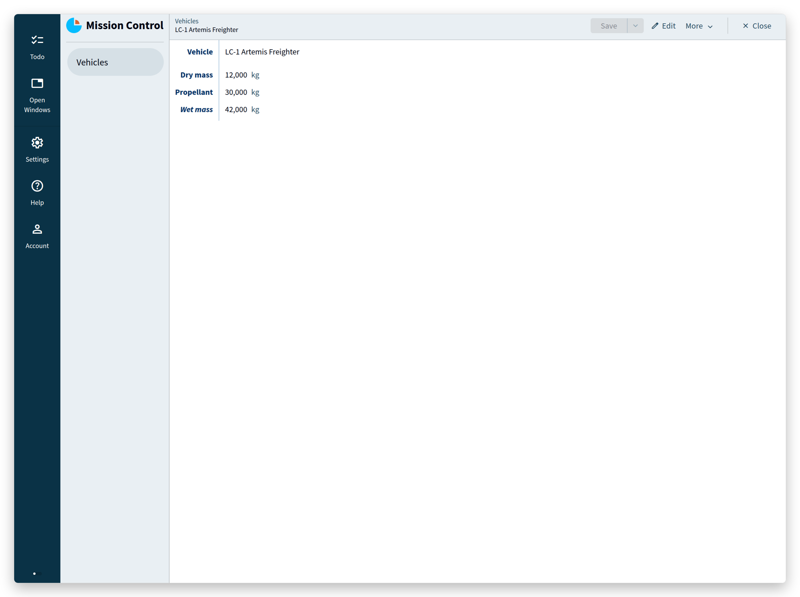
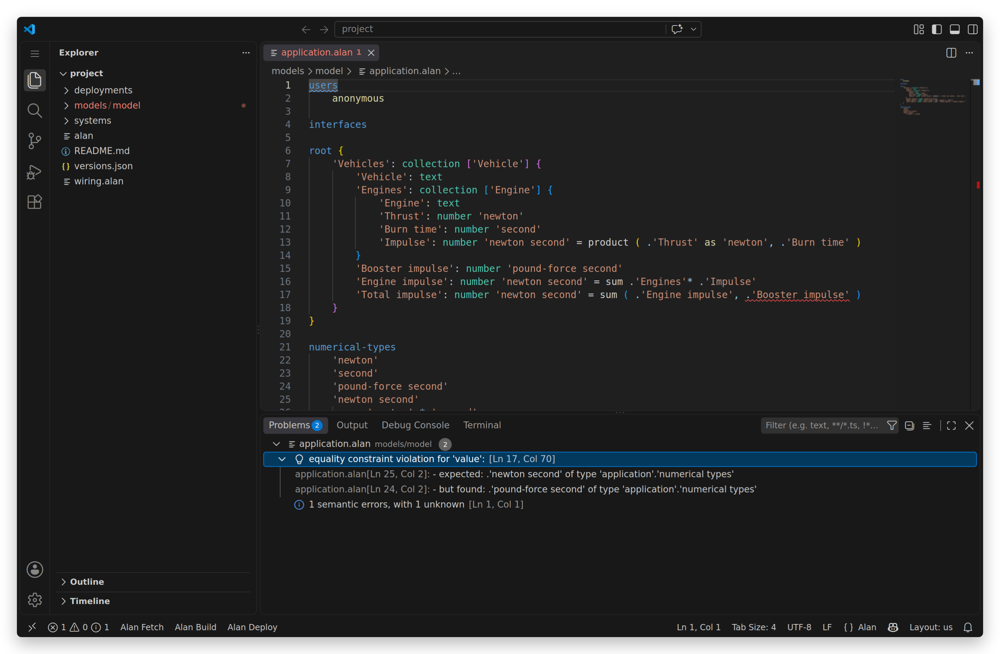
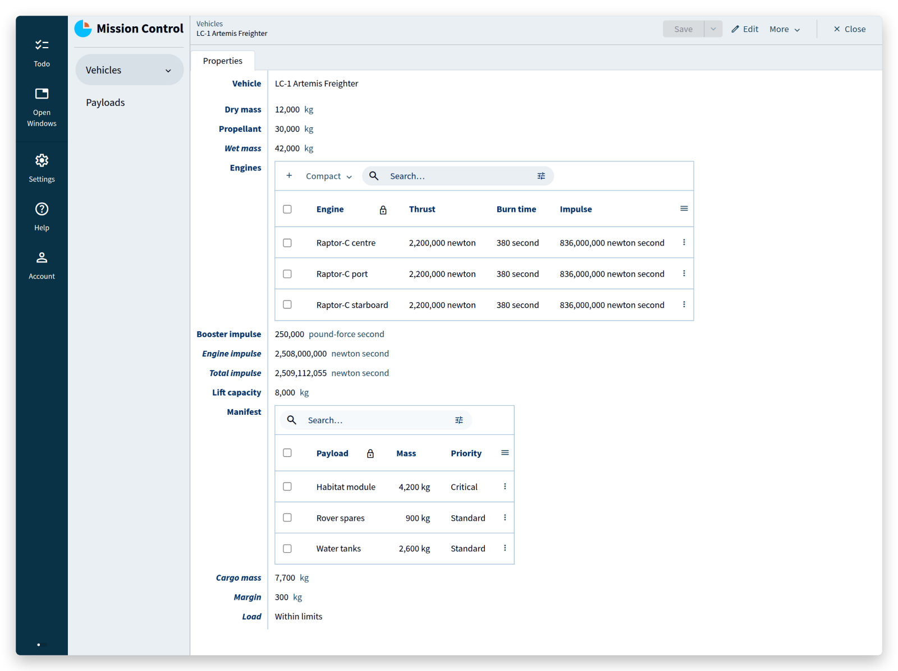
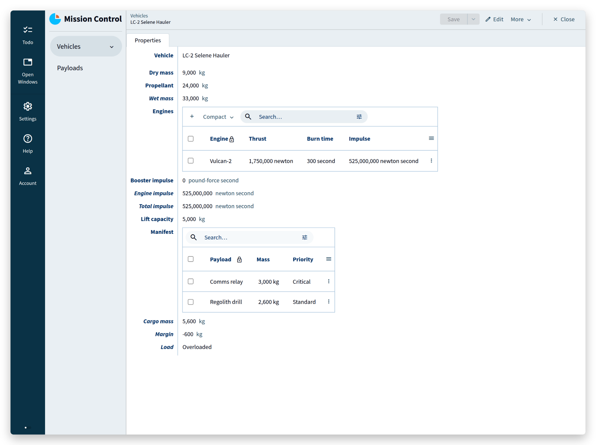
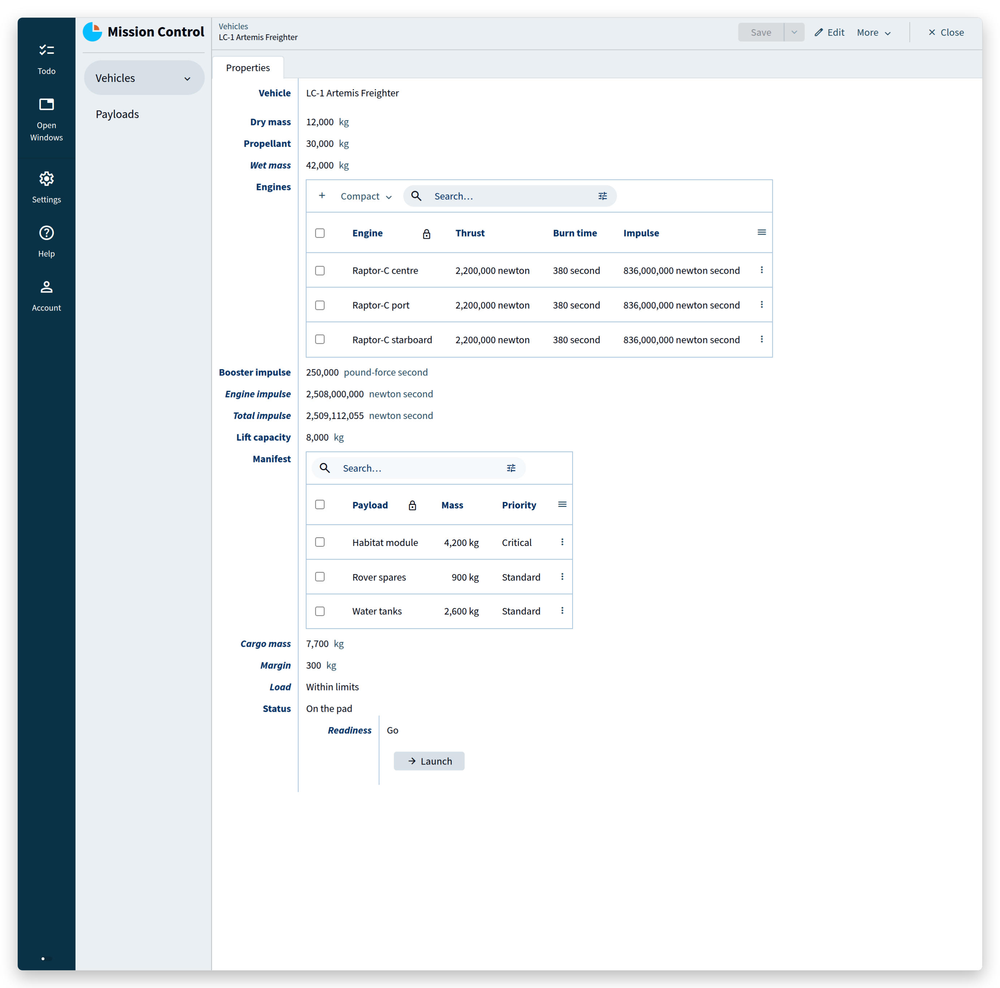
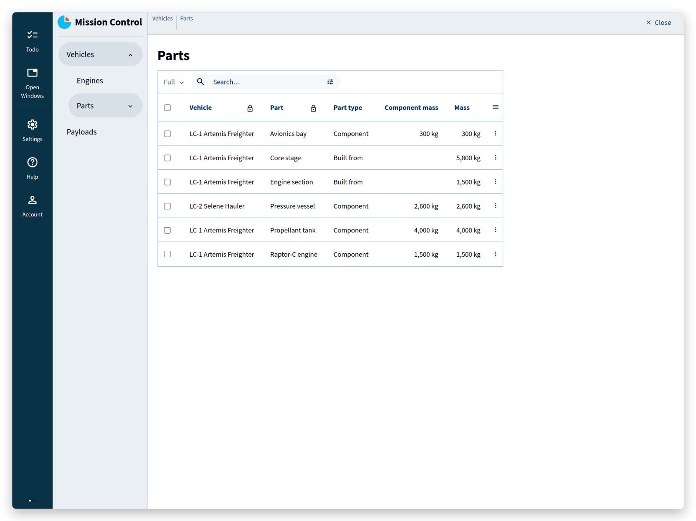

1. TOC
{:toc}

## Introduction

You are the software team for a lunar cargo flight.
Two freighters, a manifest of payloads, a countdown, and a hard rule: a vehicle that is over its lift capacity does not launch.
The flight director wants an application by the end of the afternoon.

In most stacks that means a database schema, migrations, a backend, an API, a frontend, forms, validation on both sides, an authorization layer, and a test suite to keep the arithmetic honest.
Here you will write one file — a *model* of what the mission is — and the platform will build the rest.
By the end of this tutorial you will have a multi-user application with computed values that are always current, operations that only appear when they are allowed, permissions per role, and a schema you can change while the data stays.

More interesting than what you build is what the compiler refuses to let you build.
Somewhere in the middle of this tutorial you will write the mistake that cost NASA the Mars Climate Orbiter, and watch it get caught before the app even starts.

This tutorial assumes you can build and deploy a project, as in the [IDE tutorial](/pages/tutorials/ide/ide-tutorial.html).
It does not assume you have done the [restaurant tutorial](/pages/tutorials/model/{{ page.platform_version }}/application-tutorial.html); that one goes slower and explains more.

### How to work through this page
{:.no_toc}

Seven acts grow one model, the file `models/model/application.alan`.
The first code block is a complete model; every later block is what that act adds, where `...` stands for lines that stay as they are.
The finished model is at [the end of the page](#the-whole-thing).

Each act has a matching folder in your own project, under `_docs/tutorials/mission-control/{{ page.platform_version }}/`, named after the act:

| Act | Folder |
| :- | :- |
| Act 1 | `act_01` |
| Act 2 | `act_02a` halfway, `act_02b` at the end |
| Act 3 | `act_03` |
| Act 4 | `act_04` |
| Act 5 | `act_05` |
| Act 6 | `act_06` |
| Act 7 | `act_07` |

Each folder holds two files.
`to_model/application.alan` is the model as it should look at that point, to compare with your own.
`migration/migration.alan` is the example data behind the screenshots: the two freighters, their engines, the payloads.

To put that data in your app, at any act:

1. deploy with **migrate** once, which creates `migrations/from_release`;
2. copy the act's `migration/migration.alan` over `migrations/from_release/migration.alan`;
3. deploy with **migrate** again.

Do this from Act 1 onward if you want your app to show what the screenshots show — the data comes from these files, not from the **empty** option.
Choose **empty** instead when you would rather type a vehicle or two yourself; it starts the app with no data at all.
If a deployment gets stuck, delete the `migrations` folder, deploy once with **empty**, and carry on.

Migrations have a [tutorial of their own](/pages/tutorials/migrations/{{ page.platform_version }}/migrations.html); here they are only a way to load the example data, until Act 7 changes the model with data already in the app.

## Act 1 — Five minutes

A vehicle has a dry mass and a propellant load, and it weighs the two together.
That last part is not something a user types; it follows from the other two.

```js

```

Four sections make a model: `users` (who may use the app — `anonymous` means no sign-in, which Act 6 replaces), `interfaces` (the other systems this application exchanges data with — empty here, and empty is fine), `root` (the data itself), and `numerical-types` (what the numbers mean).

Build, deploy, add a vehicle:



Everything visible there — the navigation, the list, the detail form, the add and save and search, the key that has to be unique — came from those twelve lines.
`Wet mass` has no input field, because nobody enters it: the `= sum ( ... )` behind it is not a default or a trigger, it is what the value *is*.

> **What you did not write:** a table definition, an ORM class, an API endpoint, a form, a validation rule, a recomputation hook.

> <tutorial folder: `./_docs/tutorials/mission-control/{{ page.platform_version }}/act_01/`>

## Act 2 — Numbers that know what they are

Engines. Each one has a thrust and a burn time, and their product is impulse: the quantity that decides whether the flight makes it to the Moon.

```js

```

The numerical types carry the physics:

```js

```

`= 'newton' * 'second'` is a ***product conversion rule***: it states that multiplying newtons by seconds yields newton seconds.
Without that rule the model does not compile — Alan will not multiply two quantities unless you have said what the result is.

Build and deploy here, and each engine carries its own impulse with the vehicle's total underneath the list.
This is the halfway folder of this act, `act_02a`, with three engines in it:

> <tutorial folder: `./_docs/tutorials/mission-control/{{ page.platform_version }}/act_02a/`>

One thing on that screen reads wrong: a burn time shows as **380 second**.
The word after a number is the name of its numerical type, so the fix is a better name — and not a search-and-replace.
Put the cursor on `'second'`, press **F2**, type `seconds`, and press Enter.
The language server renames the type and every use of it, the burn time and the product rule included, and leaves `'newton second'` alone: that is a different name, not a use of this one.
The blocks from here on use `'seconds'`.

### The bug that lost an orbiter
{:.no_toc}

Now the strap-on booster arrives from a supplier who reports its impulse in **pound-force seconds**, and someone adds it to the total.

This is a wrong turn on purpose. Type it if you want to watch it fail — the next block puts it right — or read on.
In the vehicle, the `Total impulse` line from a moment ago becomes two lines, and the supplier's unit has to be declared like any other:

```js

```

`Engine impulse` is the total of the engines, as before under a new name; `Total impulse` adds the booster to it.

You do not get an app with a slightly wrong number.
You get this, while you type:



```
error: equality constraint violation for 'value':
	- expected:  .'newton second' of type 'application'.'numerical types'
	- but found: .'pound-force second' of type 'application'.'numerical types'
```

On 23 September 1999 the Mars Climate Orbiter reached Mars after a nine-month cruise, passed roughly 170 km lower than planned, and was never heard from again — [destroyed in the atmosphere, or thrown back out into space around the Sun](https://llis.nasa.gov/llis_lib/pdf/1009464main1_0641-mr.pdf).
NASA's investigation board named a single root cause: a ground software file reported thruster impulse in pound-force seconds, where the trajectory software required newton seconds.

The error was not invisible, either. Navigators saw their solutions disagree through the spring and summer of that year; the board's report records that those discrepancies "were not resolved".
A $125 million spacecraft ended on a unit that lived in a document instead of in a type.

The block above is the same mistake: one number, in the wrong unit, crossing a boundary.
The difference is where the boundary sits — here it is inside a model, in front of a compiler that reads it.

The fix is not a comment or a code review: it is one conversion rule, and then a conversion the compiler can check.

`= 'pound-force second' * 4448222 * 10 ^ -6` is a ***singular conversion rule***: one numerical type expressed in another by a constant factor.
That factor is not folklore — one pound-force is 4.448222 newtons by definition — and since Alan stores whole numbers, it is written as an integer with a power of ten.

```js

```

```js

```



2,508,000,000 newton seconds from the engines, plus 250,000 pound-force seconds that became 1,112,055 newton seconds on the way in.

> **What you did not write:** unit tests for unit handling. The unit *is* the type. A mismatch is not a bug you hunt, it is a program that does not exist.

> <tutorial folder: `./_docs/tutorials/mission-control/{{ page.platform_version }}/act_02b/`>

## Act 3 — A manifest that keeps itself

Payloads are booked onto vehicles.
A payload refers to its vehicle; the vehicle needs the other direction — everything booked onto it, its total mass, its remaining margin, and whether that margin is gone.

```js

```

```js

```

Four things happen in those lines.

`'Vehicle': text -> ^ .'Vehicles'[]` is a **mandatory reference**: the value has to be the key of an existing vehicle.
Not "should be" — the compiler knows where the value points, and the runtime stores nothing that does not resolve there.

`'Manifest': reference-set` is the same relation read backwards: all payloads whose `Vehicle` points here.
You did not maintain that list; it is the inverse of a reference that already exists.

`'Cargo mass'` and `'Margin'` are computed over that set.
(A reference can also be optional, written `~>`, for data imported from a system whose keys you do not control.)

`'Load'` is a **derived state**: a `switch` on a comparison, which the platform keeps in step with the numbers.

Two constructs this tutorial has no room for, in case you go looking for them: a `file` property, which stores an uploaded document beside the data, and GUI annotations such as `@numerical-type:` and `@default:`, which tell the generated client how to show and prefill a value.

Deploy, and book two payloads too many onto the second freighter:



Margin −600 kg, `Load` = **Overloaded**, computed the moment the second payload was saved.
Nothing polls, nothing recalculates on a schedule, no cache goes stale.
Change one payload's mass and every value that depends on it — on this screen and everywhere else — is already correct when the screen redraws.

> **What you did not write:** a foreign key constraint, a join, an aggregate query, a cache, an invalidation strategy, and the bug where the total is right on one screen and wrong on another.

> <tutorial folder: `./_docs/tutorials/mission-control/{{ page.platform_version }}/act_03/`>

## Act 4 — Operations, not buttons

A vehicle moves through assembly, the pad, flight, and landing, and it may not skip a step.
In Alan, a process like that is a stategroup whose states carry the operations that leave them:

```js

```

Read the middle of it: while the vehicle is `On the pad`, `Readiness` is derived — `Hold` when the load is over capacity or the tanks are empty, `Go` otherwise — and the `Launch` command exists **only inside the state `Go`**.

These commands need no input, so their parameter lists are empty (`command { }`).
A command can also declare parameters — a small data model of its own, filled in from a form or by another system, which is how an external booking system would add a payload; the [restaurant tutorial](/pages/tutorials/model/{{ page.platform_version }}/application-tutorial2.html#commands-and-actions) builds one of those.



That is the hard rule from the introduction, and it is now impossible to break.
Not "the button is greyed out": the operation does not exist for a vehicle that is not ready.
Add one more payload and the button is gone; take it off and it is back.
An operator cannot launch an overloaded freighter by double-clicking fast, by calling the API directly, or by having a bad day.

> **What you did not write:** the check in the click handler, the same check again in the API, the race between them, and the incident report explaining which one was missing.

> <tutorial folder: `./_docs/tutorials/mission-control/{{ page.platform_version }}/act_04/`>

## Act 5 — Assemblies that cannot loop

A freighter is built from parts, and parts are built from other parts.
The mass of an assembly is the mass of what it contains — a computation that walks a structure a user is free to rearrange.

That is dangerous: nothing stops someone from saying that the core stage contains the engine section, which contains the core stage.
A recursive computation over that data would never finish.

Alan's answer is a **graph constraint**. Declare the graph, and the compiler and the runtime take it from there:

```js

```

Three pieces do the work.
`'Assembly': acyclic-graph`, written on the collection itself, declares the graph: the references in it may never form a cycle.
`'Subpart': text -> ^ ^ sibling in ( 'Assembly' )` is a reference to another entry of the *same* collection — a sibling — and enrols that reference in the graph.
`( recurse 'Assembly' )` in front of a derivation says: this computation follows that graph, which is what makes it legal to read a value from another entry at all.

The `switch` then reads as before: a component weighs what it weighs, an assembly weighs the sum of its subparts, and `as $'component'` names the node so that the branch can read from it.



The core stage weighs 5,800 kg because the platform added its tank, its avionics bay, and an engine section that in turn weighs what its engine weighs.
Try to make a part contain itself and the app refuses the reference — the graph would have a cycle, and cycles are not among the data this application can hold.

> **What you did not write:** a recursion-depth guard, a cycle detector, a nightly job to recompute totals, and the incident where two parts pointed at each other and a request hung.

> <tutorial folder: `./_docs/tutorials/mission-control/{{ page.platform_version }}/act_05/`>

## Act 6 — Who may push the button

The mission has a flight director, a loadmaster, and observers.
Everyone reads; the loadmaster books payloads; only the flight director touches vehicles — including that `Launch` command, because the command updates the vehicle.

Users first: an application with sign-in has a collection of people and a collection of passwords, and the `users` section ties them together.

`dynamic: .'Crew'` says that an authenticated user *is* an entry of `Crew`.
`passwords: .'Passwords'` points at the collection holding password data: `password-value` is the property with the hash, `password-status` says which state means the password works and which means it has to be reset, and `password-initializer` states what to create alongside a new password.

```js

```

```js

```

The model no longer has `anonymous` in its `users` section, and one file outside the model has to agree with that: open `systems/client/settings.alan` and change

```
anonymous login: enabled
```

to

```
anonymous login: disabled
```

Skip it and the build stops with the client settings, not the model:

```
systems/client/settings.alan: state constraint violation for 'yes'.
Unexpected state for 'allow anonymous user'
```

which is the compiler pointing out that a client configured for visitors cannot serve an application that has none.

One more file, and this one the compiler will *not* remind you about: the session manager decides how people sign in, and it starts out with passwords switched off.
Open `systems/sessions/config.alan` and set

```
password-authentication: enabled
```

Leave it `disabled` and everything still builds and deploys — you simply end up at a login page that has no way to accept your password.
(The same file can enable `user-creation` for sign-up from the login page; the [Users & Authentication guide](/pages/tutorials/model/{{ page.platform_version }}/application-users.html) covers that.)

Then three lines of authorization:

```js

```

`can-read: user` at the root: everyone who is signed in may read.
`can-update: user .'Role'?'Flight director'` on the vehicles, `...?'Loadmaster'` on the payloads — and the `Data` group of a password can only be updated by the person it belongs to (`user is ( ^ >'Member' )`).

Deploy with the **empty** option.
That deployment seeds one account so that you can get in at all: username `root`, password `welcome`, which the app makes you change on first sign-in.
Give it the flight director role, add a second crew member as loadmaster, and sign in as that one: the payload screens work, the vehicles are read-only, and the launch button is not there.

(The screenshots on this page come from a sandbox without sign-in, so this is an act you watch in your own app.)

Permissions are part of the model, so the client and the server enforce one and the same rule: the client hides what you may not change, and the server refuses the change if the request arrives anyway.
There is no second place to keep in sync.

An auth middleware, a permission table, role checks spread through controllers and templates, the endpoint somebody forgot to protect: none of it exists here, because the rule has only one place to live.

> <tutorial folder: `./_docs/tutorials/mission-control/{{ page.platform_version }}/act_06/`>

## Act 7 — Change the mission in flight

The freighters have a destination now, so the model needs a landing site — while the application is running, with data in it.

```js

```

Deploy with the **migrate** option instead of **empty**.
The platform generates `migrations/from_release/migration.alan`: a mapping from the running dataset to the new one, in which everything that can be carried across already is.
What it cannot know is where `Landing site` comes from, so it asks you — in code, in a file the compiler checks against both models:

```
'Landing site' = "Shackleton crater"
```

Deploy again, and the vehicles, payloads, parts and crew are all still there, now with a landing site.
The [migrations tutorial](/pages/tutorials/migrations/{{ page.platform_version }}/migrations.html) covers the language in full.

No `ALTER TABLE` script, no backfill query, no rollback plan — and no deployment where one of the three was wrong.

> <tutorial folder: `./_docs/tutorials/mission-control/{{ page.platform_version }}/act_07/`>

## The whole thing

This is the application, complete — users, authorization, physics, a manifest that maintains itself, a launch procedure that cannot be skipped, and an assembly graph that cannot loop:

```js

```

A hundred and twenty lines. From them the platform generates the database, the server, the web client with its lists, forms and search, the login page, the authorization checks, the incremental recomputation of every derived value, and the migration machinery that carries your data to the next version.

None of it is scaffolding you now have to maintain.
There is no generated code to edit, no `models.py` that has drifted from the schema, no frontend that shows a stale total.
The model *is* the application, so the application cannot disagree with it.

And notice what the compiler refused along the way: a sum of newton seconds and pound-force seconds, a reference to a vehicle that does not exist, a launch command in a state where launching is not allowed, an assembly that contains itself, and a schema change that silently drops data.
Those are not lint warnings. They are programs that do not exist.

## Where to go next

- The [restaurant tutorial](/pages/tutorials/model/{{ page.platform_version }}/application-tutorial.html), in three parts, takes the same language at a slower pace and covers commands with parameters, more derivations, and advanced references.
- [Users & Authentication](/pages/tutorials/model/{{ page.platform_version }}/application-users.html) covers sign-up and the session manager.
- The [application language documentation](/pages/docs/model/{{ page.model_version }}/application/grammar.html) is the full reference, with examples for every construct used here.
- The [migrations tutorial](/pages/tutorials/migrations/{{ page.platform_version }}/migrations.html) is the next thing to read if you intend to run an application for longer than one deployment.

Then model something of your own — the thing your organization actually does, with the rules it actually has.

Take the rule this tutorial opened with: *a vehicle that is over its lift capacity does not launch*.
In this application that rule exists once, on one line, and nothing can route around it: not the client, not the API, not the colleague who never read the wiki.
That is the part worth taking with you. The screens, the totals, the login, the migration — the platform will write those again tomorrow.

Questions and models to show off are welcome on the [forum](https://forum.alan-platform.com/).
