## Introduction
In the range of tutorials concerning the Alan platform this tutorial will focus on the model language and is a good start to learn the ins and outs of the Alan platform. By means of a story we will take you along several topics and build up the model at the same time. At the end of some topics a reference to a tutorial folder is provided in case you need extra help with producing the appropriate result. Enjoy!

Let's imagine you own a restaurant. Business is doing so well you start to feel you need to be more in control of what's going on, before chaos sets in.

Alan to the rescue!

Alan is a platform that provides a language to model your data and processes in a flexible, yet structured way. This same model is also used to generate an application in a web browser, for entering data and reviewing the state of business.

So, let's dive in!

## 1. A data model
A restaurant is nothing without a good menu. So, first, we take a look at the menu that shows us all the good food and nice drinks you offer. 

### Menu

| *Appetizer* | *Price (€)* |
| :- | :-: |
| Shrimp salad | 3,50 |
| Tomato soup | 4,50 |
| Ciabatta with tapenade | 2,50 |

| *Main course* | *Price (€)* |
| :- | :-: |
| Beef stew | 18 |
| Grilled salmon | 16,50 |
| Mashed potato with sauerkraut | 14 |

| *Dessert* | *Price (€)* |
| :- | :-: |
| Chocolate mouse | 4,50 |
| Vanilla ice cream | 3,50 |
| Cherry pie | 4 |

| *Drinks* | *Price (€)* |
| :- | :-: |
| Orange juice | 4,50 |
| Spa rood | 3 |
| Heineken pilsner | 4,20 |
| Cappuccino | 3,50 |
| Mint tea | 3 |
| Mojito | 6,30 |

This menu shows 5 kinds of data:
1. The item that can be ordered (`Item name`)
2. The price per item in Euro (`Selling price`)
3. If it is a dish or a beverage (`Item type`)
4. The type of dish or beverge (`Dish type` / `Beverage type`)
5. And of course, that this collectively is a menu (`Menu`)

If we want to organise these data elements in an Alan-model we could start with this:
```
'Menu': collection ['Item name'] {
	'Item name': text
	'Selling price': number 'euro'
}
```
This small, unfinished model tells us that `Menu` is a container that is defined as ***collection***. This means `Menu` is a collection of sets of data, where a set consists of the values for `Item name` and `Selling price`. Each set in the collection is identified by the value of `Item name` (eg. 'Chocolate mouse'). `Item name` defines what is known as the ***key*** for the collection `Menu`. And for example 'Chocolate mouse' is known as the ***key value***.
A set of values is called a ***node*** (eg. 'Chocolate mouse', '4,50'). So the collection `Menu` contains several nodes (the sets of values). In the model the containers between curly braces ( ***{ ... }*** ) define what is called the ***node type***. 

`Item name` is a container that is defined as ***text***: the value of `Item name` will be text

`Selling price` is a container that is defined as ***number*** and more specifically as 'euro': the value of `Selling price` will be a number representing euro's.

>The words *collection*, *text* and *number* are called ***types*** and are ***attributes*** of a container. In other words, the type attributed to a container defines what kind of data a container can hold.

>The curly braces ( ***{ ... }*** ) define the start and end of a node type definition. The ***node type*** defines the types of data and its structure in a node.

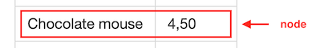


## 2. The minimal model
Let's make an app from these few lines of model code.
We need to place these lines in a template with some standard headers:
```
users

interfaces

root { }

numerical-types
```
This is the ***minimal model*** that is needed for every application that is build on the Alan platform. 

`Users` defines who can access your application and which access rights they have. Let's use `anonymous` for now, which means anyone can access our app and can read, add and change data within the app. More on `users` in the *Users tutorial*, where we explain what other options are available and how access rights can be specified for each part of your model.

`Interfaces` defines what other apps and/or databases this app is connected with. For now we are 'disconnected' from other apps and databases.

`Root { }` is a node, as you can guess by the curly braces. It is the fundamental node in all Alan models. Between these curly braces we will place our model.

`Numerical-types` define which units are used in a model and how to interpret them. In our case `'euro'` will be added here, since we used it in the model as unit for the number of `Selling price`.

Now, our model looks like this:
```
users
	anonymous

interfaces

root { 
	'Menu': collection ['Item name'] {
		'Item name': text
		'Selling price': number 'euro'
	}
}

numerical-types
	'euro'
```
This model needs to be stored in the file ***application.alan*** and located in the file tree at *[app name]/interfaces/model/*

By the way, when you retype the different lines of code from this tutorial, make sure the individual spaces are correct! For the model to be understood these spaces are important.

## 3. Build the app
How to get this app up and running? The model needs to be processed to produce executable code for a server. This is done by a ***compiler*** that is part of the Alan development environment integrated in VS Code (we use VS Code as our Integrated Development Environment). Before the compiler can translate our model we have to let the compiler know which elements and versions of the Alan platform it needs to properly translate the model. This is done by simply clicking the button `Alan Fetch` in the bottom line of the VS Code window. VS Code will download the correct files needed for compilation. This is necessary only once. 

Now we can ***build*** (compile) the model by clicking the button `Alan Build`. If everything is correct the compiler should show no errors and the model is built into an executable app, ready for you to be used.

When opening the app in a webbrowser (we assume you use a chromium-based browser) it looks like this, after you clicked `Menu` in the left column:

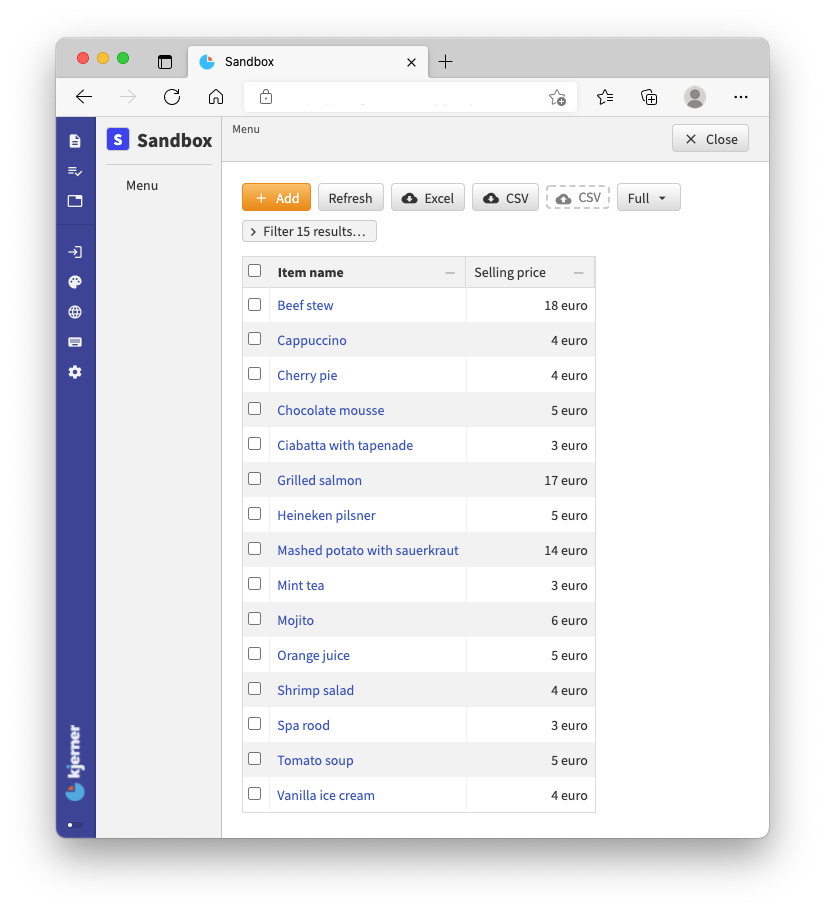

The data from the menu card is already there, but you can add some data yourself by clicking `Add`. A new window opens. Fill in the required fields, click `Save` and `Close` (top right corner) when you're done. We return to the table `Menu`. Repeat to add more data.

<tutorial folder: ./_tutorial/step_01/>

## 4. Numerical-types

Maybe you've noticed that when you enter a number with decimals, the price is rounded to a whole number:
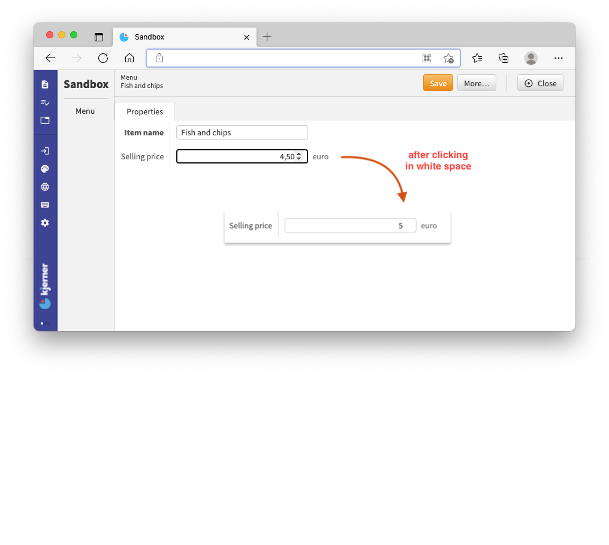

Of course, we want to correct this. Go back to your model and make sure your `numerical-types` looks like this:
```
numerical-types
	'euro'
		@numerical-type: (
			label: "Euro"
			decimals: 2
		)
```

Here we can define the label if we want it to be different from the label of the numerical-type (here `Euro` instead of `euro`) and the number of decimals that can be entered by the user (in this case 2 to be able to also set euro cents).
There's much more to numerical-types, but we'll leave it at this for now.

## 5. Stategroup
Let's extend the root by making sure we can define whether an item is a dish or a beverage:
```
root { 
	'Menu': collection ['Item name'] {
		'Item name': text
		'Selling price': number 'euro'
		'Item type': stategroup (
			'Dish' { }
			'Beverage' { }
		)
	}
}
```
The container `Item type` is added and is defined as ***stategroup***. This means the container `Item type` can only hold predefined ***states***, in this case either `Dish` or `Beverage`. Notice that `Dish` and `Beverage` have the ability to hold more containers and that these containers can be different for each state. So depending on the state different data can be stored.
Our dishes can be an appitizer, main course or dessert, so let's make these states available by adding the container `Dish type` of type ***stategroup*** to the state `Dish`. This adds more nuance to the model by making it possible to know what kind of dish we're talking about. The same counts for `Beverages`:
```
root { 
	'Menu': collection ['Item name'] {
		'Item name': text
		'Selling price': number 'euro'
		'Item type': stategroup (
			'Dish' { 
				'Dish type': stategroup (
					'Appetizer' { }
					'Main course' { }
					'Dessert' { }
				)
			}
			'Beverage' { 
				'Beverage type': stategroup (
					'Juice' { }
					'Soft drink' { }
					'Cocktail' { }
					'Beer' { }
					'Wine' { }
					'Coffee & tea' { }
			}
		)
	}
}
```
It shows that states of a stategroup can in itself have other stategroups with states and that the number of states is not limited to two. We also get to see a glimps of the hierarchical form all data models have: `Root` contains a `Menu` collection and each set of values (node) within the `Menu` collection can have state `Dish` or `Beverage` that itself can have states like `Appetizer` or `Cocktail` on an even more detailed level.

Build the model (`Alan Build`) and find out what stategroups and numerical-types do for your app:

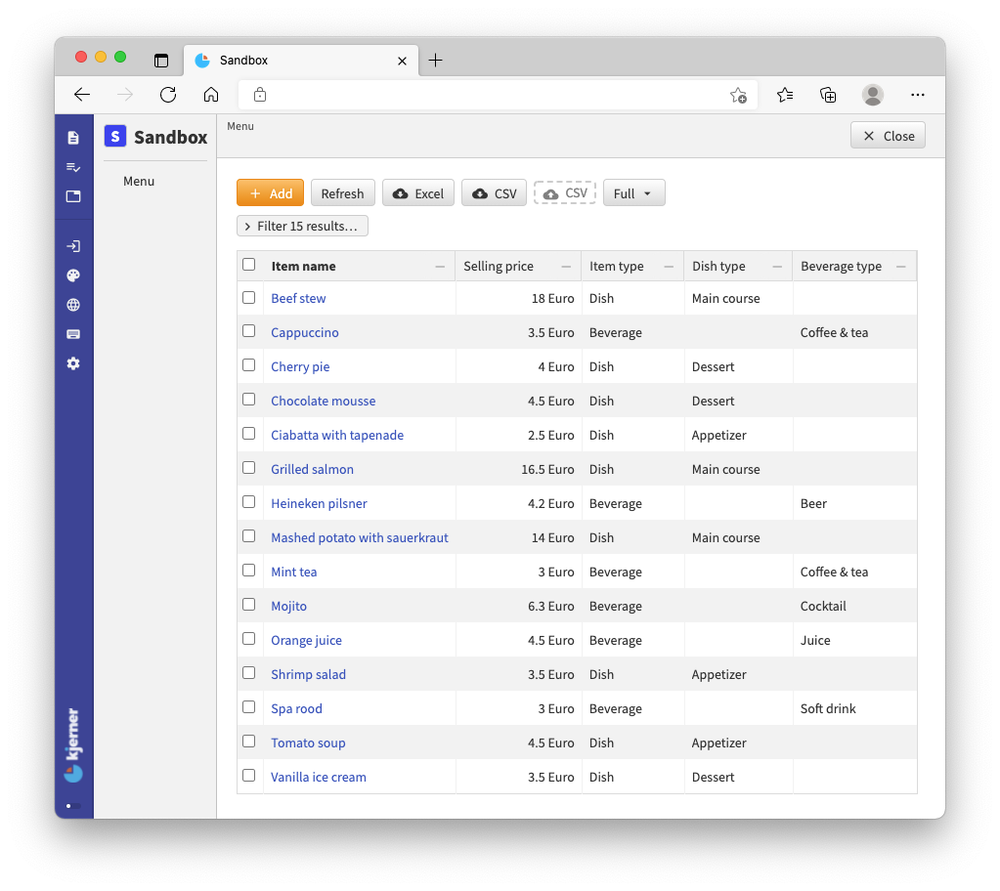

The table has a few more columns, but the data you might have entered yourself in previous steps is gone! In a real world situation that would be catastrophic and now it's maybe a little annoying. To solve this issue you need to migrate your data from one model version to the other. For this tutorial we provided migration files for each topic. Location of the appropriate files within the folder `_tutorials` (available in your project) can be found at the end of each topic. By copying and pasting the migration file the data within the migration file becomes available within your app.
More information on migrations in the tutorial *Migrations and deployments*.

If you add an item yourself you'll see we have some selection boxes available to determine the states of our added stategroups:
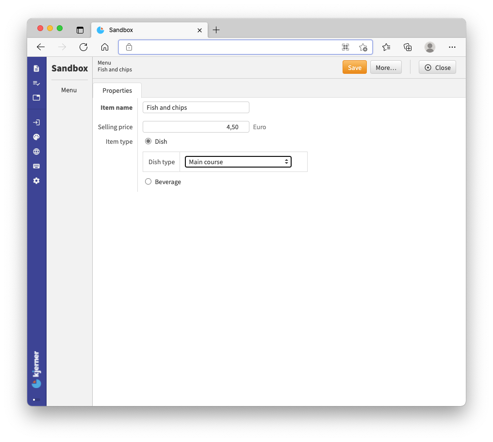

<tutorial folder: ./_tutorial/step_02/>

## 6. Expand the model
We continue with our model. Add the additional containers to the `root` below `Menu`:
```
root { 
	'Menu': collection ['Item name'] {
		'Item name': text
		'Selling price': number 'euro'
		'Item type': stategroup (
			'Dish' { 
				'Dish type': stategroup (
					'Appetizer' { }
					'Main course' { }
					'Dessert' { }
				)
			}
			'Beverage' { 
				'Beverage type': stategroup (
					'Juice' { }
					'Soft drink' { }
					'Cocktail' { }
					'Beer' { }
					'Wine' { }
					'Coffee & tea' { }
			}
		)
	}

	'Tables': collection ['Table number'] {
		'Table number': text
		'Seatsings': number 'chairs'
		'Orders': collection ['Order line'] {
			'Order line': text
			'Item': text -> ^ ^ .'Menu'[]
			'Amount': number 'units'
		}
	}

}
```
First of all, don't forget to add `chairs` and `units` to the `numerical-types` because these numerical types are new to the model:
```
numerical-types
	'euro'
		@numerical-type: (
			label: "Euro"
			decimals: 2
		)
	'chairs'
	'units'
```

Build and check the app in your browser, selecting `Tables` from the left menu bar. `Table number`'s and corresponding `Seatings` were already added:


In the left column we see that `Tables` is parent to the child `Orders`, just like in our model: We have a container of type collection within another container of type collection. This means that several `Order lines` can be added to `Orders` that is part of one single `Table`. And `Tables` can have several `Table number`'s. In our restaurant with `Tables` a particular `Table number` could have multiple `Order lines` for example for two different dishes and some beers.

As we can see from this model, stategroups and collections can contain other types, not necessarily of their own type. Collections can contain stategroups, collections, texts, etc. The same counts for stategroups and groups. With these types we can build more complex models that describe the contents of and relations between data and that suit the desired business processes.

<tutorial folder: ./_tutorial/step_03/>

### Built-in types
>We've seen some ***types*** in the previous part, but the Alan platform has several built-in data types available. Time for a complete overview with definitions:
>- A ***text*** attribute holds an unbounded string value (eg. *"this is text"*)
>- A ***number*** attribute holds an integer value (eg. *31415927*)
>- A ***file*** attribute holds two unbounded string values representing a file token and a file extension (eg. *"screenshot"* and *"png"*)
>- A ***collection*** attribute holds a map of key-value pairs. Keys are string values that have to be unique such that we can reference them unambiguously. Keys are implicitly defined for collection attributes; values are nodes of an inline defined type (eg. *{"001"; "Eggs"; 6; 'stired', 'fried'; 'omelette.jpg'}*)
>- A ***stategroup*** attribute holds a value indicating a state. States are alternatives to a property that a state group attribute indicates (eg. *'main course'*)
>- A ***group*** attribute holds a node of an inline defined type. Group attributes add structure by grouping other attributes that belong together or share permission requirements, which we'll discuss later in this tutorial.
>- The ***root*** type is a complex type that nests other (complex) types

## 7. References
There's an interesting line in the model that needs our attention: 
```
'Item': text -> ^ ^ .'Menu'[]
```
This line seems to somehow relate the container `Item` (within the collection `Tables`) with the collection `Menu`. `Menu` and `Tables` are collections on the same level, both contained within `Root`. Let's explain by going to the application first. Select a table from the list (shown in the previous image) and click `Add` in the line `Orders`:


Enter an `Order line` ("01" since its the first order from this table):


Now select the magnifying glass on the right of `Item` and you'll see this:

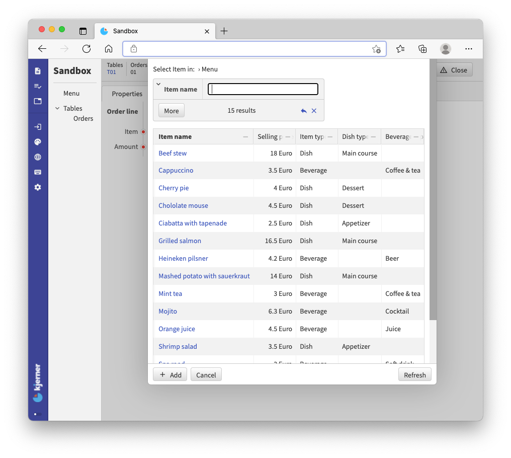

Here we see the items of `Menu` and we can select an item from the table. Or, if we start typing in the box `Item name` the table will be filtered. We can only choose an item that is in the table, specifically in the column `Item name`. This is the result of that line in the model: An `Item` is constraint to the entries in the referenced collection `Menu`. Formally, this is known as a (mandatory) ***reference (constraint)*** and is used in the model by typing this arrow **`->`**. 
A reference (constraint) always references a node type by supplying a path to the node type. A ***node type path*** uniquely identifies every node type in the model from the `root` (eg. `.'Menu'` which is short for `root .'Menu'`). The reference can only be applied to a container with type *text* (eg. `Item`). It can't be applied to the types *number*, *file*, *collection*, *stategroup* or *group*.
Also notice the square brackets `[` and `]` behind `.'Menu'`. This implies that we refer to one unspecified node in the collection `Menu` which is identified by the value of the key `Item name` of the collection `Menu`. As mentioned earlier this is the ***key value*** of the selected node: `Item` has the value 'Beef stew' after selecting it, as presented in this image:

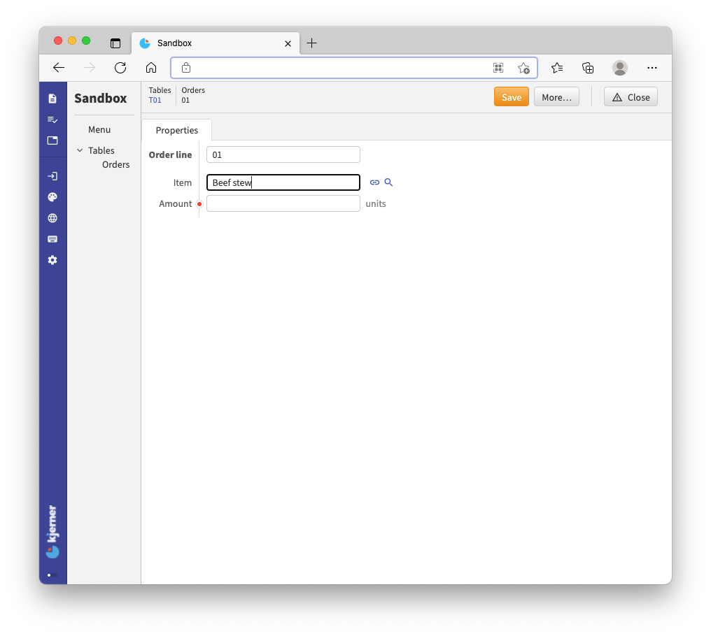

Once models get more complex this construction is very powerful, because by knowing the key value we can get information from within the node that is identified by this key value. In our case, by knowing table 'T01' ordered 2 'Beef stews' and by definition of the collection `Menu` knowing that a 'Beef stew' has a price of '18 Euro' we could calculate that this table needs to pay 36 Euro at this point in time.

>Next to `Item` being defined as of type text it is additionally being defined by its (mandatory) reference to `Menu`: Values of `Item` can only consist of key values from `Menu`. 
This extention of the definition of `Item` is also an important concept of the Alan platform.

Entering an amount and selecting `Save` gives this result:


Not all references can be made mandatory. When a text container references a collection that is defined outside the scope of the current model, for example in another app or in an external database, we can't technically make sure that the reference constraint is always met, but we do want to keep our apps and models close knit. So we make these references optional by using the symbol **~>** (curly arrow, not to be confused with **->** ) and call these ***links***.

The definition of a container of type text and a reference, like we've seen above, can be extended with what is called a ***reference rule***. We can use the word `where` to apply one or more reference rules to a text. An example, apart from our current model:
```
'Car': text -> .'Electric vehicles'[]
	where 'blue' ~> .'Blue objects'[]
	where 'american' ~> .'American products'[]
```
`Car` in this example has one *reference* and two *links* which all define `Car`:
- `Car` can contain key values from the collection `Electric vehicles`
- `Car` can contain key values from the collection `Blue objects`, by definition of the rule `blue`
- `Car` can contain key values from the collection `American products`, by definition of the rule `american`
This way `Car` is much more specified. The rule names `blue` and `american` can be used as references themselves in subsequent parts of the model, which can come in handy.

By the way, in this example we used links for the reference rules because it is not yet technically possible  and it has not been neccesary to make mandatory references to several seperate collections within the same model.

`Where` is not restricted to the use with text containers. It can also be used with states of a stategroup. More on this in the topic 'Advanced references'.

## 8. Hierarchy
We explained this: **->**, but why do we need this: **^ ^**? As mentioned earlier, there are parent and child relations between different parts of the model, thus between different data. These parts, or this data, exists on different levels, created by the node types (the containers between curly braces **{** and **}** ). For explanatory purposes, let's say `root` is on level 0. Then collection `Menu` is on level 1, while text `Item` is on level 3:

| 0 | 1 | 2 | 3 | ... | 2 | 1 |
|:-:|:-:|:-:|:-:|:-:|:-:|:-:|
|`root` | `{ Menu` | `{ ... }` | | | | `}` |
|`root` | `{ Tables` | `{ Orders` | `{ Item }` | | `}` | `}` |

So, to reference `Menu` we have to 'jump up' two levels relative to `Item`, therefore the two 'arrows' up: **^ ^** . This makes it clear to the compiler where it can find `Menu`.
Additionally, for the compiler to understand this jump up, the referenced collection also needs to be positioned above the reference constraint, i.e. `Menu` needs to be defined before `Item` can reference it, reading the model from top to bottom.

To summarize, `'Item': text -> ^ ^ .'Menu'[]` is:
- a container with the name 'Item'
- that is of type *text* 
- that is constrained by a *reference constraint* 
- which is defined by a *relative node type path* 
- that points to a *node type*.

## 9. Modify the model
Hopefully by now you can 'read' this model and understand its components and structure. Meanwhile our restaurant is in full swing, so no time to waste!

You might have experienced in your restaurant that having a static set of beverage types might not be very practical. Let's change the model accordingly and make a dynamic set of beverage types, which means the stategroup `Beverage type` is removed and replaced with a collection `Beverages types`. 

Since we still want to be able to select a beverage type when we compose our menu, we need to be able to reference `Beverages types` from `Beverage type` within the state `Beverage` in our model. Therefore it needs to be above `Menu`. Modify your model according to this new one:
```
users
	anonymous

interfaces

root {
	'Beverages types': collection ['Beverage type'] {
		'Beverage type': text
	}

	'Menu': collection ['Item name'] {
		'Item name': text
		'Selling price': number 'euro'
		'Item type': stategroup (
			'Dish' {
				'Dish type': stategroup (
					'Appetizer' { }
					'Main course' { }
					'Dessert' { }
				)
			}
			'Beverage' {
				'Beverage type': text -> ^ ^ .'Beverages types'[]
			}
		)
	}

	'Tables': collection ['Table number'] {
		'Table number': text
		'Seatings': number 'chairs'
		'Orders': collection ['Order line'] {
			'Order line': text
			'Item': text -> ^ ^ .'Menu'[]
			'Amount': number 'units'
		}
	}
}

numerical-types
	'euro'
		@numerical-type: (
			label: "Euro"
			decimals: 2
		)
	'chairs'
	'units'
```

Again, build and check your app, selecting `Beverages types` from the left menu bar:


Now you are free to add or adjust the types of beverages you have in your restaurant and still be able to use those in your menu setup:

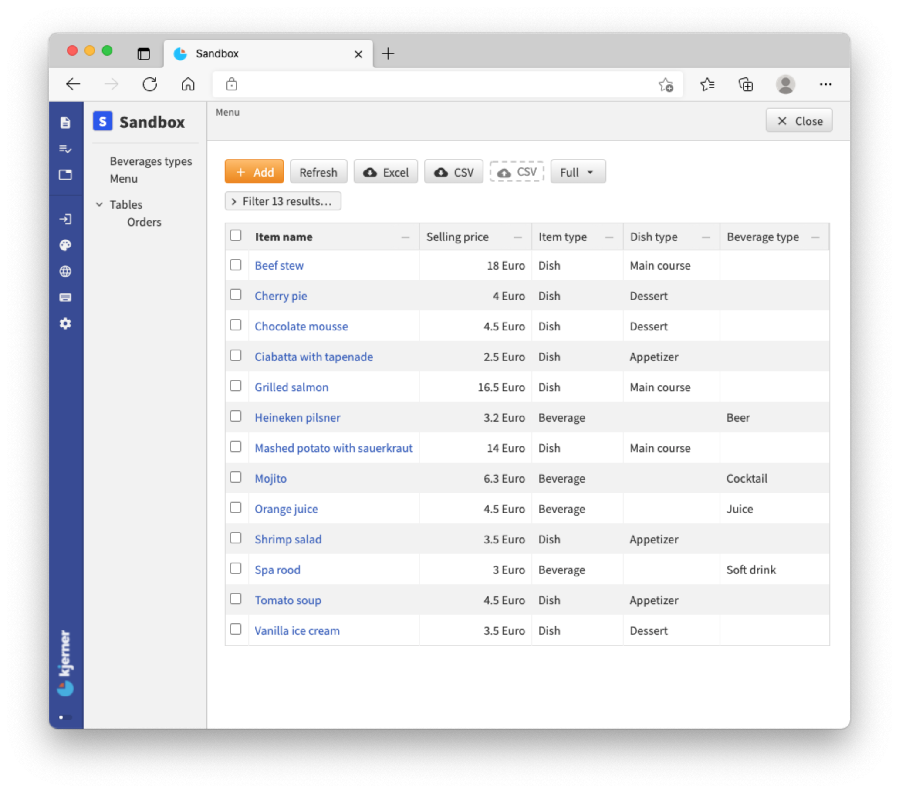

Select 'Mojito', then `Edit` (top right):

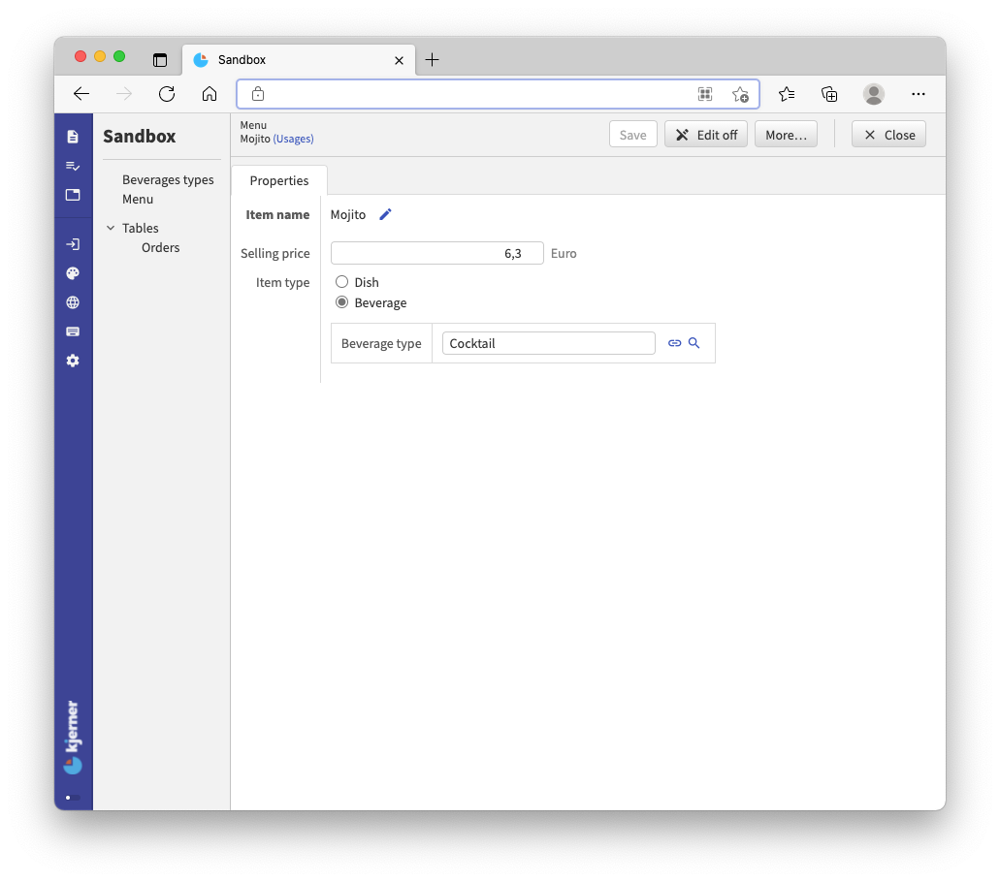

And finally the magnifying glass on the right of `Beverage type`:


Here, we can edit the `Beverage type` of 'Mojito'. The collection `Beverages types` is shown just like before with `Orders`. This *graphical user interface* ***(GUI)*** is also automatically updated just by changing our model.

<tutorial folder: ./_tutorial/step_04/>

## 10. Reference set
You decided that your restaurant will also provide a take-away service. This means adjusting the model accordingly. Let's see what is needed.

`Orders` will no longer be a child to the parent `Tables`, which makes more sense anyway: If we consider these entities more accurately, `Orders` and `Tables` don't have a parent-child relation, since they are of different order. For example the relation between `Tables` and `Seatings` is more natural, like wheels to a car or zebras to mammals.
`Orders` need to be defined as either takeaway or in-house. And if in-house, it can be linked to a table.
We will change this part of the model:
```
'Tables': collection ['Table number'] {
	'Table number': text
	'Seatings': number 'chairs'
	'Orders': collection ['Order line'] {
		'Order line': text
		'Item': text -> ^ ^ .'Menu'[]
		'Amount': number 'units'
	}
}
```
Into this:
```
'Tables': collection ['Table number'] {
	'Table number': text
	'Seatings': number 'chairs'
	'Orders': reference-set -> downstream ^ .'Orders'* .'Order type'?'In-house' = inverse >'Table'
}

'Orders': collection ['Order'] {
	'Order': text
	'Order type': stategroup (
		'Takeaway' { }
		'In-house' {
			'Table': text -> ^ ^ .'Tables'[] -< 'Orders'
		}
	)
	'Order lines': collection ['Order line'] {
		'Order line': text
		'Item': text -> ^ ^ .'Menu'[]
		'Amount': number 'units'
	}
}
```
What changed?
- We moved `Orders` one level up, alongside `Tables`
- Since we don't want a long list of `Order lines`, we organized the `Order lines` in a subcollection `Order lines` . Now each `Order` can have multiple `Order lines` (previously each `Table number` could have multiple `Order lines`)
- We've added a stategroup `Order type` to indicate the kind of order: state `Takeaway` or state `In-house`
- If the state of an orde is `In-house` we also like to know which `Table` it belongs to, so we added a text `Table` that references the collection `Tables` inside the node of state `In-house`

And now for the interestingly new parts: 
We would also like to know for each `Table` which `Orders` it has. So far we could only know for each `Order` which `Table` it is for, by means of the reference on `Table` (by the way, did you check if two ^ are correct here?). The ***reference set*** makes it possible to know which `Orders` are pointing to each `Table`, so for each `Table` we can have insight into its `Orders`. 
We achieve this by adding `Orders` to the collection `Tables` and define it as type reference set. Then we have to make the reference to the desired location by supplying the path: `-> downstream ^ .'Orders'* .'Order type'?'In-house'` This is called a *relative node type path*:
- It's relative since we start from our current position and first have to jump up one level (`^`) and then follow the node types
- It's a node type path since it descibes a path of consecutive node types on ever deeper levels: `.'Order type'?'In-house'` within `.'Orders'*`

`Downstream` tells us the node type the compiler needs to find is further down in the model. More on `downstream` in the topic 'Upstream and downstream'.
Here we use * instead of [ ] behind `.'Orders'` because we want to reference *all* the nodes (not a single node) of `Orders` that have the state `In-house`.
Finally we say 'follow the reference of `Table`', written like this: `>'Table'` (more on the symbol > in the topic 'Navigation'), but do it 'backwards' (`inverse`). If we 'jump' to `Table` we see a kind of inverse reference `-<` (instead of `->`) at the end of the line with label `Orders`. This links `Table` from collection `Orders` to `Orders` from collection `Tables`.

Make the changes to your model, build it and take a look at the app.
Select `Order` in the left column and click `Add`:


Insert '001' as order number, select 'In-house' and select a table. Add some order lines:


Hit `Save`!
Now go to `Tables`, select the table you selected when placing the order and click `Usages`:


We can see that `Order` '001' is using table 'T03':


If we click the order, we jump to the order with its order lines.

<tutorial folder: ./_tutorial/step_04a/>

## 11. Command

At this point in the tutorial we would like to show you the ***command*** statement. The model however doesn't necessarily need a command, therefore the example presented here is not the best usecase. Nevertheless it will give a glimpse into the structure of a command.
With a command we can for example create nodes in a collection, provided the data is available to create the node. Having this data is achieved by deriving it from other data (more on derivations later), receiving data through an interface or ask the user to enter data. Although commonly an ***action*** is used in the later case (an action takes into account the access rights a user has, while a command does not), we will use this scenario here.

In short, in our model we will add a command to gather data for placing a new order by means of a user form and then use this data to update the collection `Orders`:
```
'Place new order': command {
	'Provide an order number': text
	'Where is the meal consumed?': stategroup (
		'Outside of restaurant' { }
		'At the restaurant' {
			'Where is the customer seated?': text -> .'Tables'[]
		}
	)
	'Order lines': collection ['Provide an order line number'] {
		'Provide an order line number': text
		'Item to be consumed': text -> .'Menu'[]
		'Amount of this item': number 'units'
	}
} => update .'Orders' = create (
	'Order' = @ .'Provide an order number'
	'Order type' = switch @ .'Where is the meal consumed?' (
		|'Outside of restaurant' => create 'Takeaway' ( )
		|'At the restaurant' as $ => create 'In-house' (
			'Table' = $ .'Where is the customer seated?'
		)
	)
	'Order lines' = walk @ .'Order lines' as $ (
		create (
			'Order line' = $ .'Provide an order line number'
			'Item' = $ .'Item to be consumed'
			'Amount' = $ .'Amount of this item'
		)
	)
)
```
That's a lot to take in! Let's take a look at the result in the webbrowser. So, add this to the model, below `Orders`, but within `root`. Build the app and go to your browser. In the left column a button 'Place new order...' appeared:

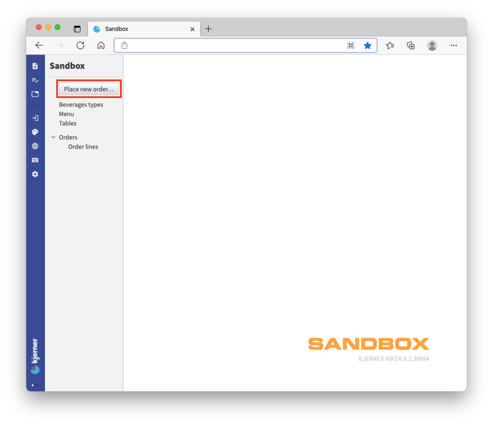

This button's title corresponds with the label of our command: `Place new order`
Click it and fill in the fields, for example like this:


Now click `Place new order` below the form en `Close` (top right). Then go to `Orders` and select your order:

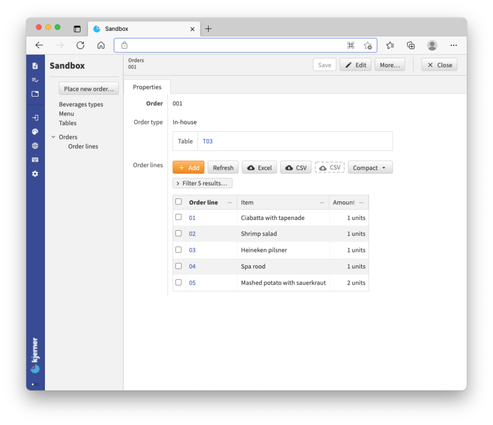

We have successfully added an entry to the collection `Order` by providing the data in the form.
On closer inspection of this example we can see that the selection `At the restaurant` for the question `Where is the meal consumed?` is translated into the state `In-house` of stategroup `Order type`.

Let's review the added command in the model. The first part of the command looks a lot like familiar model language and actually is similar:
```
'Place new order': command {
	'Provide an order number': text
	'Where is the meal consumed?': stategroup (
		'Outside of restaurant' { }
		'At the restaurant' {
			'Where is the customer seated?': text -> .'Tables'[]
		}
	)
	'Order lines': collection ['Provide an order line number'] {
		'Provide an order line number': text
		'Item to be consumed': text -> .'Menu'[]
		'Amount of this item': number 'units'
	}
} ...
```
It defines the command by providing containers in between curly braces (just like when defining a collection) that can hold specific data types. Some containers also have reference constraints to control the allowable values. These references have paths starting at the node type where the command is placed, in this case `root`. So the reference constraint of `'Where is the customer seated?'` starts at `root`. Don't be fooled by this: It still is a relative node type path, but from the node type that contains the command!
To illustrate this more clearly, let's temporarily add the command to a group `Temporary` and see how this effects the paths:
```
'Temporary': group {
	'Place new order': command {
		'Provide an order number': text
		'Where is the meal consumed?': stategroup (
			'Outside of restaurant' { }
			'At the restaurant' {
				'Where is the customer seated?': text -> ^ .'Management' .'Tables'[]  // ^ added!!
			}
		)
		'Order lines': collection ['Provide an order line number'] {
			'Provide an order line number': text
			'Item to be consumed': text -> ^ .'Menu'[]             // ^ added!!
			'Amount of this item': number 'units'
		}
		'Apply discount?': stategroup (
			'Yes' {
				'Discount period': text -> ^ .'Management' .'Discount periods'[]  // ^ added!!
			}
			'No' { }
		)
	} => update ^ .'Orders' = create (                // ^ added!!
		'Order' = @ .'Provide an order number'
		'Order type' = switch @ .'Where is the meal consumed?' (
			|'Outside of restaurant' => create 'Takeaway' ( )
			|'At the restaurant' as $ => create 'In-house' (
				'Table' = $ .'Where is the customer seated?'
			)
		)
		'Order lines' = walk @ .'Order lines' as $ (
			create (
				'Order line' = $ .'Provide an order line number'
				'Item' = $ .'Item to be consumed'
				'Amount' = $ .'Amount of this item'
				'Line status' = create 'Placed' ( )
			)
		)
		'Order status' = create 'Open' ( )
		'Discount applicable' = switch @ .'Apply discount?' (
			|'Yes' as $ => create 'Yes' (
				'Discount period' = $ .'Discount period'
			)
			|'No' => create 'No' ( )
		)
	)
}
```
This change makes it necessary to add `^` to the paths, as indicated in the four comment lines, and shows that the paths are relative, but from the node type where the command is defined, in this case the node type `Temporary`.
Please revert the model to the original state to undo this example.

All these containers are called the ***parameters*** of the command.
Although the labels are different, the structure of the command definition is the same as the collection `Orders`. In this case we want to manipulate this collection with the command and often the command definition is identical to the definition of that collection.
The parameters (containers within the command definition) correspond with the fields in the GUI-form to be filled in and thus hold the inserted values after submitting the form.
The values of the parameters together form a ***parameter node*** that can be accessed.

Then the second part of the command, the *command implementation* starts with: 
```
... => update .'Orders' ...
```
It consists of a double arrow ( ***=>*** ), the word ***update*** and a (relative!) node type path. The double arrow can be read as 'do this'. Update means we want to update a collection or stategroup. And the path points to the collection or stategroup we want to update with the provided data, in this case collection `Orders`.
Instead of update we can also use these key words: *switch*, *ignore*, *walk*, *execute* and *external*, each with their own definition and required structure that should follow the key word. Let's stick with update for now, since we want to update the specified collection with the provided data, but just so you know there are many more possibilities.

The command implementation ends with: 
```
			... = create ( ... )
```
This tells us what the update should be about: 'the update is ( ***=*** ) the creation (***create***) of a node.
The key word *create* can be replaced by only the key word ***ensure***. Create will check if an entry in the target collection already exists (if there is a node that is similar to the values the user filled in). If so, an error will be thrown and the command will be aborted. Otherwise, the new node is created. 
Ensure will also create the node, but if it already existed it will overwrite its data.

And lastly, the part between the parentheses of the key word *create*:
```
'Order' = @ .'Provide an order number'
'Order type' = switch @ .'Where is the meal consumed?' (
	|'Outside of restaurant' => create 'Takeaway' ( )
	|'At the restaurant' as $ => create 'In-house' (
		'Table' = $ .'Where is the customer seated?'
	)
)
'Order lines' = walk @ .'Order lines' as $ (
	create (
		'Order line' = $ .'Provide an order line number'
		'Item' = $ .'Item to be consumed'
		'Amount' = $ .'Amount of this item'
	)
)
```
The containers `Order`, `Order type` and `Order lines` within the collection `Orders` are equated with a parameter defined in the command, much like this:
```
'container in collection' = @ .'parameter of command'
```
This means access the parameter node, lookup the specified value (inserted in the form by the user) and copy it to the container of the collection. The symbol ***@*** is used here to tell the compiler a given path is within the command definition. Otherwise the compiler will consider these paths as within `root`. 
As an experiment to show you how the compiler responds without this symbol, remove the @ in this line: `'Order' = @ .'Provide an order number'` and build the model. The compiler will throw an error telling you it can't find `Provide an order numer` in 'attributes' and will show what it does find in 'attributes', in this case `root`.

Additionally, we see two new key words: ***switch*** and ***walk***. Let's discuss switch:
```
'Order type' = switch @ .'Where is the meal consumed?' (
	|'Outside of restaurant' => create 'Takeaway' ( )
	|'At the restaurant' as $ => create 'In-house' ( ... )
)
```
Since we don't know which selection the user has made we need a way to link al possible states of the input (parameter) stategroup with all possible states of the output stategroup. The statement switch expresses that, depending on the state of the stategroup `Where is the meal consumed?`, we want to switch between possible states of `Order type`.
You can read it like this: 
***"*** If the state of `Where is the meal consumed?` is `Outside of restaurant`, then 'do this': create the state `Takeaway` for stategroup `Order type`. If the state of `Where is the meal consumed?` is `At the restaurant`, then 'do this': create the state `In-house` for stategroup `Order type`. ***"***

It doesn't end there, because if the customer wants to eat at the restaurant we need to know at what table the customer is seated. The meaning of:
```
	|'At the restaurant' as $ ... 
```
is to say: Temporarily store the contents of the parameter node of the state 'At the restaurant' as $. The ***\$-symbol*** is like a sticky note with all the values within the node written down on it. The node type of this state ({...}) is defined in the command definition as:
```
'At the restaurant' {
	'Where is the customer seated?': text -> .'Management' .'Tables'[]
}
```
With `$` we thus have access to the value of `Where is the customer seated?`.

Then when the state `In-house` is created we have to fill the node by providing the value for `Table`:
```
=> create 'In-house' (
		'Table' = $ .'Where is the customer seated?'
	)
```
Here we refer to the temporarily stored node of state `At the restaurant` as `$` and of that node we refer to the (one and only) container `Where is the customer seated?` (Look at the sticky note and provide the value of `Where is the customer seated?`).
Next time we use the command to create a new order, these values can be different, therefore we only need to store these values temporarily. The goal of our command is to permanently store these values in a new node in the collection `Orders`.

Let's look at walk:
```
'Order lines' = walk @ .'Order lines' as $ (
	create ( ... )
)
```
The statement walk, followed by the node type path, expresses that we want to 'walk along' all entries in the parameter collection `Order lines`. The statements between the parentheses are evaluated for each of the entries in the collection. In this case for each entry in the parameter collection `Order lines` a node is created in the collection `Order lines` according to the supplied structure and values.
Again, the $-symbol is used to temporarily store each node within the collection `Order lines`. 
So once we start to create the node in the collection `Order lines`, we derive the values for each container within the node by refering to \$ and from this \$ we want a specific container.
```
		'Order line' = $ .'Provide an order line number'
		'Item' = $ .'Item to be consumed'
		'Amount' = $ .'Amount of this item'
```

The use of the $-symbol is not restricted to commands and can be applied throughout a model to refer to temporarily stored nodes or states.

As mentioned before, this is only an example of a command. Commands are commonly used to automatically create or change nodes or states without bothering the user with this or to transmit data from one app to another through an interface. More on the use of commands in interfaces in the tutorial 'Interfaces'.

<tutorial folder: ./_tutorial/step_04b/>

>Before we continu with the next topic it is good to know that *reference-set* and *command* are also considered possible *attributes* for a container. The previously mentioned types *text*, *number*, *file*, *collection*, *stategroup* and *group* are more specifically *property attributes*, in short ***properties***, of the container. This in contrast to the *attributes* *reference-set* and *command*. 

## 12 Derivations: numbers
Whenever you want to derive a value from other values, we use derivations. Derivations can be recognized in the model by the symbol **=**. This means we've already seen some derivations in the previous topic on commands. 
We've seen for example a state of a stategroup being derived from the state of another stategroup by using = and the statement switch. Such a ***state derivation*** can also be used  outside of a command attribute, more generally in a model. More on this in the topic 'Derivations: conditional expressions'.

Here we focus on number derivations. Let's make the also previously mentioned example (in the topic 'References') of calculating a subtotal per order line. Add these lines below `Amount` to your model:
```
'Order lines': collection ['Order line'] {
	'Order line': text
	'Item': text -> ^ ^ .'Menu'[]
	'Amount': number 'units'
	'Line total': number 'euro' = product (
		>'Item'.'Selling price' as 'euro' ,
		.'Amount'
	)
}
```
A property `Line total` of type number with numerical-type 'euro' is added. The value of `Line total` is derived by multiplying the selling price with the amount. The ***product*** statement takes two terms: the two numbers to be multiplied.

>An important concept arises when we focus on the symbol ***>*** in front of `Item` (the first term in the *product* statement for calculating `Line total`). This line of code means:
'With the current value of `Item` (a key value of `Menu`) of this specific `Order line` follow its reference and from the resulting node in that referenced collection provide the value of property `Selling price`.' 
>So, from a specific node of `Order lines`, that has a specific value for `Item`, a reference is made to another specific node of `Menu` from which the value of the property `Selling price` is provided.
>In short, *>* makes sure that during runtime the current value of `Item` is used to reference the appropriate node of the referenced collection.

Now we want to focus on the ***as*** statement followed by `'euro'`.
To explain what this means and for the health of our model we need to add this line:
`= 'euro' * 'units'` below `euro` so our numerical-types now looks like this:
```
numerical-types
	'euro'
	= 'euro' * 'units'
		@numerical-type: (
			label: "Euro"
			decimals: 2
		)
	'chairs'
	'units'
```
The *as* statement is followed by what is called a ***product conversion rule***, that describes how the numerical-types of the two properties are multiplied, in this case `euro` and `unit`. So the general format of a *product conversion rule* is `= 'num-type1' * 'num-type2'`.

Another possible calculation is for example a division: 
`= division ( 'property1' as 'division conversion rule' , 'property2' )`
that uses a ***division conversion rule***: 
`= 'num-type1' / 'num-type2'`

And we can do conversion of units by a constant factor, using the ***from*** statement, for example:
`'Circle circumference': number 'circum' = from 'diameter' .'Circle diameter'`
And a ***singular conversion rule***: 
`= 'num-typ' * constant`, according to the example:
```
numerical-types
	'circum'
	= 'diameter' * 314159265 * 10 ^ -8	// = diameter * pi
```

Let's add another useful line to the model:
```
'Total': number 'euro' = sum .'Order lines'* .'Line total'
```

Can you determine where it needs to go? Spoiler alert: answer ahead...

So now our whole model looks like this:
```
users
	anonymous

interfaces

root {
	'Beverages types': collection ['Beverage type'] {
		'Beverage type': text
	}

	'Menu': collection ['Item name'] {
		'Item name': text
		'Selling price': number 'euro'
		'Item type': stategroup (
			'Dish' {
				'Dish type': stategroup (
					'Appetizer' { }
					'Main course' { }
					'Dessert' { }
				)
			}
			'Beverage' {
				'Beverage type': text -> ^ ^ .'Beverages types'[]
			}
		)
	}

	'Tables': collection ['Table number'] {
		'Table number': text
		'Seatings': number 'chairs'
		'Orders': reference-set -> downstream ^ .'Orders'* .'Order type'?'In-house' = inverse >'Table'
	}

	'Orders': collection ['Order'] {
		'Order': text
		'Order type': stategroup (
			'Takeaway' { }
			'In-house' {
				'Table': text -> ^ ^ .'Tables'[] -< 'Orders'
			}
		)
		'Order lines': collection ['Order line'] {
			'Order line': text
			'Item': text -> ^ ^ .'Menu'[]
			'Amount': number 'units'
			'Line total': number 'euro' = product (
				>'Item'.'Selling price' as 'euro' ,
				.'Amount'
			)
		}
		'Total': number 'euro' = sum .'Order lines'* .'Line total' // <-- ;-)
	}

	'Place new order': command {
		'Provide an order number': text
		'Where is the meal consumed?': stategroup (
			'Outside of restaurant' { }
			'At the restaurant' {
				'Where is the customer seated?': text -> .'Tables'[]
			}
		)
		'Order lines': collection ['Provide an order line number'] {
			'Provide an order line number': text
			'Item to be consumed': text -> .'Menu'[]
			'Amount of this item': number 'units'
		}
	} => update .'Orders' = create (
		'Order' = @ .'Provide an order number'
		'Order type' = switch @ .'Where is the meal consumed?' (
			|'Outside of restaurant' => create 'Takeaway' ( )
			|'At the restaurant' as $ => create 'In-house' (
				'Table' = $ .'Where is the customer seated?'
			)
		)
		'Order lines' = walk @ .'Order lines' as $ (
			create (
				'Order line' = $ .'Provide an order line number'
				'Item' = $ .'Item to be consumed'
				'Amount' = $ .'Amount of this item'
			)
		)
	)
}

numerical-types
	'euro'
	= 'euro' * 'units'
		@numerical-type: (
			label: "Euro"
			decimals: 2
		)
	'chairs'
	'units'
```

And at runtime (in the webbrowser) it looks like this:
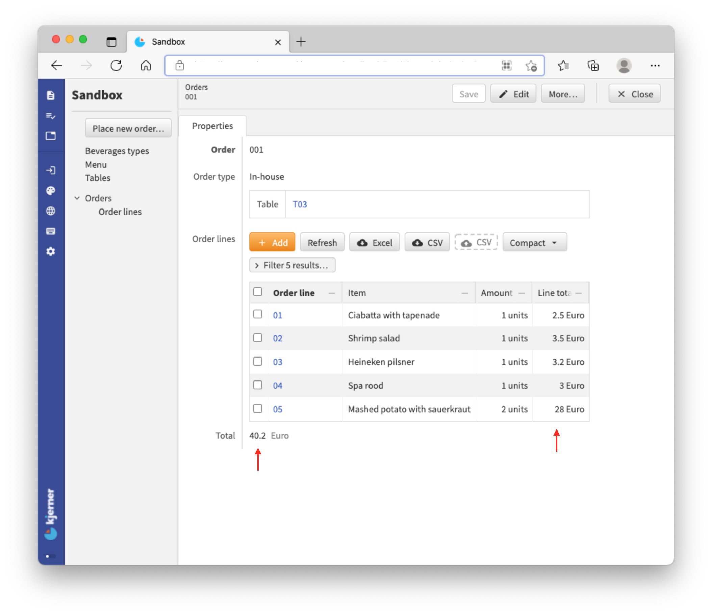

Other possible calculations that can be used in ***number derivations*** are:
***min***: determines the minimum of a set of values
***max***: determines the maximumof a set of values
***std***: determines the standard deviation of a set of values
***count***: counts the number of values in a set 
***remainder***: calculates the remainder of a division (10 mod 3 = 1)
***division***: calculates the division of two numbers  
***add***: calculates the addition of two numbers
***diff***: calculates the difference of two (relative!) numbers, for example the difference between two dates or two degrees Celcius 

Examples of absolute and relative numbers:
(number of) days: absolute, "28 days"
date: relative, "28-7-2021"
years: absolute, "5 years"
year: relative, "2021"
degrees: absolute, "21 degrees"
degrees Celcius: relative, "21˚C"
seconds, minutes, hours: absolute, "2 hours, 35 minutes and 8 seconds" (duration)
time of day or 'the time': relative "14:35:08"

So far we've seen numerical derivation, but we can also derive other types of data.

<tutorial folder: ./_tutorial/step_04c/>

## 13 Another model expansion
To show examples of other types of derivation we need to create a more intricate model.
Let's create a group `Management` at the top of the model for more permanent data, while still being able to adjust it. This group contains a new collection `Discount periods`, a number `VAT percentage` and the existing collections `Beverages types` and `Tables` (we're not going to change this data on a daily basis):
```
'Management': group {
	'Discount periods': collection ['Period'] {
		'Period': text
		'Percentage' : number 'percent'
		'Minimal spendings': number 'euro'
	}

	'VAT percentage': number 'percent'

	'Beverages types': collection ['Beverage type'] {
		'Beverage type': text
	}

	'Tables': collection ['Table number'] {
		'Table number': text
		'Seatings': number 'chairs'
		'Orders': reference-set -> downstream ^ ^ .'Orders'* .'Order type'?'In-house' = inverse >'Table'
	}
}
```
When you moved `Beverages types` and `Tables` to the group `Management` rebuild your app. You'll get some errors saying the compiler can't find these properties. Correct the errors according to the changes made.

And since we've added a new numerical type, we need to add this to our `numerical-types` in the model:
```
'percent'
```
We will use the collection `Discount periods` for selecting a certain discount percentage (`Percentage`), depending on the amount of money spend (`Minimal spendings`). `VAT percentage` will be used to calculate value added tax (VAT).
Change the number property `Total` within collection `Orders` into `Subtotal`, because the new `Total` will take the appropriate discount into account:
```
'Subtotal': number 'euro' = sum .'Order lines'* .'Line total'
```

<tutorial folder: ./_tutorial/step_05/>

## 14 Derivations: conditional expressions

Now let's add a stategroup `Discount applicable`, also within `Orders`. These lines of code also show some more examples of the symbol **>** :
```
'Discount applicable': stategroup (
	'Yes' {
		'Discount period': text -> ^ ^ .'Management' .'Discount periods'[]
		'Discount': number 'euro' = switch ^ .'Subtotal' compare ( >'Discount period' .'Minimal spendings' ) (
			| < => 0
			| >= => product (
				from 'percent' >'Discount period' .'Percentage' as 'percent-fraction',
				^ .'Subtotal'
			)
		)
		'Total': number 'euro' = sum ( ^ .'Subtotal' , - .'Discount' )
	}
	'No' {
		'Discount': number 'euro' = 0
		'Total': number 'euro' = ^ .'Subtotal'
	}
)
```
Add the numercial type `percent-fraction`, the product conversion rule and the singular conversion rule to the numerical types. It should now look like this:
```
numerical-types
	'euro'
	= 'units' * 'euro'
	= 'percent-fraction' * 'euro'
		@numerical-type: (
			label: "Euro"
			decimals: 2
		)
	'chairs'
	'units'
	'percent'
	'percent-fraction'
	= 'percent' / 1 * 10 ^ 2
```
In short, this model extension makes it possible to apply a discount by selecting a `Discount period` from the previously added collection `Discount periods`; for example 'Summer holiday' that will give 3% discount on spendings over €35.
If discount is applicable (state `Yes`) and a discount period is selected, the `Discount` will be calculated:
- Compare the `Subtotal` with the `Minimal spendings` that belong to the selected `Discount period`
- If `Subtotal` is smaller than `Minimal spendings` then `Discount` will be equal to 0
- If `Subtotal` is bigger than or equal to `Minimal spendings` then `Discount` will be equal to the product of the appropriate `Percentage` and `Subtotal`. The value of `Percentage` is first transformed from `percent` to `percent-fraction` (from 3% to 0,03). The value of `Subtotal` is this number of `percent-fraction` times number of `euro`. Its unit is equal to `euro`

Because we `switch` on a `compare` we can provide the desired states with operators like 'greater than', 'equal to', 'less than' and combinations of these.
Finally, the `Total` is calculated by adding `Subtotal` to the negative of `Discount` (subtraction).
If discount is not applicable (state`No`) `Discount` is equal to 0 and `Total` is equal to `Subtotal`.

Although the inputs and outcome are numbers, we also call this a ***state derivation*** because the result is determined from which state is true.

We also have to adjust the command `Place new order`, since this comand updates collection `Orders` and this collection has changed. Can you find out where these seperate parts of code should go and what they mean?:
```
'Apply discount?': stategroup (
	'Yes' {
		'Discount period': text -> .'Management' .'Discount periods'[]
	}
	'No' { }
)
```
And:
```
'Discount applicable' = switch @ .'Apply discount?' (
	|'Yes' as $ => create 'Yes' (
		'Discount period' = $ .'Discount period'
	)
	|'No' => create 'No' ( )
)
```
Let's take a look at the app and enter an order:

An order with a subtotal of €40,20 receives during the summer holiday a discount of 3%  when spending €35 or over.

It's time to calculate the VAT. To do this we need to know the `Total` and calculate a percentage of it. But we have two kinds of `Total` depending on whether a discount was applied or not. This means our calculation should depend on which state that specific `Total` is in. Again we can use the `switch` statement for this:
```
'VAT': number 'euro' = switch .'Discount applicable' (
	|'Yes' as $'discount' => product (
		from 'percent' ^ .'Management' .'VAT percentage' as 'percent-fraction' ,
		$'discount' .'Total'
	)
	|'No' as $'no discount' => product (
		from 'percent' ^ .'Management' .'VAT percentage' as 'percent-fraction' ,
		$'no discount' .'Total'
	)
)
```
We define `VAT` as a `number` of numerical type `euro` and derive it (=) depending on the states of stategroup `Discount applicable` (switch): either `Yes` or `No`. In both cases we end up using the product statement and supply this with the appropriate terms. The interesting parts are where the \$-symbols are used. If we look back at our definition of the stategroup `Discount applicable` (at the start of this topic) we see that each state has a node type definition by providing properties and derivations within the curly braces: `'Yes' { ... }` and `'No' { ... }`. 
As explained previously, when `as $` is used a specific node (all the values of that particular node of the specified state within a node of collection `Order`) is temporarily marked as `$`. Here we added a name to each specific temporary node and can reference these with \$'name'. We could have added names in the previous example as well, or leave them out here. It can be convenient to apply these names to differentiate them when several temporary nodes are needed and a model gets cluttered with \$'s. Although not necessary for the compiler, it is more readable for humans.
Here we've given the marked node the temporary name `discount` for nodes in the state `Yes` and `no discount` for nodes in the state `No`. So, when we write `$'discount' .'Total'` we point at the value of `Total` within a temporarily marked node of state `Yes`. And similar for `$'no discount'`.
`$'discount'` and `$'no discount'` are called ***named objects***.

Here's the result of our work:
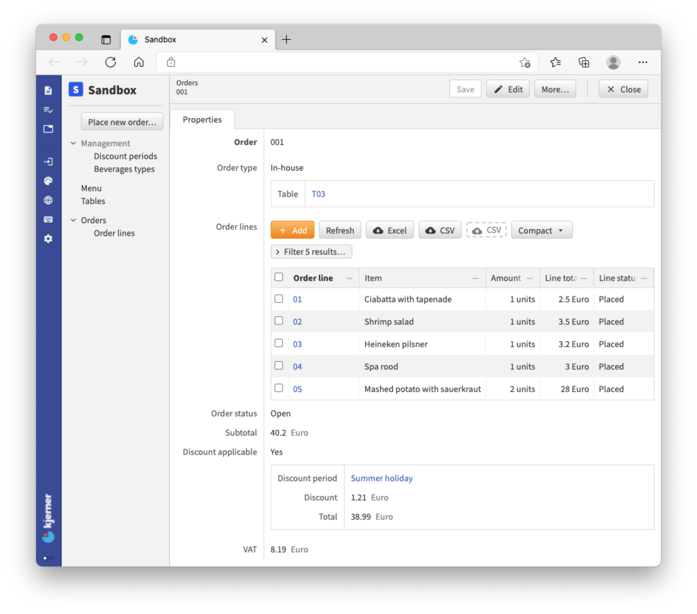

Derivations come in several forms and are powerful tools. We've shown you some examples, but want to provide an in depth overview in the *Derivations tutorial*.

<tutorial folder: ./_tutorial/step_06/>

## 15 Upstream and downstream

As mentioned before, when we click `Alan Build` the compiler will compile the model into code that is executable for a computer. When models get really intricate, with lots of references and all kinds of derivations, the compiler builds code that supports calculations in an order that not neccesarily corresponds with the order in which we built our model. 
At runtime applications perform calculations in four phases:
1. determining constraints while calculating top-to-bottom
2. determining constraints while calculating bottom-to-top
3. determining derivations while calculating top-to-bottom
4. determining derivations while calculating bottom-to-top

If at runtime a reference constraint can't be determined in the first phase because the referenced collection is below the point of reference, the compiler will throw an error during the build. We can bypass this by telling the compiler it will be possible to determine the reference in the second phase of calculations at runtime, when calculations are performed bottom-to-top. We use the statement ***downstream*** for this, since in our readable model the reference constraint points to a collection further down. From the perspective of the calculation it is as if the referenced collection is still 'before' the point of reference, since its calculating bottom-to-top.
The model can make use of either the statement ***upstream*** or downstream for each calculation phase:
- determining constraints phase 1: upstream
- determining constraints phase 2: downstream
- determining derivations phase 3: upstream
- determining derivations phase 4: downstream

To create an example without the need for building a very intricate model, let's change the model slightly. Move the `Menu` collection below the `Orders` collection. This disobeys the previously mentioned rule (in the topic 'Hierarchy') that collections referenced at some point in the model need to be above that point.
Build the model and the compiler will throw an error:
>order constraint violation. `Menu` needs to be a 'predecessors' entry in 'attributes'. Available 'predecessors':
	- `Management`

The error refers to this line, within the collection `Orders`:
```
'Item': text -> ^ ^ .'Menu'[]
```
The compiler expected to find the referenced collection `Menu` above this point in the model. As we've learned just now we can bypass this error by adding the statement `downstream` like this:
```
'Item': text -> downstream ^ ^ .'Menu'[]
```
Build the model again and you'll notice that the compiler is at ease with this. We've told the compiler to look for `Menu` further down in the model, in the second phase of calculations.

Please revert your model to the previous state, because this example is not good practice: For good readability of your model it is best to stick to the rule that whatever you would like to reference has to come first in your model.

In some situations we can't avoid needing `downstream`, for example as we've seen with the reference-set `Orders` in collection `Tables` (discusse in the topic 'Reference set'). There we need to add `downstream` to this reference-set to make the compiler find the referenced property `Table`, because `Table` needs to be below collection `Tables` to be able to reference it.

## 16 Reorganise and extend the model

In the topic 'Derivations: conditional expressions' we've calculated the number `Total` as part of the stategroup `Discount applicable`. In our app it is therefore shown inside a box along `Discount period` and `Discount`. Both visually and model-wise it's more appropriate to show and calculate `Total` outside of `Discount applicable`. Let's adjust the model accordingly. The tail of collection `Orders` now looks like this:
```
'Orders': collection ['Order'] {
	...

	'Discount applicable': stategroup (
		'Yes' {
			'Discount period': text -> ^ ^ .'Management' .'Discount periods'[]
			'Discount': number 'euro' = switch ^ .'Subtotal' compare ( >'Discount period' .'Minimal spendings' ) (
				| < => 0
				| >= => product (
					from 'percent' >'Discount period' .'Percentage' as 'percent-fraction',
					^ .'Subtotal'
				)
			)
		}
		'No' {
			'Discount': number 'euro' = 0
		}
	)

	'Total': number 'euro' = switch .'Discount applicable' (
		|'Yes' as $'discount' => sum ( $'discount' ^ .'Subtotal' , - $'discount' .'Discount' )
		|'No' as $'no discount' => $'no discount' ^ .'Subtotal'
	)

	'VAT': number 'euro' = product (
		from 'percent' ^ .'Management' .'VAT percentage' as 'percent-fraction' ,
		.'Total'
	)
}
```
Instead of `VAT` using a state switch now `Total` switches on the state of `Discount applicable`.

Working towards the processes of order preparation and service let's take this opportunity to also add the stategroups `Line status` and `Order status` within the collections `Order lines` and `Orders` respectively. The top part of collection `Orders` now is this:
```
'Orders': collection ['Order'] {
	'Order': text
	'Order type': stategroup (
		'Takeaway' { }
		'In-house' {
			'Table': text -> ^ ^ .'Tables'[] -< 'Orders'
		}
	)
	'Order lines': collection ['Order line'] {
		'Order line': text
		'Item': text -> ^ ^ .'Menu'[]
		'Amount': number 'units'
		'Line total': number 'euro' = product (
			.'Amount' as 'units',
			>'Item'.'Selling price'
		)
		'Line status': stategroup (
			'On hold' { }
			'Placed' { }
			'Service' { }
			'Served' { }
		)
	}
	'Order status': stategroup (
		'Open' { }
		'Closed' { }
	)
	'Subtotal': number 'euro' = sum .'Order lines'* .'Line total'
	...
}
```
Customers sometimes change their mind while ordering, so we don't want to place evey order line immediately, but place all lines once everybody is happy. To support this process we've added `Line status`. It has these states:
- state `On hold` for when an order line is inserted but the customer might change his/her mind
- state `Placed` for an order line that is 'approved' and ready to be prepared
- state `Service` for when the order line is prepared and can be served to the customer
- state `Served` for an order line that is served to the customer

`Order status` has states `Open` after placing the first order, and `Closed` after payment of the bill. This brings us to the next adjustment: the command `Place new order`. We need to add the states corresponding to these stategroups when placing an new order:
```
'Place new order': command { 
	... 
} => update .'Orders' = create (
	'Order' = @ .'Provide an order number'
	'Order type' = switch @ .'Where is the meal consumed?' (
		|'Outside of restaurant' => create 'Takeaway' ( )
		|'At the restaurant' as $ => create 'In-house' (
			'Table' = $ .'Where is the customer seated?'
		)
	)
	'Order lines' = walk @ .'Order lines' as $ (
		create (
			'Order line' = $ .'Provide an order line number'
			'Item' = $ .'Item to be consumed'
			'Amount' = $ .'Amount of this item'
			'Line status' = create 'Placed' ( )
		)
	)
	'Order status' = create 'Open' ( )
	'Discount applicable' = switch @ .'Apply discount?' (
		|'Yes' as $ => create 'Yes' (
			'Discount period' = $ .'Discount period'
		)
		|'No' => create 'No' ( )
	)
)
```
No new parameters need to be added to the command, but we have to create the states `Placed` and `Open` when executing this command. Both are not determined by input from the user (therefore not depending on a parameter), since the purpose of the command implies these states and can be statically determined.
Let's take a look at our app:


Also add `@default: auto-increment` this to the existing lines within collection `Orders` and `Order lines` repectively:
```
'Order': text @default: auto-increment

'Order line': text @default: auto-increment
```
This is called a ***GUI annotation*** and makes sure that when you add an order or order line it automatically creates a followup number for those keys. GUI annotations always have the symbol ***@*** as prefix. GUI annotations need a seperate topic to be described in full, so we won't elaborate on this right now. This just makes it easier to add orders and order lines for now.

Finally, let's create a group `Service` and add `Menu`, `Orders` and `Place new order` in it, to further streamline the model.

As you might have noticed it is easy to make adjustments to your model: Moving a block of code, adding a derivation or property, changing the layout and applying a GUI annotation. Finetuning your model is quite easy without losing the integrity of your data.

<tutorial folder: ./_tutorial/step_07/>


## 17 More model extentions
In the previous topic we've added `Line status` but the different states do not have any effect yet. The order line status needs to change according to the process in our restaurant. In short the process looks like this: Service goes to a table, customers order their drinks and/or dishes and might change their minds, orders are placed to be prepared and finally, the orders are delivered to the table.
So, we want to change the state without accidentilly skip a state. Let's implement this:
```
'Line status': stategroup (
	'On hold' {
		'Ready for preparation': command { } => update ^ .'Line status' = create 'Placed' ( )
	}
	'Placed' {
		'Ready for service': command { } => update ^ .'Line status' = create 'Service' ( )
	}
	'Service' {
		'Served': command { } => update ^ .'Line status' = create 'Served' ( )
	}
	'Served' { }
)
```
Each state got a command that can change the current state to the next one. Notice that these commands do not have a command definition, only a command implementation, because all we need here is a button.
Build the model and view it in your browser by going to 'Orders' and selecting order 001 (or input an order first):

Set the view to `Full`. This will reveil some extra columns with in the first column a button `Place order line` (if you inserted an order yourself you must have selected `On hold` as line state).
Click the button of an order line to place it and refresh the table `Order lines`. As you can see the button disappears from the column `Place order line` and a new one appears in the column `Ready for service`. Repeat for this button and see what happens.
If you can imagine that different people with different roles within the restaurant have access to specific parts of the model, you could organise who gets to push which button. This is possible by implementing `users` and their access rights, which will be discussed in another topic.
Now clicking each line individually can become a hassle, so let's create a command that can set all lines with state `On hold` within one order to `Placed`:
```
'Place order lines': command { } => walk .'Order lines' as $'line' (
	switch $'line' .'Line status' (
		|'On hold' => update $'line' (
			'Line status' = create 'Placed' ( )
		)
		|'Placed' => ignore
		|'Service' => ignore
		|'Served' => ignore
	)
)
```
This command (again only a command implementation) is placed below `Order lines` within `Orders`. We see familiar and new words.
The command implementation shows a 'do this' (`=>`), followed this time by `walk` and a node type path to the collection `Order lines`, which means 'walk' along all the nodes of this collection. Each node in the collection is temporarily stored as `$'line'`. We want the app to check for each of these nodes the property `Line status` and perform a 'do this' depending on the state. If the state is `On hold` then we want to update that node by creating the state `Placed` for its property `Line status`. In any other case we want to ignore it and do nothing.
In short: Walk along all the nodes of collection `Order lines` and if the property `Line status` of a particular node is set to `On hold` update the node by changing the `Line status` to state `Placed`.
Build the model and view the result, again in `Orders` and selecting `001`:

Click the button and refresh `Order lines`. This command only affects lines with state `On hold`.

Then there is another process we want to support: When the customer leaves we want to make sure all order lines are served and the bill is paid, so we can close the order.
Add these new lines in the state `Open` of stategroup `Order status` and take a look at it:
```
'Order status': stategroup (
	'Open' {
		'All served': stategroup = switch ^ .'Order lines'* .'Line status'?'On hold' (
			| nodes => 'No' ( )
			| none => switch ^ .'Order lines'* .'Line status'?'Placed' (
				| nodes => 'No' ( )
				| none => switch ^ .'Order lines'* .'Line status'?'Service' (
					| nodes => 'No' ( )
					| none => 'Yes' ( )
				)
			)
		) (
			'No' { }
			'Yes' {
				'Paid': command { } => update ^ ^ .'Order status' = create 'Closed' ( )
			}
		)
	}
	'Closed' { }
)
```
When the `Order status` is `Open` we want to check if all order lines are `Served` but we don't know how many order lines an order contains. By checking if any nodes within `Line status` exist with the states `On hold`, `Placed` or `Service` we can either confirm or deny that all order lines are served.
Important to notice that this line would switch on the state of `Line status`:
```
switch .'Line status' ( ... )
```
While this line switches on whether nodes with status `On hold` exist or not:
```
switch .'Order lines'* .'Line status'?'On hold' ( ... )
```
<sup>(For the purpose of comparison `^` is left out in this line)</sup>

This line says: Check all nodes (`*`) of `Order lines` for the state `On hold` of stategroup `Line status`. The result is either there are nodes with this state (`nodes`) or there are no nodes with this state (`none`). If the result is `none` we still want to check for the other states in the same way. Only if there are no nodes with the last state we can be sure all nodes are `Served`, because order lines can only have and must have at least one of these four states.
Once it is confirmed that all order lines are served (state `Yes`) we provide a button that can be clicked when the customer has paid the bill. This will change the state of `Order status` to `Closed`.
Check out the app:


<tutorial folder: ./_tutorial/step_08/>

## 18 Advanced references
Before we get to the advaced part we add some more common lines to the model.
When food and drinks are prepared and ready for service, we would like to provide service with additional information, for example the priority of service (when food is hot it needs to be served asap) and the table to serve to. We will add this information in steps. Take a look at the overview Order lines, with the view set to `Full`:

Add `Priority` to the state `Service` of stategroup `Line status`:
```
'Service' {
	'Priority': stategroup = switch ^ >'Item' .'Item type' (
		|'Beverage' => 'Low' ( )
		|'Dish' as $'dish' => switch $'dish' .'Dish type' (
			|'Appetizer' => 'Medium' ( )
			|'Main course' => 'High' ( )
			|'Dessert' => 'Low' ( )
		)
	) (
		'Low' { }
		'Medium' { }
		'High' { }
	)
	'Served': command { } => update ^ .'Line status' = create 'Served' ( )
}
```
This looks similar to the previously defined state derivation of stategroup `All served` (within state `Open` of stategroup `Order status`), exept here we switch on the state of the stategroup, not whether a collection has nodes or not.
To not make the model too complicated at this point we simply say that desserts have a low priority (mainly cold food), appetizers a medium priority (could be warm food) and main courses a high priority (mainly warm food). Check out the extra column:
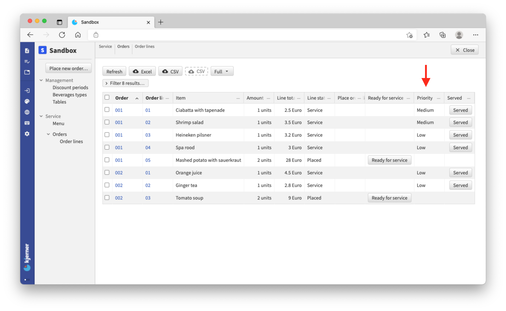

Only if an order is of order type `In-house` we would like to show the table to serve to when it's ready to be served. To achieve this we have to look at the states of both stategroups `Order type` and `Line status`:
```
'To serve': stategroup = switch ^ . 'Order type' (
	| 'Takeaway' => 'No' ( )
	| 'In-house' as $'in-house' => switch . 'Line status' (
		|'On hold' => 'No' ( )
		|'Placed' => 'No' ( )
		|'Service' => 'Yes' ( 'Table' = $'in-house' >'Table' )
		|'Served' => 'No' ( )
	)
) (
		'No' { }
		'Yes' {
			'Table': text -> ^ ^ ^ ^ .'Management' .'Tables'[] = parameter
		}
	)
```
This shows the table if `To serve` is `Yes`:

The main part again looks like structures we've seen before: The code has a state switches that switch on stategroups. The addition is between parenthesis. This is also known as a ***state parameter*** (similar to the command parameter) and with it we can supply a state with an additional piece of information from a node, in this case `Table`.
We temporarily stored the node of state `In-house` as `$'in-house'` and a few lines down in the model we want to follow the reference of `Table` within that node to appoint it to the state parameter `Table`. Then when we get to the state `Yes` we can derive the value of text property `Table` from the parameter, but first have to tell that this property is related to the collection `Tables` in group `Management` by providing a reference to it. 
By providing this reference, as part of the definition of `Table`, we 'close the loop' and make sure that the value of the derivation can only be of the same collection `Tables` as the text property `Table`. The compiler will check this 'reference loop' during compilation and if we by accident referenced for example another collection `Tables` it will throw an error. This makes the Alan platform very stable, since we have to be very clear about what data we expect at which part in the model.

Let's say we would also like to show the priority when stategroup `To serve` has state `Yes`. We do this for explanatory purposes, because the model it creates is not clean and it will show the priority in the table twice, but the structure it will show is interesting and important.
To achieve this it is required to have access to the node of state `Service` of stategroup `Line status`. Therfore add `$'service'` to the state `Service` in the state switch of stategroup `To serve`:
```
'To serve': stategroup = switch ^ . 'Order type' (
	| 'Takeaway' => 'No' ( )
	| 'In-house' as $'in-house' => switch . 'Line status' (
		|'On hold' => 'No' ( )
		|'Placed' => 'No' ( )
		|'Service' as $'service' => 'Yes' ( 'Table' = $'in-house' >'Table' )
		|'Served' => 'No' ( )
	)
) ( ... )
```
If we build the model like this the compiler will throw an error saying it can't find the named object `in-house`. We created another 'sticky note' `$'service'` on a lower level than the previous 'sticky note' `$'in-house'`. On this lower level the only reachable 'sticky note' is `$'service'`. It's like the 'sticky notes' are stacked and only the last one is visible. To get to a 'sticky note' defined on higher levels we need to jump up thos levels, but not like using the regular `^`, but by using `$^`. The temporarily stored nodes create a hierachy in itself.
Another thing to notice is that the names we gave to these temporarily stored nodes are only for human readability and have no meaning to the compiler. We could just as easily have used only `$`. 
Applying this new knowledge creates this:
```
'To serve': stategroup = switch ^ . 'Order type' (
	| 'Takeaway' => 'No' ( )
	| 'In-house' as $'in-house' => switch . 'Line status' (
		|'On hold' => 'No' ( )
		|'Placed' => 'No' ( )
		|'Service' as $'service' => 'Yes' ( 'Table' = $^ $'in-house' >'Table' ) // <--- !! $^
		|'Served' => 'No' ( )
	)
) ( ... )
```
Building the model now will show a problem, but it's only a warning, saying we didn't use `service`, so let's use it:
```
'To serve': stategroup = switch ^ . 'Order type' (
	| 'Takeaway' => 'No' ( )
	| 'In-house' as $'in-house' => switch . 'Line status' (
		|'On hold' => 'No' ( )
		|'Placed' => 'No' ( )
		|'Service' as $'service' => 'Yes' where 'Service' = $'service' ( 'Table' = $^ $'in-house' >'Table' ) // <--- !! where ...
		|'Served' => 'No' ( )
	)
) (
		'No' { }
		'Yes' where 'Service' -> .'Line status'?'Service' {						// <--- !! where ...
			'Table': text -> ^ ^ ^ ^ .'Management' .'Tables'[] = parameter
		}
)
```
We've seen `where` being used before, but then applied to a text property and now applied to a state. It serves as a *reference rule* here as well and further defines the state `Yes` by adding the reference to a node of state `Service`.

If we 'zoom out' and look at the structure:
```
'To serve': stategroup = switch ... (
	| ...
	| ... => switch ... (
		| ...
		| ...
		|'Service' as $'service' => 'Yes' where 'Service' = $'service' ( ... )
		...
	)
) (
		...
		'Yes' where 'Service' -> .'Line status'?'Service' {
			...
		}
)
```
We see:
- a state derivation within a state derivation (two times `switch`)
- in case of state `Service` temporarily store the node and 'do this': Initialize the state `Yes`
- state `Yes` with where rule and reference (to 'close the loop') and a node type definition ({ ... })

Now the node of state `Service` of stategroup `Line status` is available from within the state `Yes` of stategroup `To serve`. With a state switch we can determine the property `Priority` by deriving it from `Priority` within the node of this state `Service`:
```
'Yes' where 'Service' -> .'Line status'?'Service'
{
	'Table': text -> ^ ^ ^ ^ .'Management' .'Tables'[] = parameter
	'Priority': stategroup = switch .&'Service' .'Priority' (
		|'Low' => 'Low' ( )
		|'Medium' => 'Medium' ( )
		|'High' => 'High' ( )
	) (
		'Low' { }
		'Medium' { }
		'High' { }
	)
}
```
For referencing the reference rule (`where`) the ***&-symbol*** is used.
In our model we access the stategroup `Priority` of node `Service` by writing `.&'Service' .'Priority'`. The rest is a common state derivation.

By revisiting the Car example from the topic 'References', where we explained the where rule applied to a text property, we can show you why the notation `.&'where'` is used:
```
'Electric vehicles': collection ['Vehicle'] {
	'Vehicle': text
	'Color': text
	'Is': stategroup (
		'Fast' {
			'Top speed': number 'km/h'
		}
		'Slow' { }
	)
}

'Car': text -> .'Electric vehicles'[] // as $ (this is implicit)
	where 'fast' -> $ .'Is'?'Fast'

'Top speed': number 'km/h' = .'Car'&'fast' .'Top speed'
```
Here we used property `Car` with reference rule `fast` (this means `Car` can only have values of `Electric vehicles` that also have state `Fast`) to derive `Top speed` by using the notation `.'property'&'where'`.
Back to our model, since a state is not a property there is no property to refer to and therefore the notation becomes `.&'where'`.

Here is the result of ouw efforts in the app:
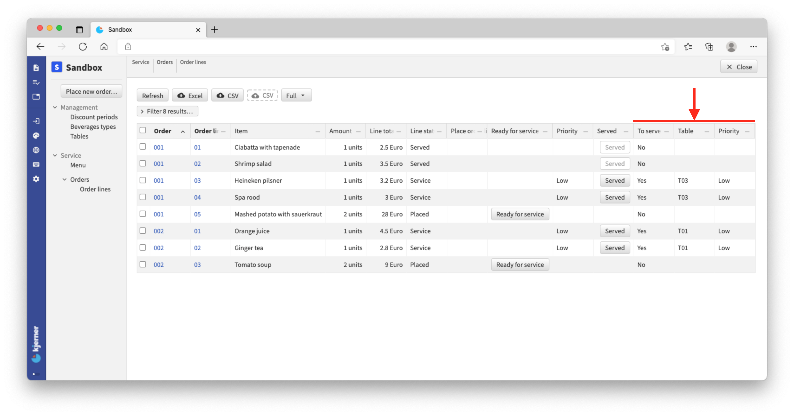

The example is a bit far fetched but it gives a preview into how intricate models can become.

<tutorial folder: ./_tutorial/step_09/>

## 19 More advanced references
We haven't even touched on the subject 'kitchen' yet. The kitchen is where ingredients are turned into dishes. Basic ingredients need to be in stock, prices of products need to be monitored, etc. Let's start easy and create a seperate group `Kitchen` (between `Management` and `Service`), a collection `Products` and a stategroup that show if a product is a basic ingredient or a composed product (for example a dish):
```
'Kitchen': group {
	'Products': collection ['Product'] {
		'Product': text
		'Product type': stategroup (
			'Basic ingredient' { }
			'Composed product' { }
		)
	}
}
```
If it's a basic ingredient (state `Basic ingredient`) we would like to register the purchase price and the amount this price refers to, for example 1000 grams of potato's cost 5 euro:
```
'Basic ingredient' {
	'Amount': number positive 'units'
	'Purchase price': number 'thousandth eurocent'
}
```
Also add the new numerical-type `thousandth eurocent`:
```
'thousandth eurocent'
	@numerical-type: (
		label: "Euro"
		decimals: 5
	)
```
This means a number like 500.000 will be represented as "Euro 5,00000". If later on the purchase cost of for example potato per unit is calculated, by dividing 500.000 by 1.000, the result ("Euro 0,00500") is accurate enough for further calculations.
A composed product consists of other composed products and/or basic ingredients, for example mashed potato with suaerkraut consists of a composed product potato mash and a basic ingredient sauerkraut. Potato mash consists of the basic ingredients potato, milk and butter in certain quantities. These products all exist as nodes on the same level within our collection `Products`:
- Mashed potato with sauerkraut (composed product)
- Sauerkraut (basic ingredient)
- Potato mash (composed product)
- Potato (basic ingredient)
- Milk (basic ingredient)
- Butter (basic ingredient)

If a products has state `Composed product` we want to know a cost price by adding the prices of the ingredients proportionally to the required amount. Let's first describe that composed products consist of products from the same collection:
```
'Composed product' {
	'Composed amount': number positive 'units'
	'Ingredients': collection ['Product'] {
		'Product': text -> ^ ^ ^ .'Products'[]
		'Amount': number 'units'
	}
}
```
Build your model and an error occurs:
>'property' `Products` is a self-reference, but a reference to a sibling is required.

What this means is exactly what we try to accomplish ( a self-reference), but the compiler doesn't comply and needs 'a reference to a sibling'. To understand this you first need to know that all nodes in the same collection are siblings: They all 'live' on the same level.
To refer to a node from within another node in the same collection we need to apply the word `sibling`:
```
'Composed product' {
	'Composed amount': number positive 'units'
	'Ingredients': collection ['Product'] {
		'Product': text -> ^ ^ sibling
		'Amount': number 'units'
	}
}
```
Be aware that we jump up two levels instead of the three (in the previous reference)! If we want to refer to a sibling a reference is needed to the level of the key of a collection, not to the level of the collection itself.
Next up is the calculation of a price, without taking into account the amount for now, to create the model step by step. Shown below is the group `Kitchen` we build sofar, including the cost price calculations:
```
'Kitchen': group {
	'Products': collection ['Product'] {
		'Product': text
		'Product type': stategroup (
			'Basic ingredient' {
				'Amount': number positive 'units'
				'Purchase price': number 'thousandth eurocent'
			}
			'Composed product' {
				'Composed amount': number positive 'units'
				'Ingredients': collection ['Product'] {
					'Product': text -> ^ ^ sibling
					'Amount': number 'units'
					'Price': number 'thousandth eurocent' = ( sibling ) >'Product' .'Cost price'
				}
			}
		)
		'Cost price': number 'thousandth eurocent' = ( sibling ) switch .'Product type' (
			|'Basic ingredient' as $'basic' => $'basic' .'Purchase price'
			|'Composed product' as $'composed' => sum $'composed' .'Ingredients'* .'Price'
		)
	}
}
```
The price of an ingredient of a composed product is determined by the price that is listed under that product's cost price. So: `'Price' ... = ... >'Product' .'Cost price'` points here:
```
'Products': collection ['Product'] {
	'Product': text
	'Product type': stategroup (
		'Basic ingredient' { ... }
		'Composed product' {
			...
			'Ingredients': collection ['Product'] {
				...
				'Price': number 'thousandth eurocent' = ( sibling ) >'Product' .'Cost price'	// ----> !!
			}
		}
	)
	'Cost price': number 'thousandth eurocent' = ( sibling ) switch .'Product type' (			// <---- !!
		...
	)
} 
```
And the cost price per product is derived from whether it's a `Basic ingredient` or a `Composed product`. Either we can simply use the `Purchase price` or we need to sum the prices of all the ingredients that make up the composed product: `sum $'composed' .'Ingredients'* .'Price'`.

So, in the example of mashed potato with sauerkraut (composed product) the cost price structure looks like this:
- Mashed potato with sauerkraut (composed product)
	- Sauerkraut (basic ingredient)
	- Potato mash (composed product)
		- Potato (basic ingredient)
		- Milk (basic ingredient)
		- Butter (basic ingredient)

And is detemined like this:
€<sub>mashed potato with sauerkraut</sub> = €<sub>sauerkraut</sub> + €<sub>potato mash</sub> = €<sub>sauerkraut</sub> + ( €<sub>potato</sub> + €<sub>milk</sub> + €<sub>butter</sub> )

Every time a derivation uses information from a sibling we need to tell the compiler it should look for a sibling by adding `( sibling )` (make sure you add the space before and after the word `sibling`!).
Let's build the model and find out another error occurs:
>no valid 'dependency location' found for 'property'. Unexpected 'relative object location':
	- expected:  'non sibling entity'
	- but found: 'sibling entity'

And the error points to `Cost price` in this line:
```
'Price': number 'thousandth eurocent' = ( sibling ) >'Product' .'Cost price'
```
`Sibling` in this line `'Product': text -> ^ ^ sibling` solves the problem of not being able to point at a node within the same collection (a user can now say potato mash consists of potato, milk and butter), but also creates a new problem: A user could potentially say that potato mash consists of potato which consists of potato mash, or even worse, that potato mash consists of potato mash itself! Without getting philosophical about whether this is correct or not on an existential level, if a computer would try to calculate the price of potato mash it would end up in an eternal calculation.
The kinds of calculations that use the result of the same calculation are called ***recursive computations***. Like a printer that prints on the back side of its just printed page. It's convenient, but not if it keeps doing that with the same sheet of paper. We'll end up with black pages and unreadable text. The printer needs to know when to stop turning the same sheet of paper and load a new sheet for the next printing step.
To avoid never ending calculations and still make use of the strength of these recursive calculations the Alan platform uses ***graph constraints***, a type of constraints that limits the kind of relations (***edges***) between nodes in a graph (a graph being for example a collection of nodes).
Two graph constraints are implemented on the Alan platform: The ***acyclic-graph*** and the ***ordered-graph***. The next image shows a visual representation of the definitions of these graph constraints:


An acyclic-graph constraint constrains nodes from forming a cycle: Every node can have links to (multiple) other nodes, but it's not allowed to be referenced back to itself. Any loop is forbidden.
An ordered-graph constraint is even more strict and constrains all nodes to one single chain, like a train with a locomotive (***source***) and a final wagon (***sink***). Obvious examples for an ordered-graph are the days in a month or months in a year: There is a first and a last and in between a consecutive order.

To be very explicit, these constraints do not prevent a user from entering or manipulating data like this:
- In a collection with acyclic-graph constraint:"Potatos consist of eggs and grapefruit, and eggs consist of potato mash and chicken soup"
- In a collection with ordered-graph constraint:"The year starts with month October and ends with month April"

It's the relations between the nodes in a collection that is constrained, not the content. Most computers have no concept of potato, grapefruit or chicken soup.

Continuing with our model, we need to add an acyclic-graph constraint. This is achieved like this:
```
'Kitchen': group {
	'Products': collection ['Product']
		'Assembly': acyclic-graph
	{ ... }
```
And the reference to a sibling needs to be added to this graph `Assembly`:
```
'Product': text -> ^ ^ sibling in ('Assembly')
```
The graph `Assembly` stores the relations (edges) between all the nodes and makes sure these remain acyclic. In the app either a user can't select the product that would create a cyclic graph or the app throws an error telling the user it can't save the selected settings.
Finally the derivations need to be aware of this acyclic-graph constraint and know which graph to consult when performing calculations (so it won't end up in a never ending loop):
```
'Price': number 'thousandth eurocent' = ( sibling in ^ ^ 'Assembly' ) >'Product' .'Cost price'
```
And:
```
'Cost price': number 'thousandth eurocent' = ( sibling in 'Assembly' ) switch .'Product type' (
	|'Basic ingredient' as $'basic' => $'basic' .'Purchase price'
	|'Composed product' as $'composed' => sum $'composed' .'Ingredients'* .'Price'
)
```

The app now looks like this:
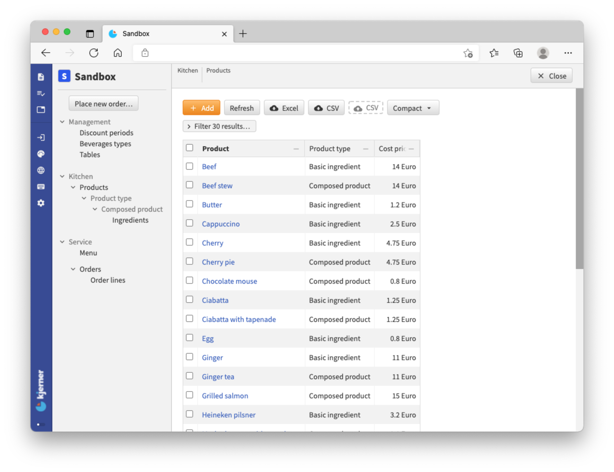

Let's take a look at `Potato mash`:

It consists of butter, milk and potato, each products that can also be found in the same collection `Products`. As expected there's something off with the price: It does not yet take into account the amounts. 
For each ingredient we would like to calculate the price for the amount that is used in the composed product. So we change the calculation of `Price` and add a calculation for `Price per unit` in collection `Ingredients`:
```
'Ingredients': collection ['Product'] {
	'Product': text -> ^ ^ sibling in ('Assembly')
	'Amount': number 'units'
	'Price per unit': number 'thousandth eurocent' = ( sibling in ^ ^ 'Assembly' ) division ( >'Product'.'Cost price' as 'thousandth eurocent' , >'Product'.'Amount' )
	'Price': number 'thousandth eurocent' = ( sibling in ^ ^ 'Assembly' ) product ( .'Price per unit' as 'thousandth eurocent' , .'Amount' )
}
```
The calculation `Price per unit` refers to `Amount` in the node type of the collection `Products`. This needs to be added and has a similar structure as the derivation of `Cost price`:
```
'Amount': number positive 'units' = ( sibling in 'Assembly' ) switch .'Product type' (
	|'Basic ingredient' as $'basic' => $'basic' .'Amount'
	|'Composed product' as $'composed' => $'composed' .'Composed amount'
)
```
`Price per unit` is determined by dividing the cost price of the ingredient by the (purchased) amount. `Price` is then the product of this `Price per unit` and the amount required in the composed product. The `Cost price` remains the same: `Purchased price` for basic ingredients and `Price` for composed products.
Amounts all have `units` for unit. This can be kilogram, gram, liter, pieces, etc. Deriving the amount of a composed product from its ingredients (similar to the derivation of the price) would require us to know specific volumes or masses of all the ingredients. Then we would be able to calculate how they add up to the weight or volume of the composed product. We won't get into this part in this tutorial. The units of a composed product need to be added by the user.

Be aware to also add to numerical-type `thousandth eurocent` the product and division conversion rules (in that order):
```
'thousandth eurocent'
	= 'thousandth eurocent' * 'units'
	= 'thousandth eurocent' / 'units'
	@numerical-type: (
		label: "Euro"
		decimals: 5
	)
```

Our potato mash now costs less, because the ingredients cost less:


To end this topic, we can add a stategroup `To be put on menu` in the collection `Products`, to specify for each product if it can be ordered by a customer:
```
'To be put on menu': stategroup (
	'Yes' { }
	'No' { }
)
```
In the collection `Menu` within group `Service` the key `Item name` now can refer to this collection `Products` and specifically to the state `Yes` of stategroup `To be put on menu`:
```
'Item name': text -> ^ ^ .'Kitchen' .'Products'[]
	where 'menu item' -> $ .'To be put on menu'?'Yes'
```
<sup>(Be aware: `as $` is implicit, after the reference constraint in the first line)</sup>

The definition of `Item name` is extended with a reference to the collection `Products` and a where rule that more specifically states that only products with the state `Yes` can be used as `Item name`.
If you want to add an item to the menu, you can now select from a list:


<tutorial folder: ./_tutorial/step_10/>

## The End
With this we like to end this introductory tutorial into the model language and hopefully begin your journey in the world of Alan. There is still a lot to discover. And "exercise makes perfect" (in Dutch:"Oefening baart kunst").
Enjoy!
