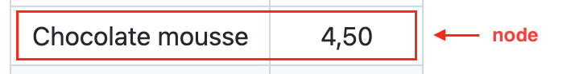
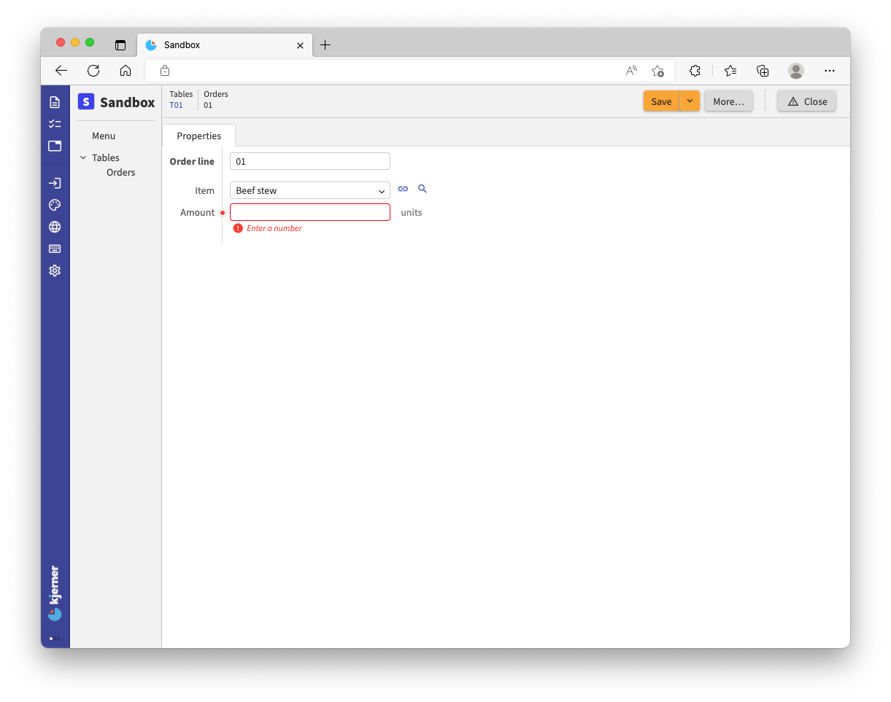
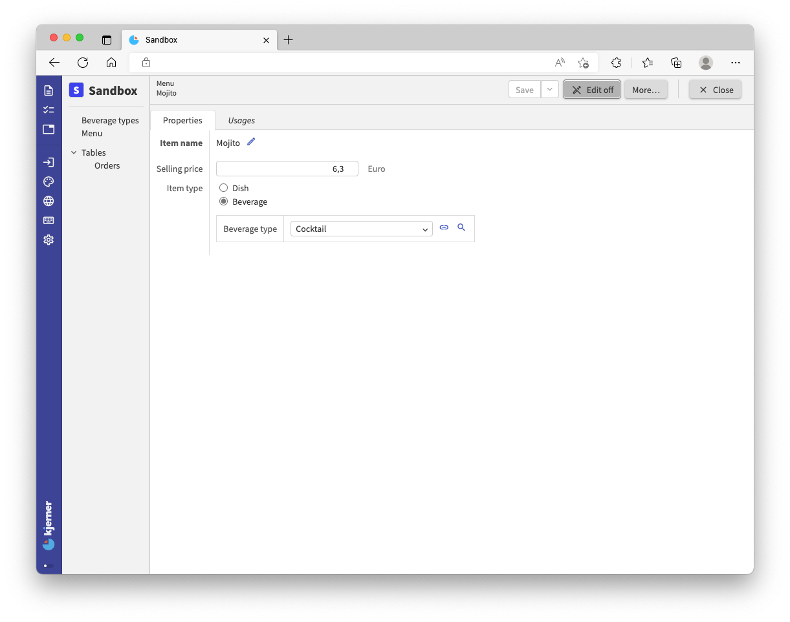
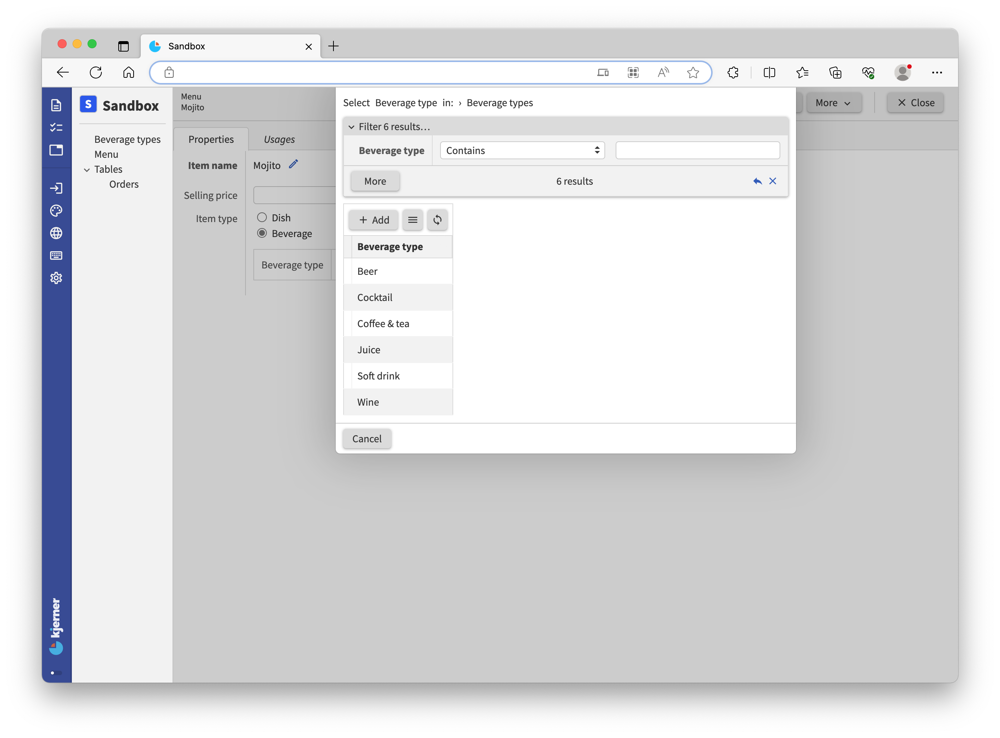

1. TOC
{:toc}

## Introduction
This tutorial aims to give you a basis for modeling data with the `application` language: the main language for building Alan apps.
Before you get started, make sure that you have completed the [IDE tutorial](/pages/tutorials/ide/ide-tutorial.html).

In the `application` language, you write `application` models.
An `application` *model* (an `application.alan` file) expresses all core parts of your application.
This includes -- but is not limited to -- the required data structure, computations, business processes, authentication and authorization.
You start by specifying the most basic ingredient of a data-intensive application: *base data*.
This is the primary data an application needs to work, like a menu which is essential for a meal ordering app.
Note that this includes *all states* that are important to your application, like the status of an order or a payment.
On top of the base data model, you express other aspects such as required permissions for reading a piece of data, or a [*todo* item](/pages/docs/model/{{ page.model_version }}/application/grammar.html#todo-items) for a rejected payment.

By means of a story we will take you along several topics and build up the model at the same time.
At the end of some topics, a reference to a tutorial folder is provided in case you need extra help to get the expected result. Enjoy!

Imagine you own a restaurant. Business is doing so well you start to feel you need to be more in control of what's going on, before chaos sets in.

Alan to the rescue!

Alan is a platform that provides a language to model your data and processes in a flexible, yet structured way.
From the model that you create, the Alan platform generates a fully fledged web application for entering data and reviewing the state of your restaurant.

So, let's dive in!

## Modeling data
A restaurant is nothing without a good menu. So, first, let's take a look at the menu that shows us all the good food and nice drinks you offer.

### Menu
{:.no_toc}

| *Appetizer* | *Price (€)* |
| :- | -: |
| Shrimp salad | 3,50 |
| Tomato soup | 4,50 |
| Ciabatta with tapenade | 2,50 |

| *Main course* | *Price (€)* |
| :- | -: |
| Beef stew | 18 |
| Grilled salmon | 16,50 |
| Mashed potato with sauerkraut | 14 |

| *Dessert* | *Price (€)* |
| :- | -: |
| Chocolate mousse | 4,50 |
| Vanilla ice cream | 3,50 |
| Cherry pie | 4 |

| *Drinks* | *Price (€)* |
| :- | -: |
| Orange juice | 4,50 |
| Spa rood | 3 |
| Heineken pilsner | 4,20 |
| Cappuccino | 3,50 |
| Mint tea | 3 |
| Mojito | 6,30 |

This menu shows 5 kinds of data:
1. The item that can be ordered (`Item name`)
2. The price per item in Euro (`Selling price`)
3. If it is a dish or a beverage (`Item type`)
4. The type of dish or beverage (`Dish type` / `Beverage type`)
5. And of course, that this collectively is a menu (`Menu`)

If we want to describe the data in this menu in an Alan application, we can start with an Alan model of a menu:
```js
'Menu': collection ['Item name'] {
	'Item name': text
	'Selling price': number 'euro'
}
```

This small, unfinished model tells us that a `Menu` is a **collection**: a collection of `Menu` items. Each menu item has an `Item name` and a `Selling price`. Each menu item can be uniquely identified by its `Item name`, like 'Chocolate mousse'. `['Item name']` after `collection` expresses that: `Item Name` is the **key attribute**. An `Item Name` such as 'Chocolate mousse' is a **key** of a `Menu` item.

A single `Menu` item consisting of an `Item name` and a `Selling price` is called a **node** (e.g. 'Chocolate mousse', '4,50'). So, a `Menu`-collection stores nodes (menu items). In the model, curly braces ( **{ ... }** ) and everything inbetween define the *type* of a node (`Menu` item).

`Item name` holds a value of type `text`: an `Item name` is a piece of text.

`Selling price` holds a value of type `number`. The meaning of the number is expressed as well: `euro`. A `Selling price` is a number representing a euro amount.

`Menu`, `Item name`, and `Selling Price` are **attributes** of a node. The keywords *collection*, *text* and *number* in a model express the **types** of the attributes. An *attribute type* specifies what kind of data an attribute can hold.

<!-- >Curly braces ( ***{ ... }*** ) describe the start and end of a **node type** definition. A *node type* defines the types of data and its structure in a node. -->




## The minimal model
Let's make an app from the `Menu` model.
For that we need the following code in our `./models/model/application.alan` file.
Let's open it up, and put down the following code that describes the main sections of an `application` model:
```js

```

This is the ***minimal model*** that is needed for every application that you build on the Alan platform.

The `users` section defines who can access your application and how.
We use `anonymous` for now, which means that anyone can access your app and read and edit the app data.
In the [application language documentation](/pages/docs/model/{{ page.model_version }}/application/grammar.html) you can find more details about the `users` section.

The `interfaces` section defines what other apps and/or databases this app is connected with.
For now we stay 'disconnected' from other apps and databases.

The `root { }` section defines the *root node type*, as you can guess by the curly braces.
This is where you start modeling your application: a single `root` node holds all application data.
Paste the `Menu` model that we created earlier, between the braces.

The `numerical-types` section defines which units are used in your application and how to interpret them.
We use `'euro'` as the unit for the `Selling price` of a `Menu` item, so let's add `'euro'` to the numerical types.

Our model should now look like this:
```js

```

By the way, when you type Alan code, make sure to use **whitespace between keywords**, and **tabs for indentation**!
Otherwise, the compiler will start complaining.

## Deploying the app
How to get this app up and running? The model needs to be processed to produce executable code for a server.
This is done by a ***compiler*** that is part of the Alan platform tools.
You can download the platform tools by clicking `Alan Fetch` in VS Code, or by running `./alan fetch` from the command line.
`Alan Fetch` uses the `versions.json` file in your project root to determine which versions of the tools are needed.

When `Alan Fetch` is done, you can ***build*** (compile) an application by clicking the button `Alan Build` or running `./alan build` from the command line.
If your model and other parts of your Alan project are valid, the compiler shows no errors.
After editing your model, you need to run Alan build again to see if the model is still valid.
Note that if you build your application regularly, it is easier to troubleshoot errors.

When you can successfully build your application, you can run `Alan Deploy` to transform your project into an app, ready for you to be used.
When clicking `Alan Deploy`, you get a menu where you can choose a *'data source for this deployment'*.
For your first deployment, select the **empty** option.
Throughout this tutorial, we supply migrations that enable you to use the **migrate** option.
This option also enables you to retain application data from a running app, as explained in the [migrations guide](/pages/tutorials/migrations/{{ page.platform_version }}/migrations.html).

---

If you ever get stuck with migrations or deployments:
- remove your `./migrations` folder
- click `Alan Deploy`, and choose the **empty** option
- click `Alan Deploy` again, and now choose the **migrate** option

That should provide you with a clean slate for continuing with the tutorial.

---

When opening your app in a webbrowser (we assume you use a chromium-based browser) it should look like this when clicking `Menu` in the left column, except that there will be no data:


Add some `Menu` items to familiarize yourself with the *Graphical User Interface* (GUI).
Click **Add** to start adding a new item.
Then, fill in the required fields for the item.
Click **Save** and **Close** (top right corner) when you're done.
This will bring you back to the `Menu` table, where you can add more items and modify existing ones.

For this tutorial, we use test data from the `_docs` folder, such that you do not start with an empty app after updating your model.
For that:
- click `Alan Deploy` and choose the 'migrate' option to create the folder `migrations/from_release`,
- open the `migration.alan` file for the relevant tutorial step in `_docs/tutorials/restaurant1/{{ page.platform_version }}/`: `step_01/migration/migration.alan` for the current step,
- copy the contents of the `migration.alan` file to the clipboard,
- paste the clipboard contents in `migrations/from-release/migration.alan`, overwriting the existing file contents.
- click `Alan Deploy` and choose the 'migrate' option again.
After succesful deployment, you can find the data in your app.

> <tutorial folder: `./_docs/tutorials/restaurant1/{{ page.platform_version }}/step_01/`>

## Numerical-types
Maybe you've noticed that when you enter a number with decimals, the price is rounded to a whole number:


That is because internally, Alan only stores whole numbers.
You have to use a numerical type that describes the accuracy that you want.
Then you can tweak the GUI such that decimals work as well.

Go back to your model, change `euro` at the `Selling price` to `eurocent`, and make sure your `numerical-types` section looks like this:
```js

```

The `@numerical-type:` part is a GUI annotation; an instruction for the graphical user interface of your app.
We can specify the label that we want to see if we want it to be different from the label of the numerical-type (here `Euro` instead of `eurocent`).
Furthermore, we can specify the number of decimals that the user can enter: 2 as the accuracy is `eurocent`.
There's much more to numerical types, but we'll leave it at this for now.

<sup>For a better understanding of the syntax, read the [syntax guide](/pages/tuts/syntax.html).</sup>

## Stategroups
For our `Menu` items, we want our application to store some additional information.
For example, we want to store if an item is a dish or a beverage.
For that, we add an `Item type` to our model:
```js

```
An `Item type` is a stategroup attribute, which holds a choice between states: `Dish` or `Beverage`.
Notice that you can specify attributes specific to `Dish` and `Beverage` in your model between the curly braces.
So, depending on the state that a user chooses, different data will be stored.

For example, a dish can be an appetizer, main course, or dessert.
This again is a choice, so let's make the states available by adding the attribute `Dish type` of type `stategroup` to the state type `Dish`.
In addition, let's do something similar for `Beverages`, such that we can neatly organize menu items in our application:
```js

```

Alan `application` models are hierarchical models specifying a hierarchical dataset: the `root` node holds a collection of `Menu` items.
Each `Menu` item (a node) has an `Item type` which can be `Dish` or `Beverage`.
`Dish` and `Beverage` are nodes which hold a `Dish type` and `Beverage type`, respectively.
The value of `Dish type` can be `Appetizer`, `Main course`, `Dessert`.
Similarly the `Beverage type` can be `Juice` or one of the other possible states that the model specifies.

> <tutorial folder: `./_docs/tutorials/restaurant1/{{ page.platform_version }}/step_02/`>

Build and deploy to find out what stategroups and numerical types do for your app. But, before you deploy, make sure to copy the `migration.alan` file from the tutorial folder to `migrations/from-release/migration.alan`, as explained before. Then choose the deployment option **migrate**, which will use the copied `migration.alan` file. Remember to repeat this process in subsequent steps of the tutorial.

In your updated application, set the view to **Full** to see all columns:


The table now has a few more columns.
If you add an item yourself you'll see radio buttons and a drop-down for choosing states for the added stategroup attributes:


## Built-in attribute types
Our restaurant is more than just a menu. We also have `Tables`; let's express that in our model:
```js

```

Don't forget to add `chairs` and `units` to the `numerical-types`, as these numerical types are new to the model:
```js

```

Deploy and check the app in your browser: click `Tables` in the left menu bar. `Table number`'s and corresponding `Seatings` are already there:


In the left column we see that `Tables` is parent to the child `Orders`, just like in our model:
 we have specified a collection attribute `Tables` that nests a collection attribute `Orders`.
This means that in the app, each `Tables` item has its own collection of `Orders`.
An `Orders` collection holds order lines.
An `Order line` describes an order for a specific `Item` with an ordered `Amount`:

| *Order line* | *Item* | *Amount* |
| :- | :- | -: |
| 01 | Orange juice | 2 |
| 02 | Tomato soup | 2 |
| 03 | Beef stew | 2 |
| 04 | Chocolate mousse | 1 |
| 05 | Cappuccino | 1 |

> <tutorial folder: `./_docs/tutorials/restaurant1/{{ page.platform_version }}/step_03/`>

---

### Overview of attribute types
{:.no_toc}
The application language supports six built-in attribute types.
- A ***text*** attribute holds an unbounded string value (e.g. *"this is text"*).
- A ***number*** attribute holds an integer value (e.g. *31415927*).
- A ***file*** attribute holds two unbounded string values representing a file token and a file extension (e.g. *"screenshot"* and *"png"*).
- A ***collection*** attribute holds a map of key-value pairs. Keys are string values that have to be unique such that we can reference them unambiguously. Keys are implicitly defined for collection attributes; values are nodes of an inline defined type (e.g. `{"001"; "Eggs"; 6; 'stired', 'fried'; 'omelette.jpg'}`).
- A ***stategroup*** attribute holds a value indicating a state. States are alternatives to a property that a state group attribute indicates, such as `'Main course'`.
- A ***group*** attribute holds a node of an inline defined node type. Group attributes add structure by grouping other attributes that belong together or share permission requirements, which we'll discuss later in this tutorial.

## References
There's an interesting line in the model that needs our attention:
```js
'Item': text -> ^ ^ .'Menu'[]
```
This line says that an `Item` on an order from a table refers to a `Menu` item.
First, let's see what this means for our application.

Click on `Tables` on the left hand side.
Click table "T01" from the list (shown in the previous image) and then click the **Add** button next to `Orders`:


Enter an `Order line`, like "01" since its the first order from this table:


Now, click the magnifying glass next to the field for `Item` and you'll see this:


Here we see the items from the `Menu` and we can choose an item from the table.
Or, if we start typing in the box `Item name`, the table will be filtered.
We can only choose an item that is in the table.
When we click an item, the `Item name` from the item we clicked will be placed in the text field.



As explained above, the `Item name` is the key value of the `Menu` item.
It uniquely identifies a `Menu` item, and we can therefore use it to unambiguously reference an item.
With the lock-symbol you can now follow the reference from `Beef stew` to the actual `Menu` item.

Notice that the field for `Item` must contain the `Item name` of a `Menu` item such as `Beef stew`.
Other values are not accepted by your application.
This is because in our model, we have used this arrow keyword `->`, which is for **mandatory** references (also: constraints).

The navigation expression that follows the `->` in the model, expresses how the application can find the collection holding `Menu` items.
The keyword `^` tells the application to go to the parent node.
For an `Orders` item "01" (a node), the parent node is a `Tables` item "T01" (which is also a node).
Then we have another `^`, so the application knows that another parent step is required: from the `Tables` item to the `root` node. The `root` node holds the `Menu` items.
To instruct the application to look in that collection, the expression concludes with `.'Menu'[]`.
Which means: look up the `Item` value in the `Menu` collection.

In a model you can just count opening curly braces (`{`) above an expression to see where a series of `^` leads to, as each curly brace corresponds to a node in your application when navigating from a child node to a parent node:
```js

```

> **In summary**, the expression states that `Item` is a text value and references a `Menu` item. Therefore, the text value of an item has to equal the `Item name` (key value) of a `Menu` item.

---

Entering an amount, clicking `Save` and then `Close` gives this result:


Sometimes you may want references to be *optional* rather than *mandatory*.
When you import data from other apps this is necessary, as you can typically not force those apps to respect your wishes concerning your text values.
For **optional references**, you use the keyword **~>** (tilde arrow) instead of **->** (dash arrow).

## States versus references
Hopefully by now you can 'read' this model and understand its components and structure.
Meanwhile our restaurant is in full swing, so no time to waste!

You may have noticed in your restaurant that having a fixed set of beverage types is impractical.
Let's change that by supporting a dynamic set of beverage types.
For that, you need to remove the code for the `Beverage type` attribute, and express that you have a collection of `Beverages types` instead.

As we still want to be able to select a `Beverage type` when we compose our `Menu`, we need to be able to reference a `Beverages types` item from the state `Beverage` in our model.
```js

```

Notice that we place `Beverage types` above the `Menu`.
That is quite logical as `Beverage types` should be entered before creating a `Menu`, but the compiler requires it as well.
By default, expressions in an `application` model point to earlier defined attributes.
This is important for the guarantees that the language gives you, which we discuss in the [docs](/pages/docs/model/{{ page.model_version }}/application/grammar.html).

Again, build and check your app, selecting `Beverage types` from the left menu bar:


Now you are free to add or adjust the `Beverage types` you have in your restaurant while also being able to use them in your menu setup:


Click on 'Mojito', click on the **Edit** button (top right):



and finally hit the magnifying glass on the right side of `Beverage type`:



Here, we can choose the `Beverage type` of 'Mojito'. The collection `Beverages types` is shown, just like the `Menu` items earlier in this tutorial.

> <tutorial folder: `./_docs/tutorials/restaurant1/{{ page.platform_version }}/step_04/`>

## Next
This concludes the introductory tutorial into the `application` language, and hopefully begins your journey in the world of Alan.
If you have any questions or comments about the tutorial or the platform, feel free to post on the [forum](https://forum.alan-platform.com/)!

In this tutorial, we've only touched the basics: you can now create your own data model and generate an app for it.
A few words of advice for when you feel ready to start building your own application:
- ***Begin with the end in mind***. What is the purpose of your app and what data is required to support this purpose? How can you organize the data in collections?
- ***Experiment***. Just try it! If something does not work exactly the way you want or expect, you can easily restructure and reuse parts of the model you have already created.

But, there is still a lot to discover.
In [Tutorial C: a Restaurant app, Part II](/pages/tutorials/model/{{ page.platform_version }}/application-tutorial2.html) we discuss derived values, inverse references, commands, and more.
