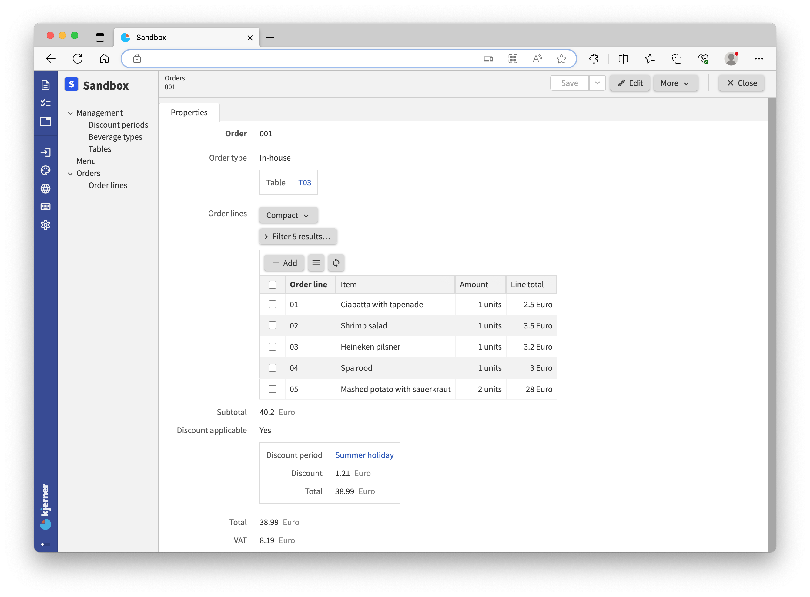
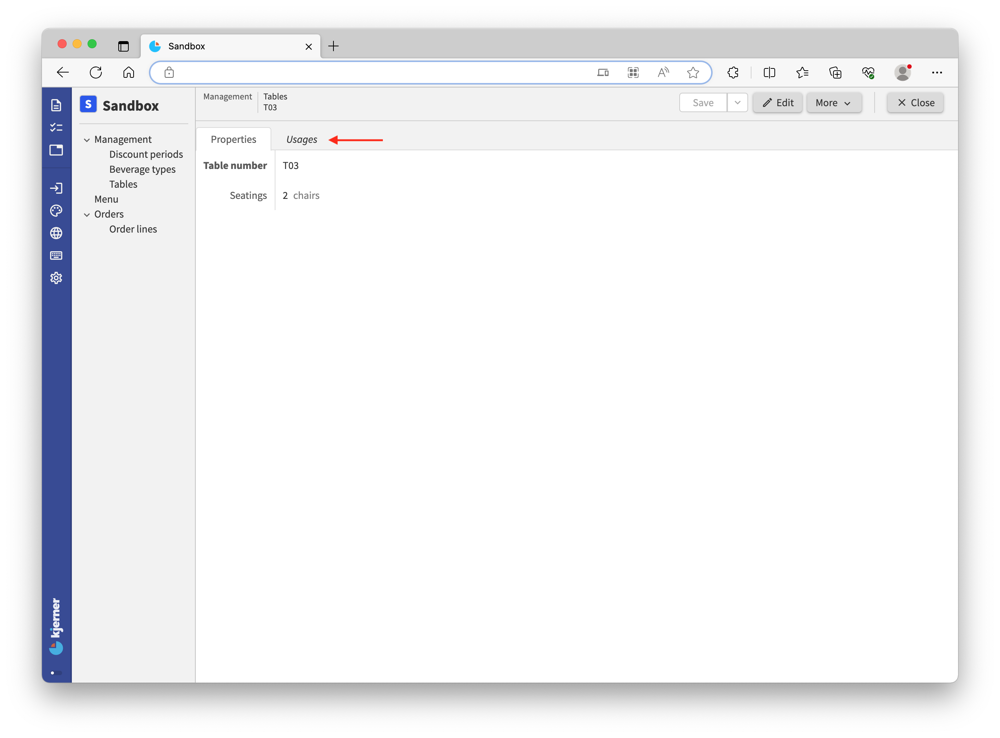

1. TOC
{:toc}

## Introduction
This is the second part of the application language tutorial where we build a restaurant app.
Make sure that you have completed [the first part](/pages/tutorials/model/{{ page.platform_version }}/application-tutorial.html) before continuing.

Let's recap: in the first part, we wrote a small data model for our restaurant.
From that data model, we generated a web application for entering a menu, tables, and orders.
In this second part you will learn about [derived values](#derived-values) and [commands & actions](#commands-and-actions).

## Take-away
You decided that your restaurant will also provide a take-away service.
For that, we have to make adjustments to the model.
Let's see what is needed.

`Orders` will no longer be part of `Tables`: we can have `Orders` without `Tables`.
But, for an `Order`, we do want to know if it is a `Takeaway` order, or if it is an `In-house` order for a table.
For that, we add an `Order type`.

So, we rewrite this piece of code:
```js

```

to this:
```js

```

What changed?
- We moved `Orders` one level up, to the `root`.
- Previously, we had a list of `Order lines` per table.
That is inconvenient, because we want to know which `Order lines` belong to the same order.
Therefore, we updated our model to express that `Orders` have a collection of `Order lines`.
- We've added a stategroup `Order type` with two possible states: `Takeaway` or `In-house`
- For `In-house` `Orders`, we also want to know for which `Table` they are. Therefore, `In-house` orders now have a `Table` attribute, that references a `Tables` item.

## Derived values
Our customers have to pay us, and for that we need to compute the cost of their orders.
Let's start with a `Line total`: the cost of a single `Order line`.
The `Line total` of an `Order line` is a derived value, computed from the (base values) `Amount` and the `Selling price`:
```js

```
After `units` for the `Line total` we have have written a formula for deriving the `Line total` of an `Order line`.
The formula (derivation expression) expresses that the `Line total` is computed by multiplying (taking the `product` of) the `Amount` by `Selling price`.

For retrieving the `Selling price` of the `Item` we use the notation `>'Item'`.
That means, starting at the `Order lines` node, follow the `Item` reference (expressed by `-> ^ ^ .'Menu'[]`).
So, at runtime, `>'Item'` gives us the `Menu` item that corresponds to an `Order line`.

After `Selling price`, there is some special code: `as 'units'`.
To explain what this means and for the health of our model we need to add this line:
`= 'units' * 'eurocent'` below `euro` so our `numerical-types` section now looks like this:
```js

```
The `as` keyword is followed by a ***product conversion rule***.
Such a rule describes how `numerical-types` of the two properties are multiplied, like `unit` and `euro`.
So the general format of a *product conversion rule* is `= 'num-type1' * 'num-type2'`.
The first part (`'num-type1'`) is wat we mention after the keyword `as`.
For a `division` the `as` keyword is followed by a ***division conversion rule*** indicated by the `/` in place of the `*` keyword.
<sub>NOTE: for future versions of Alan, we plan to let the compiler infer this.</sub>


For converting number values with a constant factor, you can use the `from` keyword followed by the name of a ***singular conversion rule***, like `'diameter'`:
```js

```
In the example, `diameter` refers to the *singular conversion rule* on the last line.

Conversion rules ensure that `numerical-types` for derived values are correct.
Also, they enable reuse of (singular) conversions.

---

Let's add another useful line to the model:
```js
'Total': number 'eurocent' = sum .'Order lines'* .'Line total'
```

This line expresses that `Total` is the sum of the `Line total` from a set of `Order lines`.
For that purpose, the expression starts with the keyword `sum`, followed by a path that produces a set of numbers to sum.
The grammar calls this an [`object set path`](/pages/docs/model/{{ page.model_version }}/application/grammar.html#grammar-rule--object-set-path).
The `object set path` starts with navigation steps that lead to a `collection`: `.'Order lines'`.
Subsequently, the keyword `*` expresses expansion of the `collection` to a set of objects: `Order line` nodes.
The expression concludes with a value path (`.'Line total'`) expressing which value from each `Order line` should be retrieved.

Can you determine where the line needs to go? Spoiler alert: answer ahead...

So now our whole model looks like this:
```js

```

And at runtime (in your app) it looks like this:


Note that operations such as `sum` work on both a set of values as well as on a list of values.
For summing a list of separate values, you use parentheses after the `sum` keyword, as we did for `product`:
```js
sum ( .'value A', .'value B', .'value C', .'value D' )
```

The supported operations for deriving number values can be found [here](/pages/docs/model/{{ page.model_version }}/application/grammar.html#derived-numbers).
- `sum`: determines the sum of a *set or list* of values
- `min`: determines the minimum of a *set or list* of values
- `max`: determines the maximum of a *set or list* of values
- `std`: determines the standard deviation of a set of values
- `count`: counts the number of values in a set
- `remainder`: computes the remainder of a division (10 mod 3 = 1)
- `division`: computes the division of two numbers
- `add`: computes the addition of two numbers
- `diff 'date'`: computes the difference of two (relative!) numbers, for example the difference between two dates or two temperatures

Examples of absolute and relative numbers:
- (number of) days: absolute, "28 days"
- date: relative, "28-7-2021"
- years: absolute, "5 years"
- year: relative, "2021"
- degrees: absolute, "21 degrees"
- temperature: relative, "21˚C"
- seconds, minutes, hours: absolute, "2 hours, 35 minutes and 8 seconds" (duration)
- time of day or 'the time': relative "14:35:08"

So far we've seen number derivations, but we can also derive other types of data.


> <tutorial folder: `./_docs/tutorials/restaurant1/{{ page.platform_version }}/step_04a/`>

## Growing our business
Our restaurant business is growing.
Many people are now working with our app, and its time for some reorganization.
We have more permanent data that only `Management` should touch, and we want to show that in our application.
For that, we express a group called `Management` at the top of the model.
This group captures a new collection `Discount periods`, a `VAT percentage`, and the existing collections `Beverages types` and `Tables` as shown below.

When rebuilding the app, you'll get some **errors** saying the compiler can't find certain properties.
Correct the errors according to the changes made, by adding missing navigation steps such as `.'Management'`.

```js

```

The `VAT percentage` will be used for computing the value added tax (VAT).
For the `VAT percentage`, we also have to add a numerical type to the `numerical-types` section in the model:
```js
'percent'
```

The `Discount periods` are for discounts during different time periods, where the discount depends on the amount of money spent at the restaurant.

Rename the attribute `Total` for `Orders` to `Subtotal`:
```js
'Subtotal': number 'eurocent' = sum .'Order lines'* .'Line total'
```
The actual `Total` cost will depend on a discount when applicable.

> <tutorial folder: `./_docs/tutorials/restaurant1/{{ page.platform_version }}/step_05/`>

## Conditional expressions
Now, let's add a stategroup `Discount applicable` to `Orders`.
Note that we also need to update the `numerical-types` section with the new numerical type `fraction`, a corresponding product conversion rule, and a singular conversion rule `percent`:
```js

```

With this model extension, you can apply a discount by selecting a `Discount period` from the previously added collection `Discount periods`.
For example, selecting 'Summer holiday' will give a 3% discount on spendings over €35.
If a discount is applicable (state `Yes`) and a `Discount period` is selected, the `Discount` will be computed after saving your changes, as follows:
- Compare the `Subtotal` with the `Minimal spendings` that belong to the selected `Discount period`
- If `Subtotal` is smaller than `Minimal spendings` then `Discount` will be equal to 0
- If `Subtotal` is bigger than or equal to `Minimal spendings` then the `Discount` will be computed using the corresponding `Percentage`.
The `Percentage` is first converted from `percent` to `fraction` (from 3% to 0.03).
The `Discount` is then computed as the `product` of the computed `fraction` and the `Subtotal`.

The `Total` cost is computed by subtracting `Discount` from the `Subtotal` using the `sum` operation and a sign inversion (`-`).


With the `switch` expression for the `Discount`, you switch on the comparison (`compare`) result of two numbers.
We can match against the following possible results for the comparison:
- 'greater than' (`>`)
- 'greater than or equal to' (`>=`)
- 'less than' (`<`)
- 'less than or equal to' (`<=`)
- 'equal to' (`==`)
- 'less than or greater than' (`<>`)

Cases may not overlap, so you cannot match against `<` as well as `<=`.

---

Let's take a look at the app and enter an order:

An order with a subtotal of €40,20 receives a discount of 3% when spending €35 or more during the summer holiday.

Now, let's compute the tax (`VAT`).
To do this we need to know the `Total` cost and take a percentage of it.
But, the actual `Total` cost of an `Orders` item depends on whether a discount was applied or not.
For that purpose, we use a `switch` statement for switching on the state of a stategroup attribute, after which we can compute the `VAT` from the `Total` of the order:
```js

```

For computing the `Total`, we `switch` on the state of `Discount applicable`.
In case of state `Yes` we use a special instruction `as $'discount'`.
This stores the `Yes` node under the name `$'discount'`.
Because of that, we can refer to it in the remaining part of the expression (and only there): `$'discount'.'Total'`.
We call this a **named object** (or constant variable).

Here's the result of our work:


For each property type that the `application` language supports, the language also supports expressing for deriving such values.
So, you can derive text values, file values, references, stategroup states, and even collections.
You can find many examples in the `application` language [documentation](/pages/docs/model/{{ page.model_version }}/application/grammar.html#derived-values).

> <tutorial folder: `./_docs/tutorials/restaurant1/{{ page.platform_version }}/step_06/`>


## Usages and reference sets
References are by default unidirectional.
However, it is often useful to 'invert' those references: for `Tables` we may want to know which `Orders` have been placed for it.

You may have noticed the `Usages` button in your app, when viewing a `Tables` item.
Clicking on `Usages`, gives you a screen with exactly that information: which `Orders` were placed for the `Tables` item.

Let's try that with a new order.
Select `Orders` **in the left column** and click **'Add'** (note that you can currently not **'Add'** items from the Usages screen directly):


Insert '001' as the order number, choose `In-house` and select a table.
Just for fun, add some order lines as well:


Now, hit `Save`!
Go to `Tables`, pick the table you selected when placing the order and click `Usages`:



We can see that in our version `Order` '001' is using table 'T03':


If we click the order, we jump to the order with its order lines.

---
In the web app, we have this nice 'Usages' screen.
The web app computes these screens for us.
However, we cannot use these 'Usages' in computations.
For that, we need bidirectional references.

You can turn unidirectional references into bidirectional references with a **reference set**.
A *reference set* holds inverse references, which are identical to the usages that we just saw.
Let's add that reference set, and some derivations that use it:
```js

```

Now, build it and take a look at the app.
For each `Tables` node we can now see how many `Orders` have been placed at that table.
Furthermore, we can see the `Total order value` for the `Orders` placed at a specific table.
Nice stats that may enable us to optimize the placement of our `Tables`.

For expressing the reference set, we use a special keyword `downstream` followed by a navigation path.
The keyword `downstream` indicates that the reference-set holds references to nodes that are later defined in your model.
For normal references that use reference later defined attributes, it is required as well.
In our experience, well designed application models rarely require the `downstream`, except for `reference-set` attributes.
If the `downstream` keyword is required, you can often reorder properties in your model to prevent it.
In other cases, we often find that a model contains a dependency that requires our attention/should be changed.

The navigation path contains the keyword `*` instead of `[]` that we saw for unidirectional references.
That is because multiple `Orders` can reference the same table; the `reference-set` for a specific table will hold *all* `Orders` that refer to that specific table.
Finally we say: take the `inverse` of the `Table` reference that you find under `In-house`.

> <tutorial folder: `./_docs/tutorials/restaurant1/{{ page.platform_version }}/step_06a/`>

## Commands and actions
When we build Alan applications, we often connect them to other systems that send information.
For example, suppose that we need to connect our restaurant application to a third party app for placing orders.
We then typically define an Alan `interface` (which looks a lot like an `application`), expressing which commands the third party app can send.
For example, a command `Place new order` for placing a new order.

Our app needs to implement the `Place new order` command for it to work.
We do that with `application` language.

<sup>
NOTE: discussing the Alan `interface` language goes beyond the scope of this tutorial.
If you would like to see a tutorial about the Alan `interface` language, and interconnecting multiple different applications, please let us know on the [forum](https://forum.alan-platform.com).
</sup>

Alternatively, we need a user interfaces that works well on a mobile device with clickable buttons to execute operations.
In addition, users may need to perform multiple different operations on data in sequential manner to complete a task.
For that purpose, Alan supports `action`'s.

Commands and actions are nearly identical with regard to how you express them.
But, commands are executed on the server, whereas actions are executed on the client (by your web application).
Which of the two you should choose depends entirely on your use case, as illustrated above.

Now let's look at our implementation of `Place new order` for the third party app:
```js

```

That's a lot to take in!
Let's take a look at the result in the webbrowser.
Add the code to your model at the bottom, on the `root` type.
Then, build the app and go to your browser.
In the left column a button 'Place new order...' appears:


The title of this button corresponds to the label of our command: `Place new order`
Click it and fill in the fields, for example like this:


Now click `Place new order` below the form and then click `Cancel` (to cancel next order entry).
Then go to `Orders` and select your order:


We have successfully added an order to the `Orders` collection by filling out the requested fields in the form.
If you closely inspect the example, you can see that the choice for `At the restaurant` in answer to the question `Where is the meal consumed?` is translated into the state `In-house` of stategroup `Order type`.

Let's take a closer look at our code for the command.
The first part of the command looks a lot like a data model.
And that is what it is: for expressing the required parameters (fields) for a command, we define a small data model:
```js

```

In this small data model (known as command parameters) inside our main model, we can express references to the main model, like `-> ^ ^ .'Tables'[]`.
The navigation expressions in these command parameters are evaluated with respect to their place within this parameter node, just like for references in our main model. Navigation within and out of this parameter node behaves similarly to any other node in our model.

If instead we have a command called `Remove order line` for `Orders`, we will get a button when opening an `Orders` item. When picking a `Line` from the `Order lines`, we can choose from the lines from the open `Orders` item. Navigation expressions are again evaluated with respect to their place within the parameter node.
```js

```

If needed, you can also express references inside the command parameters with a regular node path.

The parameter node is given a named object by defining `as $'param'`. With this `$'param'` the properties within the parameter node can be referenced.

After the parameter node and naming the node with a named object, we express the operations that are to be performed, like:
```js
... => update .'Orders' ...
```
The double arrow can be read as 'do'.
The keyword `update` expresses that we want to update an attribute.
The path that follows resolves to the attribute value that we want to update: the collection of `Orders`.

Instead of update we can also use these keywords: `switch`, `ignore`, `walk`, `execute`, and `external`, just so you know that there are multiple options.
Let's stick with `update` for now, as we want to update the specified collection with provided data.

The command implementation concludes with:
```js
		... = create ( ... )
```
This tells us what the update should be about: 'the update is (`=`) the creation (`create`) of a node.
Instead of `create`, you can also use `ensure`.
`Create` will check if an entry in the target collection with the provided key already exists, and rejects the whole command if that's the case.
The `ensure` operation does not fail. It creates the node, or otherwise overwrites values in the way that you specify in your model.

The part between the parentheses of keyword `create` reads:
```js

```
This part expresses how the new order is constructed from the command parameters.
For example, the attribute `Order` will hold whatever the external app provides for `Provide an order number`.
Note that we use the named object `$'param'` here multiple times to reference the parameter node (the dataset that conforms to our mini model).

> <tutorial folder: `./_docs/tutorials/restaurant1/{{ page.platform_version }}/step_06b/`>

## The End
This concludes the tutorial into the `application` language, at least for now: there is more to follow.
For a sneak preview, you can take a look at the additional tutorial folders we provided, and see if you can understand the models yourself.
The [documentation](/pages/docs/model/{{ page.model_version }}/application/grammar.html) can also help you a lot there, and don't forget about the [forum](https://forum.alan-platform.com/)!

Have fun building your own applications, and don't forget: **begin with the end in mind** and **experiment**!
