1. TOC
{:toc}

## Introduction
This tutorial teaches you to model data with the `application` language, the main language for building Alan apps.
Complete the [IDE tutorial](/pages/tutorials/ide/ide-tutorial.html) first, so that you have a project to work in.

In the `application` language you write an `application` *model*: the file `models/model/application.alan`.
That model expresses the core of your application: the structure of the data, computations over it, business processes, and who may see and change what.
You start with the most basic ingredient of a data-intensive application: *base data*.
Base data is the primary data an application needs to work, such as the menu of a meal ordering app.
It includes *all states* that matter to the application, such as the status of an order or a payment.
On top of the base data you express further aspects, such as the permissions required to read a piece of data, or a [*todo* item](/pages/docs/model/{{ page.model_version }}/application/grammar.html#todo-items) for a rejected payment.

The tutorial follows one story and extends one model step by step.
Most topics end with a reference to a tutorial folder in your project, so you can compare your model with the expected result.

The story: you own a restaurant. Business is going well, and you want to stay in control of what is going on before chaos sets in.

Alan is a platform with a language for modeling data and processes in a flexible, yet structured way.
From the model you write, the platform generates a complete web application for entering data and reviewing the state of your restaurant.
You never write the application itself; you describe what the data is, and the platform builds the app around it.

## Modeling data
A restaurant is nothing without a good menu, so start there.

### Menu
{:.no_toc}

| *Appetizer* | *Price (€)* |
| :- | -: |
| Shrimp salad | 3.50 |
| Tomato soup | 4.50 |
| Ciabatta with tapenade | 2.50 |

| *Main course* | *Price (€)* |
| :- | -: |
| Beef stew | 18 |
| Grilled salmon | 16.50 |
| Mashed potato with sauerkraut | 14 |

| *Dessert* | *Price (€)* |
| :- | -: |
| Chocolate mousse | 4.50 |
| Vanilla ice cream | 3.50 |
| Cherry pie | 4 |

| *Drinks* | *Price (€)* |
| :- | -: |
| Orange juice | 4.50 |
| Spa rood | 3 |
| Heineken pilsner | 4.20 |
| Cappuccino | 3.50 |
| Mint tea | 3 |
| Mojito | 6.30 |

This menu holds five kinds of data:
1. The item that can be ordered (`Item name`)
2. The price per item in euro (`Selling price`)
3. Whether it is a dish or a beverage (`Item type`)
4. The type of dish or beverage (`Dish type` / `Beverage type`)
5. And the fact that all of this together is a menu (`Menu`)

A first model of such a menu looks like this:
```js

```

This small, unfinished model says that a `Menu` is a **collection**: a collection of menu items.
Each menu item has an `Item name` and a `Selling price`, and is uniquely identified by its `Item name`, such as 'Chocolate mousse'.
The `['Item name']` after `collection` expresses exactly that: `Item name` is the **key attribute**, and a value like 'Chocolate mousse' is a **key**.

A single menu item — an `Item name` together with a `Selling price`, for example 'Chocolate mousse' and 4.50 — is called a **node**.
A `Menu` collection stores such nodes.
In the model, the curly braces ( **{ ... }** ) and everything between them define the *type* of a node.

`Item name` holds a value of type `text`: a piece of text.

`Selling price` holds a value of type `number`, and the model states what the number means: `euro`.

`Item name` and `Selling price` are **attributes** of a node type.
The keywords `text` and `number` express the **types** of those attributes: an attribute type specifies which values an attribute can hold.

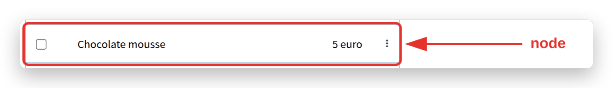

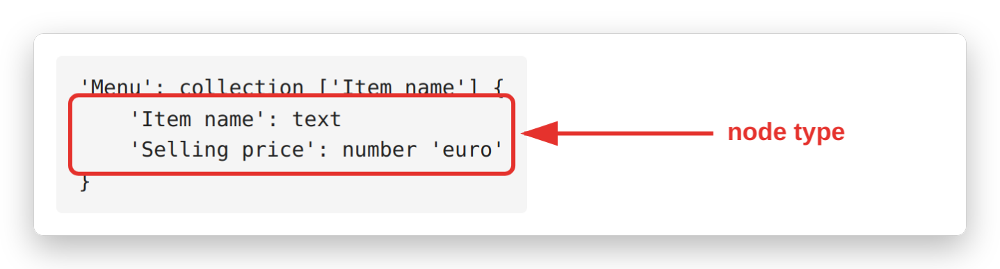

## The minimal model
To turn the `Menu` model into an app, put it inside a complete model.
Open `models/model/application.alan` and write down the sections that every `application` model has, if they are not already there:
```js

```

This is the ***minimal model***: the smallest model the Alan platform accepts.

The `users` section defines who can access the application and how.
Use `anonymous` for now, which means that anyone can open the app and read and edit its data.
The [application language documentation](/pages/docs/model/{{ page.model_version }}/application/grammar.html) describes the other options.

The `interfaces` section defines which other apps and databases this app is connected to.
For this tutorial the app stays disconnected.

The `root { }` section defines the *root node type*.
This is where modeling starts: one single `root` node holds all application data.
Paste the `Menu` model from the previous section between its braces.

The `numerical-types` section defines the units used in the application and how to interpret them.
The `Selling price` of a menu item is in `'euro'`, so add `'euro'` there.

The model now looks like this:
```js

```

One rule while typing Alan code: separate keywords with **whitespace**.
Indentation is free — spaces and tabs are both accepted, and the Alan formatter normalizes indentation to tabs for you.

## Deploying the app
To run this app, the model has to be translated into code that a server can execute.
A ***compiler*** does that; it is part of the Alan platform tools.
Download those tools with `Alan Fetch` in VS Code, or with `./alan fetch` from the command line.
`Alan Fetch` reads the `versions.json` file in the project root to determine which versions of the tools it needs.

After fetching, the *Alan language server* starts by itself and checks every `.alan` file in the project — models, migrations, and the rest — while you type.
Its findings appear in the **Problems** panel and are underlined in the editor, so most mistakes surface long before you build anything.

To ***build*** (compile) the whole project yourself, use `Alan Build`, or `./alan build` from the command line.
A build reports nothing when the project is valid, and reports errors when it is not.

Once the build succeeds, run `Alan Deploy` to turn the project into a running app.
`Alan Deploy` asks for a *'data source for this deployment'*.
Choose the **empty** option for the first deployment.
The **migrate** option keeps the data of an already running app, which is what you use for every later deployment in this tutorial; the [migrations guide](/pages/tutorials/migrations/{{ page.platform_version }}/migrations.html) explains how that works.

---

If deployment or migration ever gets stuck, start over with a clean slate:
1. delete the `migrations` folder,
2. run `Alan Deploy` and choose the **empty** option,
3. run `Alan Deploy` again and choose the **migrate** option.

---

Open the app in a Chromium-based browser such as Chrome or Edge, and click `Menu` in the left column:

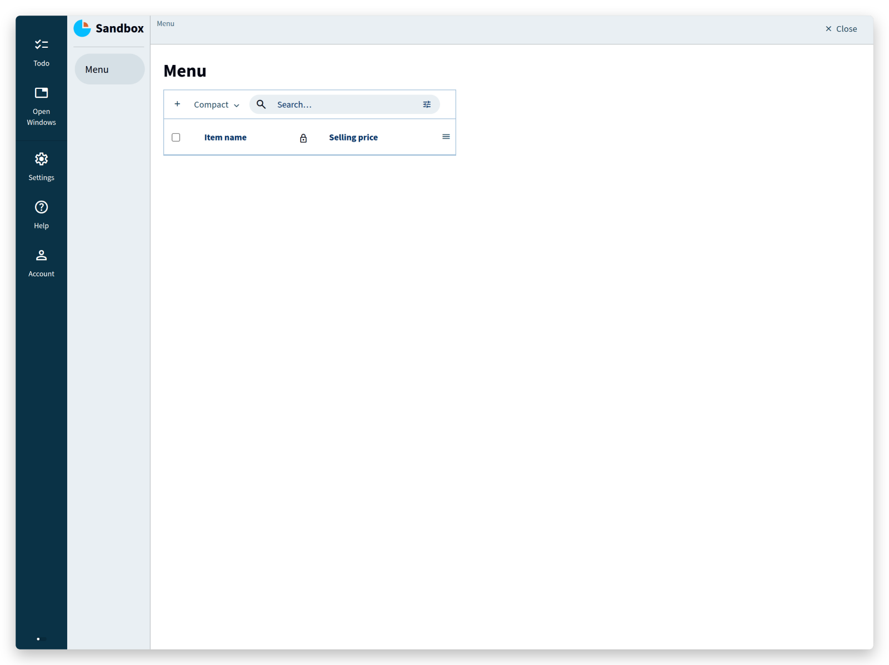

Add a few menu items to get a feel for the *graphical user interface* (GUI).
Click the **+** button above the table to add an item, fill in its fields, and click **Save** and then **Close** in the top right corner.
That returns you to the `Menu` table, where you can add more items and edit existing ones.

Typing test data by hand after every model change gets tedious, so the tutorial ships data for each step in the `_docs` folder.
To load the data for a step:
1. run `Alan Deploy` and choose the **migrate** option, which creates the folder `migrations/from_release`,
2. open `_docs/tutorials/restaurant1/{{ page.platform_version }}/step_01/migration/migration.alan` (`step_01` for this step),
3. copy its contents over the contents of `migrations/from_release/migration.alan`,
4. run `Alan Deploy` again and choose the **migrate** option.

After the deployment succeeds, the data is in your app.

> <tutorial folder: `./_docs/tutorials/restaurant1/{{ page.platform_version }}/step_01/`>

## Numerical-types
A price entered with decimals is rounded to a whole number:

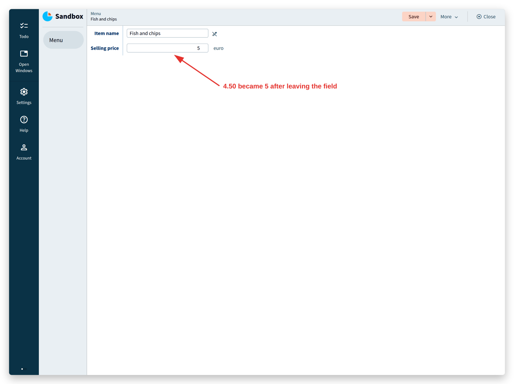

That happens because Alan stores whole numbers only.
To keep the cents, pick a numerical type with the accuracy you need, and tell the GUI how to display it.

Change `euro` at the `Selling price` to `eurocent`, and make the `numerical-types` section look like this:
```js

```

The `@numerical-type:` part is a GUI annotation: an instruction for the graphical user interface of the app.
It sets the label to show (`Euro` instead of `eurocent`) and the number of decimals a user may enter — 2, because the underlying accuracy is `eurocent`.
There is much more to numerical types; this is enough for now.

<sup>For a better understanding of the syntax, read the [syntax guide](/pages/tuts/syntax.html).</sup>

## Stategroups
A menu item carries more information than a name and a price.
A first example: an item is either a dish or a beverage.
Add an `Item type` for that:
```js

```
`Item type` is a **stategroup** attribute: it holds a choice between states, here `Dish` or `Beverage`.
Each state has its own curly braces, and attributes inside those braces belong to that state alone.
The data stored therefore depends on the state a user chooses.

A dish, for instance, is an appetizer, a main course, or a dessert — another choice.
Add a `Dish type` stategroup inside the state `Dish`, and something similar for `Beverage`:
```js

```

An `application` model is hierarchical, and so is the data it describes.
The `root` node holds a collection of menu items.
Each menu item is a node with an `Item type` that is either `Dish` or `Beverage`.
`Dish` and `Beverage` are nodes themselves, holding a `Dish type` and a `Beverage type` respectively.
A `Dish type` is `Appetizer`, `Main course` or `Dessert`; a `Beverage type` is `Juice` or one of the other states in the model.

> <tutorial folder: `./_docs/tutorials/restaurant1/{{ page.platform_version }}/step_02/`>

Build and deploy to see what stategroups and numerical types do for the app.
Before deploying, copy the `migration.alan` file from the tutorial folder to `migrations/from_release/migration.alan` as described above, and choose the **migrate** option.
Repeat that in every following step of the tutorial.

Set the view to **Full** to see all columns:

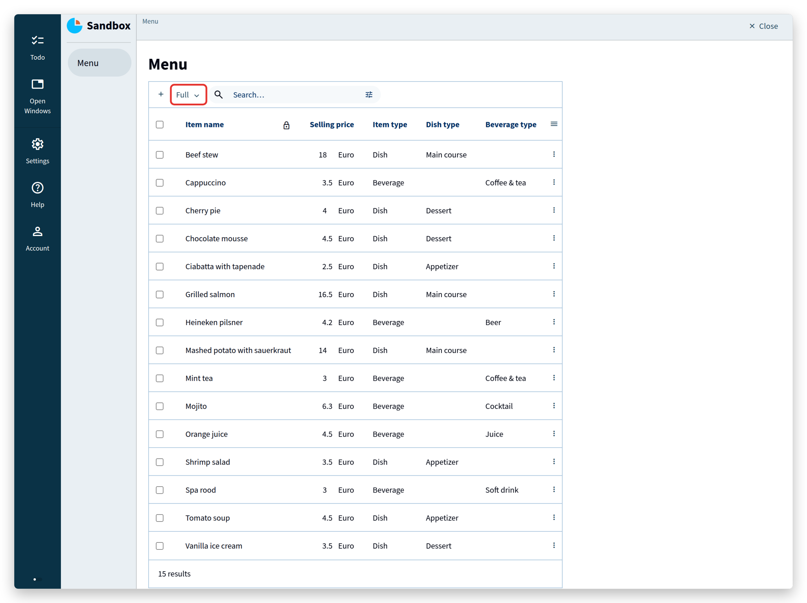

The table has a few more columns now.
Add an item yourself, and the new stategroup attributes appear as radio buttons:

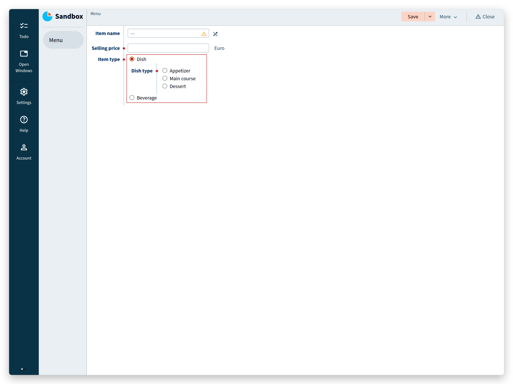

## Built-in attribute types
A restaurant is more than a menu; it also has tables.
Express that in the model:
```js

```

The numerical types `chairs` and `units` are new to the model, so add them as well:
```js

```

Deploy, and click `Tables` in the left column.
The table numbers and their seatings are already there:

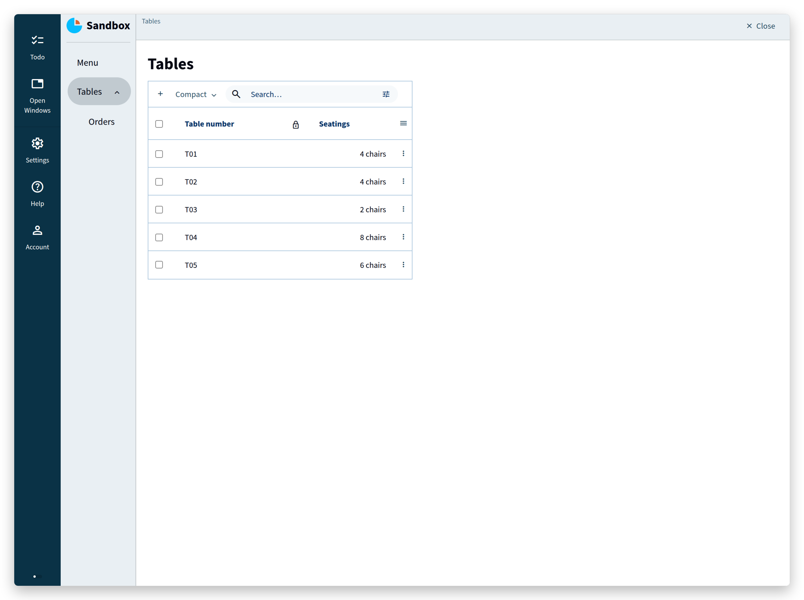

In the left column, `Orders` appears underneath `Tables`, exactly as in the model: the collection `Tables` nests a collection `Orders`.
Each table therefore has its own collection of orders, and each order line records an `Item` and an `Amount`:

| *Order line* | *Item* | *Amount* |
| :- | :- | -: |
| 01 | Orange juice | 2 |
| 02 | Tomato soup | 2 |
| 03 | Beef stew | 2 |
| 04 | Chocolate mousse | 1 |
| 05 | Cappuccino | 1 |

> <tutorial folder: `./_docs/tutorials/restaurant1/{{ page.platform_version }}/step_03/`>

---

### Overview of attribute types
{:.no_toc}
The application language has six built-in attribute types.
- A ***text*** attribute holds an unbounded string value (for example *"this is text"*).
- A ***number*** attribute holds an integer value (for example *31415927*).
- A ***file*** attribute holds two unbounded string values: a file token and a file extension (for example *"screenshot"* and *"png"*).
- A ***collection*** attribute holds a set of nodes, each identified by a unique key, so that every node can be referenced unambiguously. The key is defined by the collection; the nodes have an inline defined node type.
- A ***stategroup*** attribute holds one state out of a fixed set of alternatives, such as `'Main course'`. Each state can hold its own attributes.
- A ***group*** attribute holds a node of an inline defined node type. Groups add structure by grouping attributes that belong together or that share permission requirements.

## References
One line in the model deserves attention:
```js

```
It says that the `Item` of an order line refers to a menu item.
See first what that means in the app.

Click `Tables` in the left column, click table "T01" from the list, and click the **+** button next to `Orders`:

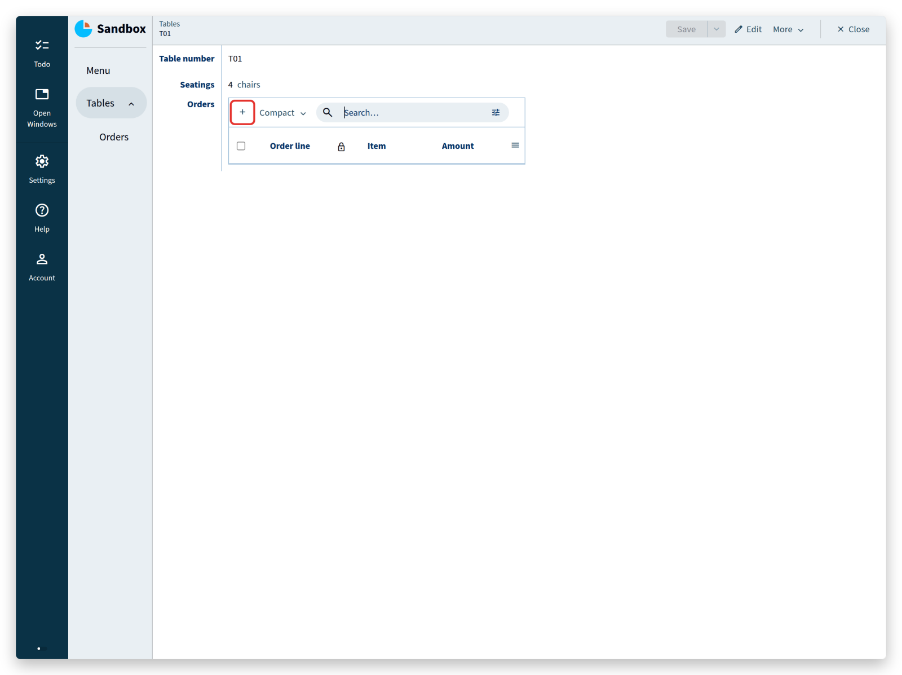

Enter an `Order line`, for example "01" for the first order at this table:

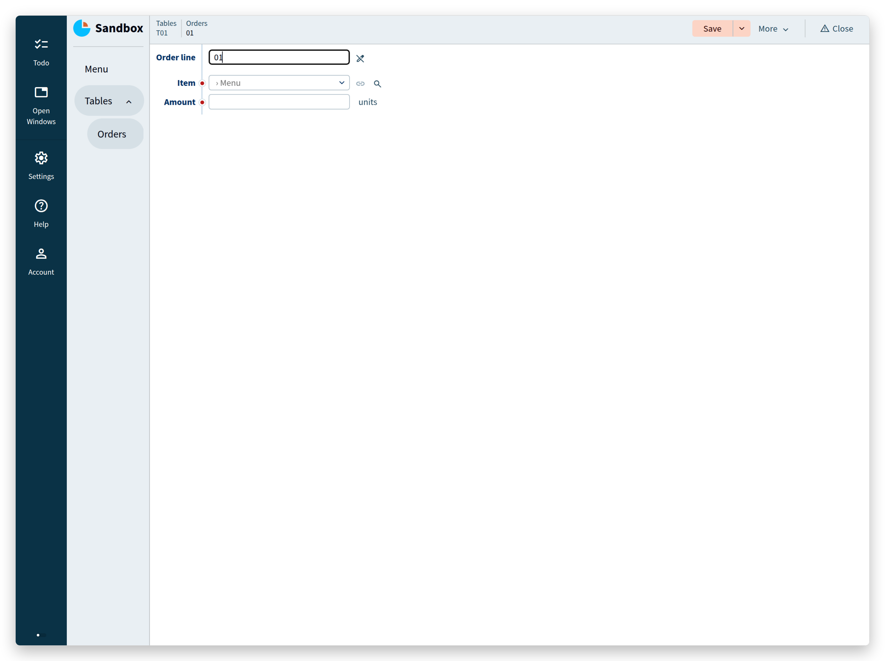

Click the magnifier next to the `Item` field:

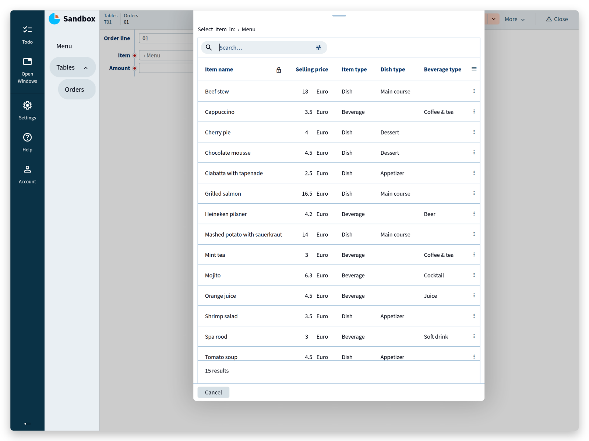

This shows the items from the `Menu`, and typing in the search box filters them.
Only an item from this list can be chosen.
Clicking an item puts its `Item name` in the field:

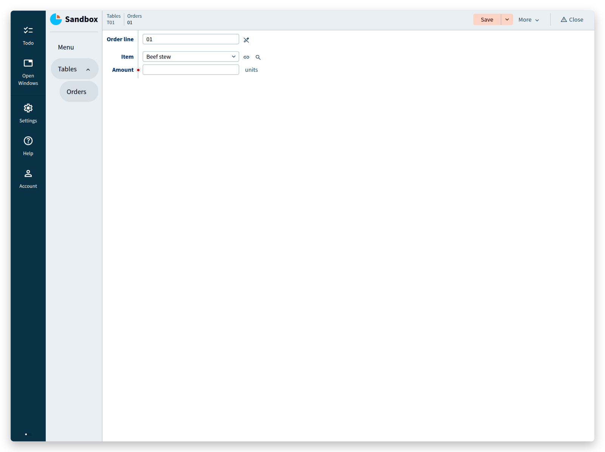

The `Item name` is the key of a menu item.
It identifies that item unambiguously, which is exactly what makes it usable as a reference.
Next to the field, the link icon takes you from `Beef stew` to the menu item it refers to.

The `Item` field accepts nothing but the `Item name` of an existing menu item.
That restriction comes from the arrow `->` in the model, which expresses a **mandatory** reference.

The navigation expression after the `->` tells the application where to find the referenced collection.
The keyword `^` means: go to the parent node.
For an order line, the parent is a table; a second `^` leads from the table to the `root` node, which holds the `Menu`.
The expression ends with `.'Menu'[]`, which means: look up the value of `Item` in the `Menu` collection.

To see where a series of `^` leads, count the opening curly braces (`{`) above the expression: each brace corresponds to one node, and each `^` to one step up:
```js

```

> **In summary**: `Item` is a text value that references a menu item, so its value has to equal the `Item name` of an existing menu item.

---

Enter an amount, click `Save` and then `Close`:

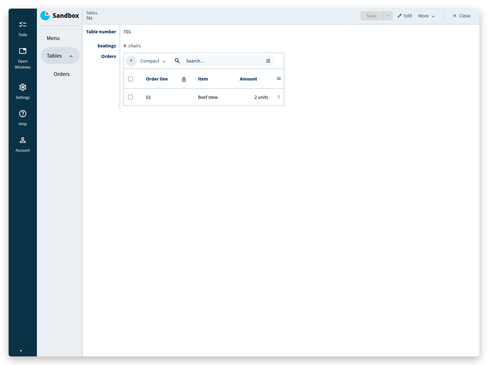

Sometimes a reference should be *optional* rather than *mandatory*.
That is common for data imported from other systems, which you cannot force to respect your keys.
An **optional reference** uses `~>` (tilde arrow) instead of `->` (dash arrow).

## States versus references
By now the structure of the model should be readable to you: collections, nodes, attributes, states, and references.
Time for a change in the restaurant.

A fixed set of beverage types turns out to be impractical: bartenders keep inventing categories.
Replace the fixed states by a collection of beverage types.
Remove the states of the `Beverage type` attribute, add a collection `Beverage types`, and let the state `Beverage` reference an item from it:
```js

```

Note that `Beverage types` goes *above* the `Menu`.
That is logical — beverage types exist before a menu uses them — and the compiler requires it: by default, expressions in an `application` model point to attributes defined earlier in the model.
That rule is what allows the language to guarantee that computations terminate and stay consistent; the [docs](/pages/docs/model/{{ page.model_version }}/application/grammar.html) explain it in detail.

Build, deploy, and select `Beverage types` in the left column:

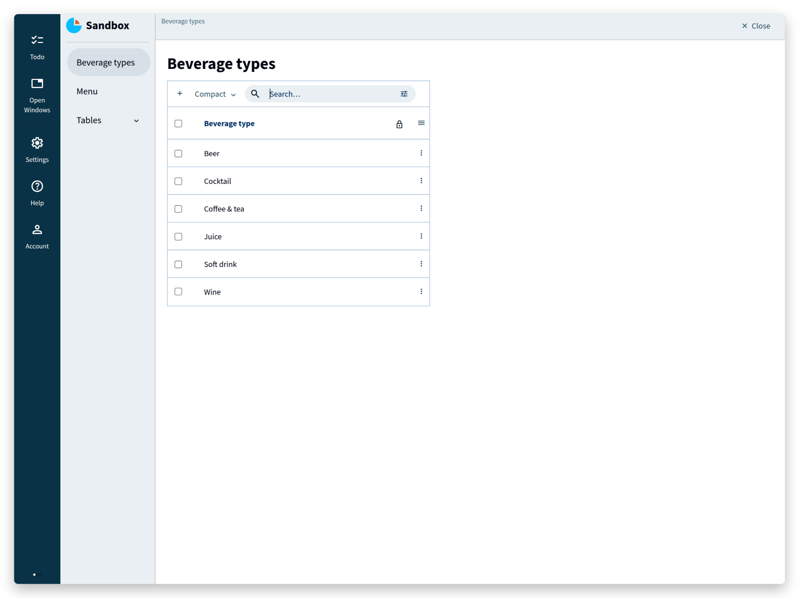

You can now add and adjust beverage types while using them in the menu:

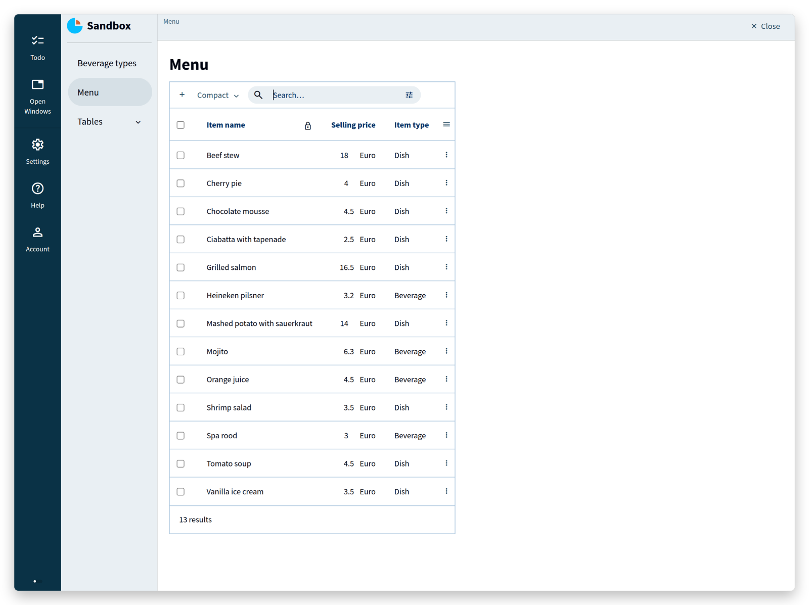

Click 'Mojito', then **Edit** in the top right corner:

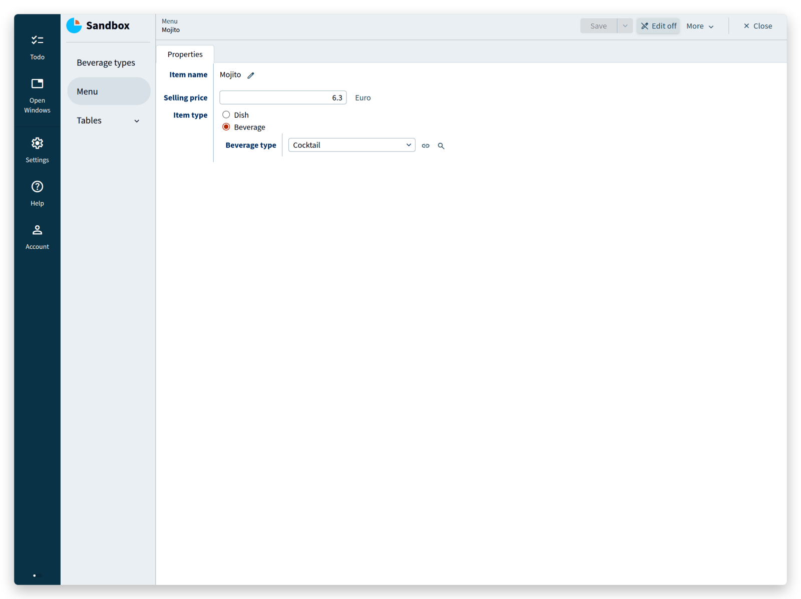

Then click the magnifier next to `Beverage type`:

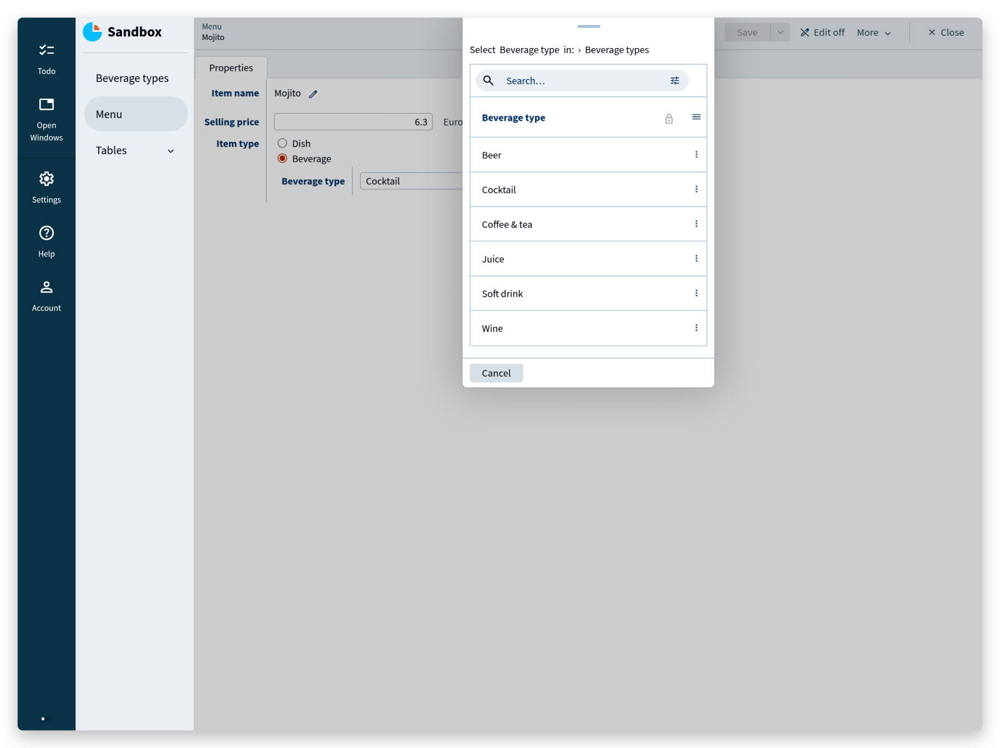

The `Beverage types` collection appears, just like the `Menu` items earlier, and one of them can be chosen for 'Mojito'.

> <tutorial folder: `./_docs/tutorials/restaurant1/{{ page.platform_version }}/step_04/`>

## Next
This concludes the introduction to the `application` language.
You can now design a data model of your own and generate an app from it.

Two pieces of advice for your own application:
- ***Begin with the end in mind***. What is the purpose of the app, which data does that purpose require, and how does that data organize into collections?
- ***Experiment***. Try things out. Restructuring a model is cheap, and parts of a model are easy to reuse.

There is more to discover.
[Part II](/pages/tutorials/model/{{ page.platform_version }}/application-tutorial2.html) covers derived values, reference sets, commands, and actions.
Questions or comments about the tutorial or the platform are welcome on the [forum](https://forum.alan-platform.com/).
