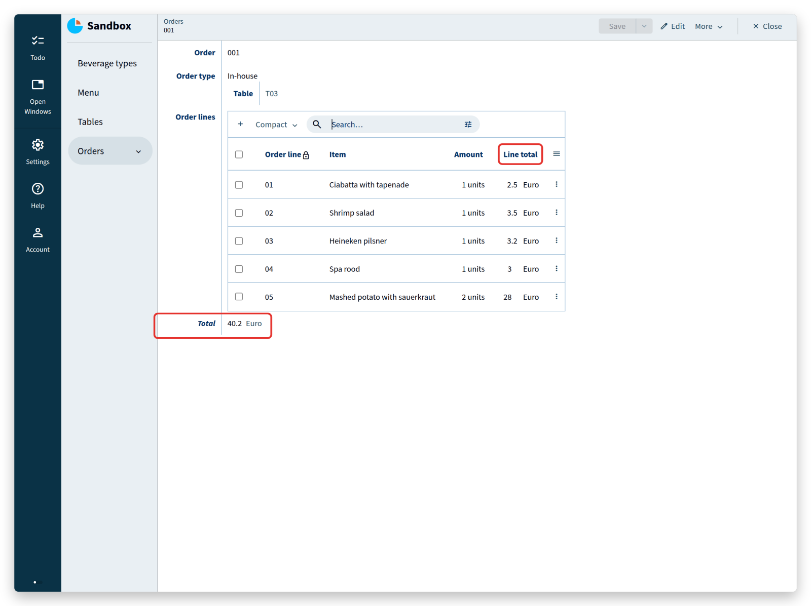
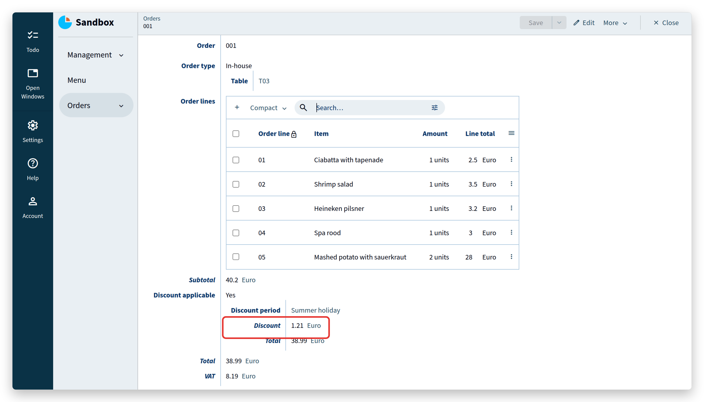
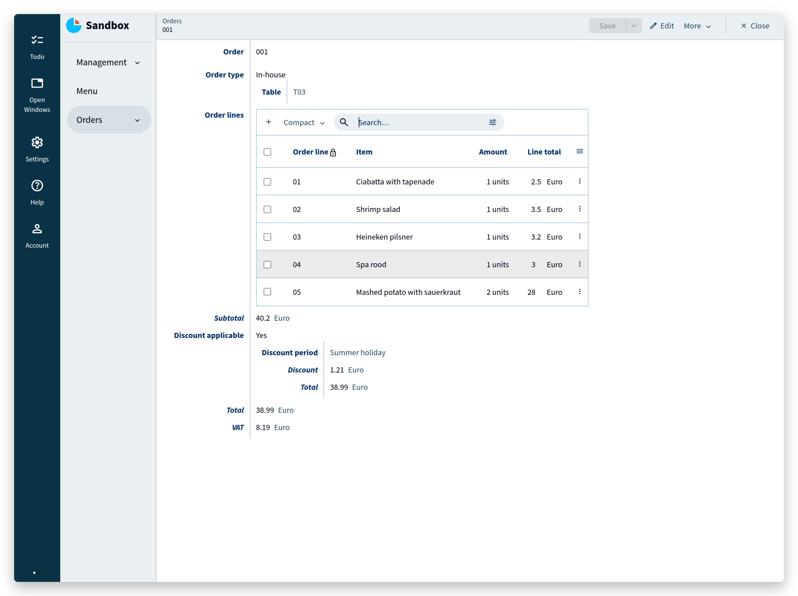
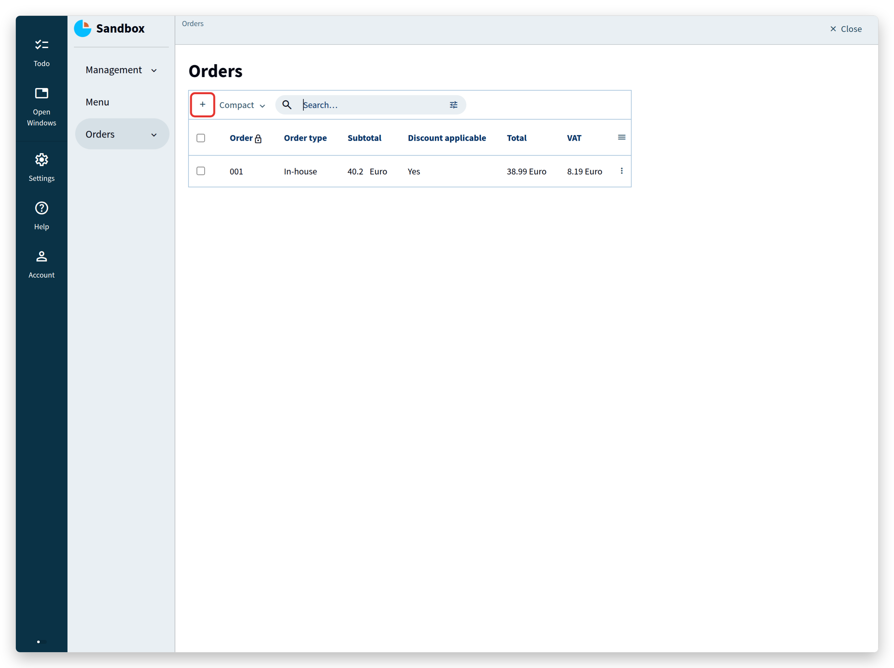
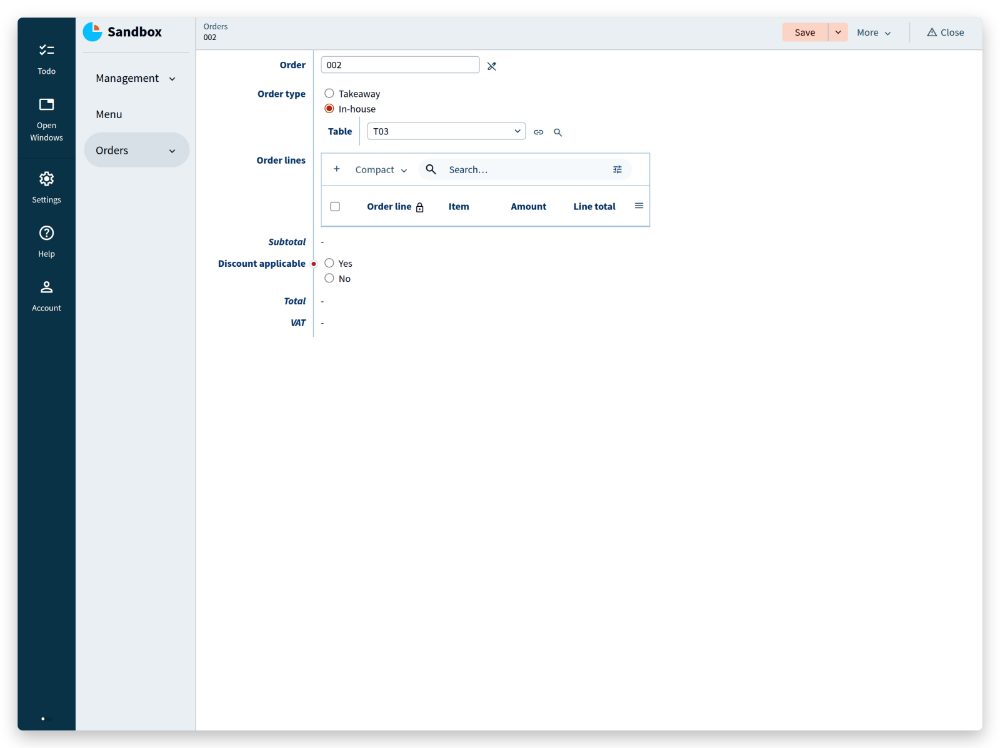
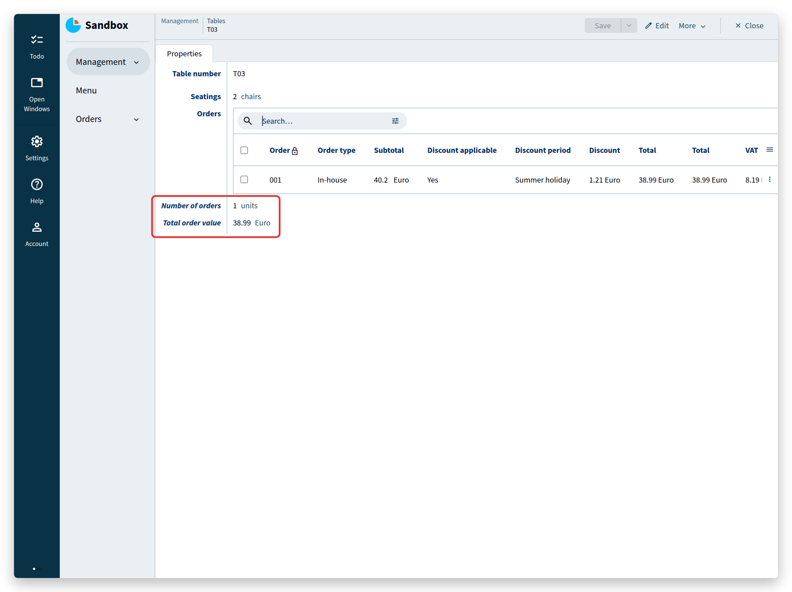
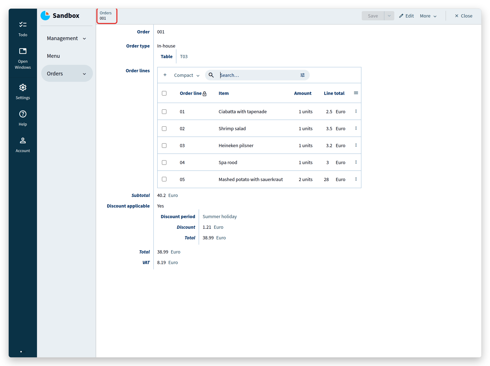
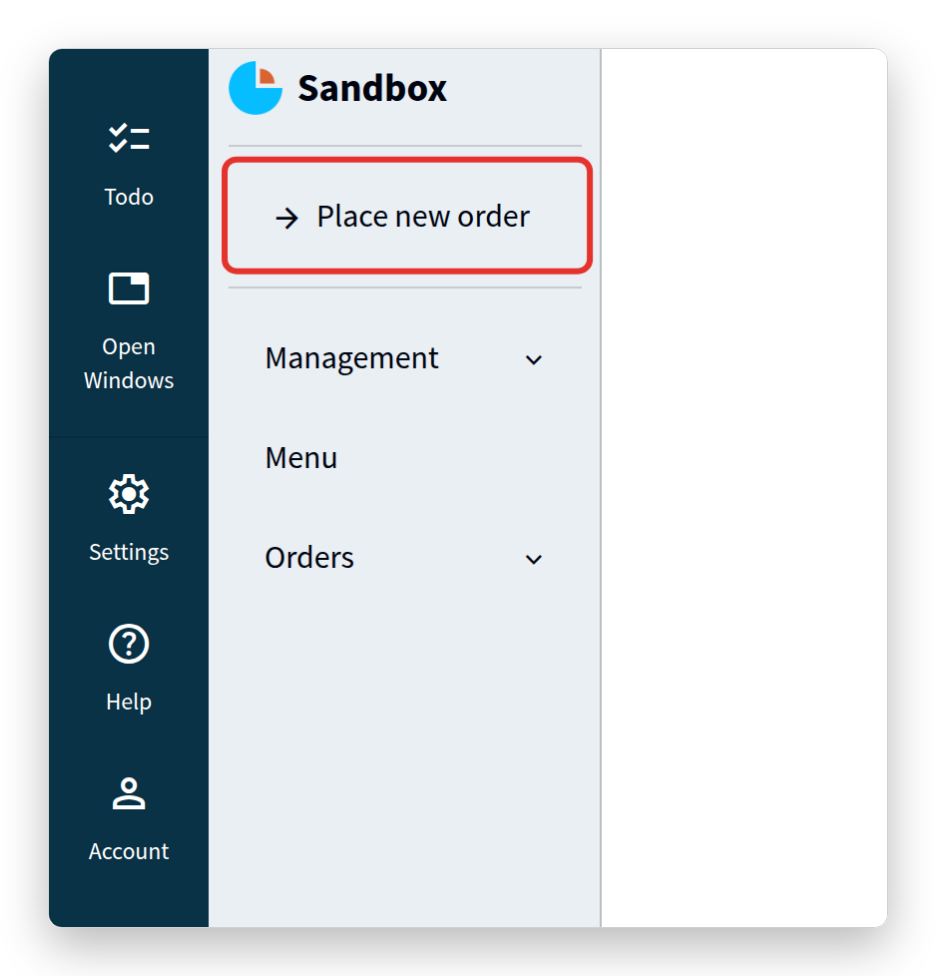
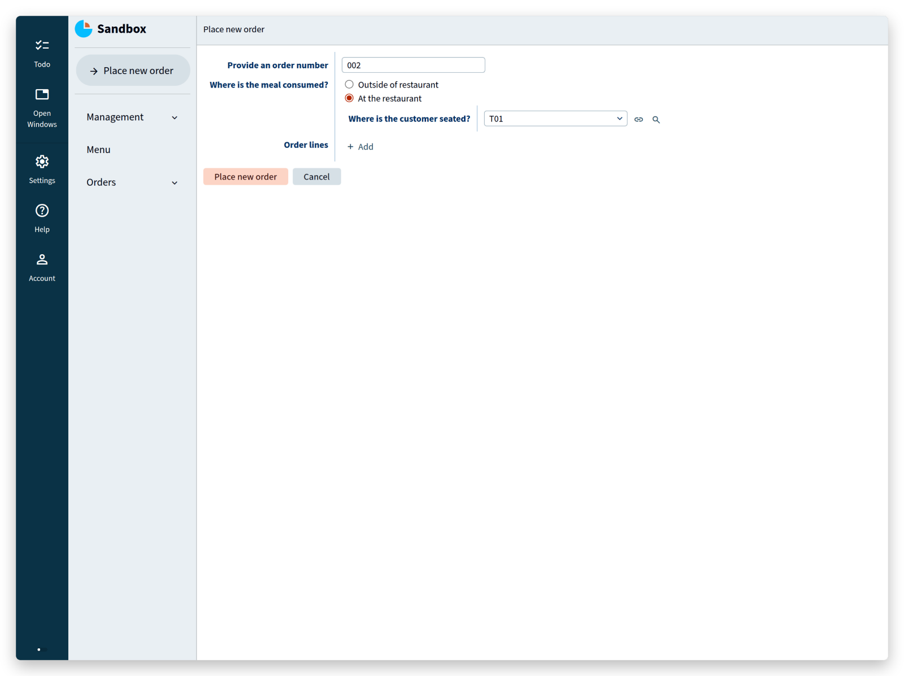
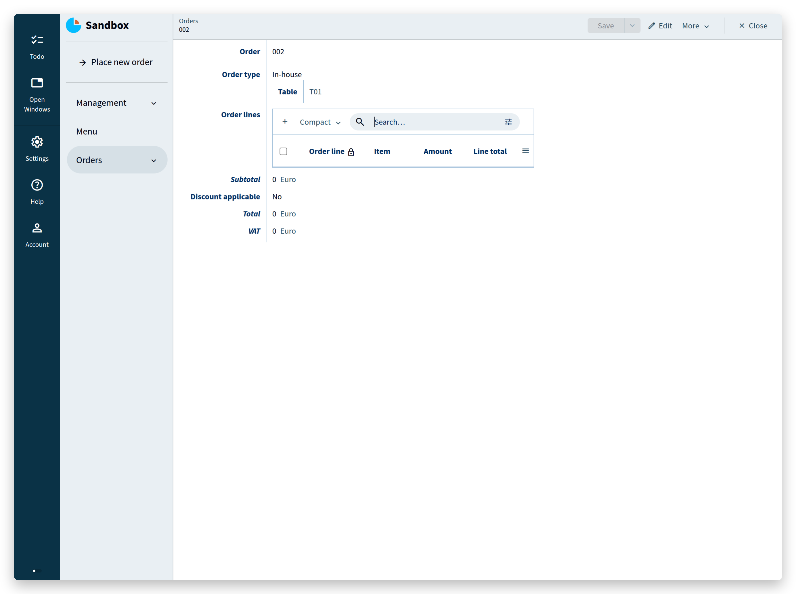

1. TOC
{:toc}

## Introduction
This is the second part of the application language tutorial that builds a restaurant app.
Complete [the first part](/pages/tutorials/model/{{ page.platform_version }}/application-tutorial.html) before continuing.

In Part I you wrote a small data model for a restaurant, and generated a web application from it for entering a menu, tables, and orders.
Part II adds computation and interaction: [derived values](#derived-values), [conditional expressions](#conditional-expressions), [reference sets](#usages-and-reference-sets), and [commands and actions](#commands-and-actions).

## Take-away
The restaurant starts a take-away service, which the model has to accommodate.

Orders no longer belong to a table: a take-away order has no table at all.
An order does need to record whether it is a `Takeaway` order or an `In-house` order for a table.

So this part of the model:
```js

```

becomes this:
```js

```

Four things changed:
- `Orders` moved one level up, to the `root`.
- Order lines used to hang directly under a table, which left no way to tell which lines belong to the same order. An order now has its own collection of `Order lines`.
- A stategroup `Order type` was added, with the states `Takeaway` and `In-house`.
- The state `In-house` holds a `Table` attribute that references an item of `Tables`.

## Derived values
Customers have to pay, so the app has to compute what an order costs.
Start with the `Line total`: the cost of a single order line.
A `Line total` is a **derived value**: it is not entered by a user, but computed from the `Amount` and the `Selling price`:
```js

```
A derived value is written as `= <expression>` behind its type: `Line total` is a `number 'eurocent'`, and the expression behind it says how that number comes about — the `product` of the `Amount` and the `Selling price`.

The notation `>'Item'` follows a reference.
Starting at the order line, it follows the `Item` reference (declared as `-> ^ ^ .'Menu'[]`), so `>'Item'` is the menu item that the order line refers to.

Multiplying an amount by a price multiplies their units as well: `units` times `eurocent` gives `eurocent`.
Alan does not assume such a rule; the model states it.
Add it under `'eurocent'` in the `numerical-types` section, which then reads:
```js

```
`= 'units' * 'eurocent'` is a ***product conversion rule***, and it is declared under the numerical type of the *result*.
Its general form is `= 'num-type1' * 'num-type2'`.
In the expression itself, `as 'units'` behind `.'Amount'` names the operand this rule multiplies first, so the compiler can check that the multiplication makes sense.
A `division` works the same way, with a ***division conversion rule*** that uses `/` instead of `*`.
<sub>NOTE: a future version of the compiler is planned to infer these rules.</sub>


A conversion by a constant factor is a ***singular conversion rule***.
The rule is declared under the resulting type, and the expression names the type it starts from with `from`:
```js

```
Here, `circum` is derived from `diameter` by the factor on the last line — pi, written as an integer with a power of ten, because Alan stores whole numbers.

Conversion rules keep the numerical types of derived values correct, and make conversions reusable.

---

The order needs a total as well:
```js

```

`Total` is the sum of the `Line total` of all order lines.
The expression starts with the keyword `sum`, followed by a path that produces the set of numbers to add up.
The grammar calls that an [`object set path`](/pages/docs/model/{{ page.model_version }}/application/grammar.html#grammar-rule--object-set-path).
It starts with navigation steps that lead to a collection (`.'Order lines'`), continues with `*`, which expands the collection into the set of its nodes, and ends with the value to take from each node (`.'Line total'`).

Where does this line belong in the model? Think about it before you read on — the answer is in the model below.

The whole model now looks like this:
```js

```

And in the app:


Operations such as `sum` work on a set of values and on a list of values.
To sum a list of separate values, put them in parentheses after `sum`, as with `product`:
```js

```

The [documentation](/pages/docs/model/{{ page.model_version }}/application/grammar.html#derived-numbers) lists all operations for deriving numbers:
- `sum`: the sum of a *set or list* of values
- `min`: the minimum of a *set or list* of values
- `max`: the maximum of a *set or list* of values
- `std`: the standard deviation of a set of values
- `count`: the number of values in a set
- `remainder`: the remainder of a division (10 mod 3 = 1)
- `division`: the division of two numbers
- `add`: the addition of two numbers
- `diff 'date'`: the difference between two *relative* numbers, such as two dates or two temperatures

A number is *absolute* when it expresses an amount, and *relative* when it expresses a position on a scale:
- days: absolute, "28 days"
- date: relative, "28-7-2021"
- years: absolute, "5 years"
- year: relative, "2021"
- degrees: absolute, "21 degrees"
- temperature: relative, "21˚C"
- seconds, minutes, hours: absolute, "2 hours, 35 minutes and 8 seconds" (a duration)
- time of day: relative, "14:35:08"

Numbers are only one kind of derived value; the language derives other types as well, as the next sections show.

> <tutorial folder: `./_docs/tutorials/restaurant1/{{ page.platform_version }}/step_04a/`>

## Growing the business
The restaurant is growing, more people work with the app, and the model needs some reorganization.
Some data is permanent and should be maintained by management only, and the model can say so.

Put a group `Management` at the top of the model.
It holds a new collection `Discount periods`, a `VAT percentage`, and the existing collections `Beverage types` and `Tables`:

```js

```

Rebuilding now produces **errors**: expressions elsewhere in the model still navigate to the old locations, and the compiler cannot find those attributes any more.
Fix each error by adding the missing navigation step, `.'Management'`.
This is normal Alan work — the compiler points at every place that a structural change affects, which is exactly why such changes are safe to make.

The `VAT percentage` is used to compute value added tax, and needs a numerical type of its own:
```js

```

The `Discount periods` hold discounts for different periods, where the discount depends on the amount spent.

Rename the `Total` of an order to `Subtotal`, since the actual total will depend on a discount:
```js

```

> <tutorial folder: `./_docs/tutorials/restaurant1/{{ page.platform_version }}/step_05/`>

## Conditional expressions
Add a stategroup `Discount applicable` to `Orders`.
The `numerical-types` section needs the new numerical type `fraction`, a product conversion rule for it, and a singular conversion rule `percent`:
```js

```

With this extension, a discount applies when a user selects a `Discount period` from the collection added earlier.
Selecting 'Summer holiday', for example, gives 3% discount on amounts over €35.
When `Discount applicable` is `Yes` and a `Discount period` is selected, the app computes the `Discount` as follows:
- compare the `Subtotal` with the `Minimal spendings` of the selected `Discount period`,
- if the `Subtotal` is smaller, the `Discount` is 0,
- otherwise the `Percentage` of that period is converted from `percent` to `fraction` (3% becomes 0.03), and the `Discount` is the `product` of that fraction and the `Subtotal`.

The `Total` is then the `Subtotal` minus the `Discount`, expressed as a `sum` with a sign inversion (`-`).

The `switch` expression for the `Discount` switches on the result of a `compare` of two numbers.
A case matches one of these results:
- 'greater than' (`>`)
- 'greater than or equal to' (`>=`)
- 'less than' (`<`)
- 'less than or equal to' (`<=`)
- 'equal to' (`==`)
- 'less than or greater than' (`<>`)

Cases may not overlap, so a `switch` cannot match both `<` and `<=`.

---

Enter an order in the app:

An order with a subtotal of €40.20 gets 3% discount, because it exceeds the €35 that the summer holiday period requires.

Next, compute the tax (`VAT`), which is a percentage of the total.
The total depends on whether a discount applied, so the expression has to `switch` on the state of `Discount applicable` before it can use the total:
```js

```

In the case of state `Yes`, the expression uses `as $'discount'`.
That stores the `Yes` node under the name `$'discount'`, so that the rest of the expression can refer to it as `$'discount'.'Total'`.
Such a name is called a **named object**.

The result:


Every property type in the `application` language can be derived, not just numbers: text values, file values, references, stategroup states, and even collections.
The [documentation](/pages/docs/model/{{ page.model_version }}/application/grammar.html#derived-values) has examples of each.

> <tutorial folder: `./_docs/tutorials/restaurant1/{{ page.platform_version }}/step_06/`>


## Usages and reference sets
A reference can be followed in both directions, but the app shows only one direction by default: an `In-house` order shows its `Table`.
The opposite direction — which orders refer to a particular table — is called a *usage*.

First place a new order.
Select `Orders` **in the left column** and click the **+** button above the table:



Enter an order number, choose `In-house`, select a table, and add a few order lines:



Click `Save`.
Open the table you selected (under `Management`, `Tables`) and its properties show only `Table number` and `Seatings`.
The app does know which orders refer to this table, but it hides usages by default.

To see them, click **Account**, open **UI settings**, and set **Advanced features** to **Yes**.
A **Usages** tab now appears for every reference, without any change to the model.
Return to the table and open **Usages** to see the orders that refer to it.

Usages are a debugging aid.
To show inverse references among the properties of a table, and to compute with them, the model needs a **reference set**: an attribute that holds all orders whose `Table` reference points to this table.
Add the reference set and two derivations that use it:
```js

```

Build, deploy, and open the table you used earlier ('T03' in this example):



The `Orders` reference set shows that order '001' uses table 'T03'.
Below it are the number of orders placed at that table and their total order value — statistics that could inform how the tables are arranged.
Click the order to jump to it and its order lines:



The reference set uses the keyword `downstream` before its navigation path.
`downstream` states that the attribute points at nodes that are defined *later* in the model, which is normally not allowed: a reference to an attribute defined later in the model requires it too.
Well designed models rarely need `downstream` outside reference sets.
When the compiler demands it elsewhere, reordering the attributes usually removes the need; if it does not, the model probably contains a dependency worth reconsidering.

The navigation path uses `*` where a reference attribute uses `[]`, because several orders can refer to the same table: the reference set holds *all* of them.
The path ends by taking the `inverse` of the `Table` reference found under `In-house`.

> <tutorial folder: `./_docs/tutorials/restaurant1/{{ page.platform_version }}/step_06a/`>

## Commands and actions
Alan applications are often connected to other systems that send them information.
Suppose the restaurant app has to accept orders from a third-party ordering app.
The two systems agree on an Alan `interface` — a file that looks a lot like an `application` model — which declares the commands the other app may send, such as `Place new order`.

The restaurant app has to implement that command, and it does so in the `application` language.

<sup>
NOTE: the Alan `interface` language is beyond the scope of this tutorial.
If a tutorial about the `interface` language and connecting applications would help you, say so on the [forum](https://forum.alan-platform.com).
</sup>

A second reason for commands is the user interface itself: a screen that works on a mobile device needs buttons that perform an operation in one click, and some tasks consist of several operations that a user should perform as one step.
For that, Alan has `action`s.

Commands and actions are expressed in almost the same way.
The difference is where they run: a command runs on the server, an action runs on the client, in the browser.
Which one fits depends on the use case, as described above.

Here is the implementation of `Place new order`:
```js

```

That is a lot at once, so look at the result first.
Add the code to the `root` type, at the bottom of the model, build the app, and open it in the browser.
A button 'Place new order...' appears in the left column:



The label of the button is the name of the command, `Place new order`.
Click it and fill in the form:



Click `Place new order` below the form, then `Cancel` to close the form for the next order.
Go to `Orders` and open the order that was just created:



Filling in the form added an order to the `Orders` collection.
The answer 'At the restaurant' to the question 'Where is the meal consumed?' became the state `In-house` of the stategroup `Order type`.

Now to the code.
The first part of a command looks like a data model, and that is what it is: the parameters of a command are described by a small data model of their own:
```js

```

Inside these command parameters, references to the main model are expressed as usual, for example `-> ^ ^ .'Management'.'Tables'[]`.
Navigation inside the parameter node works exactly as it does anywhere else in the model: every step is evaluated relative to the position of the expression.

A command on a collection has access to that collection.
A command `Remove order line` on `Orders`, for example, gives every order a button, and its `Line` parameter can only refer to the order lines of the order it is called on:
```js

```

The parameter node is named with `as $'param'`, which makes the properties inside the parameter node available as `$'param'.'...'` in the rest of the command.

After the parameters comes the operation to perform, such as `... => update .'Orders' ...`.
Read the double arrow as 'do'.
The keyword `update` states that an attribute is updated, and the path that follows resolves to the attribute in question: the collection `Orders`.

Instead of `update`, a command can use `switch`, `ignore`, `walk`, `execute`, and `external`; Part III uses several of these.
`update` is the one needed here.

The implementation ends with `... = create ( ... )`: the update *is* (`=`) the creation (`create`) of a node.
`create` fails, and rejects the whole command, when the collection already contains a node with the given key.
`ensure` is the alternative: it creates the node when it does not exist, and otherwise overwrites the values as the model specifies.

Between the parentheses of `create` stands how the new order is built from the parameters:
```js

```
The attribute `Order`, for instance, takes whatever the caller provided for `Provide an order number`.
The named object `$'param'` refers to the parameter node — the data that conforms to the small model above — and is used for each value taken from it.

> <tutorial folder: `./_docs/tutorials/restaurant1/{{ page.platform_version }}/step_06b/`>

## Next
Part II covered computation over the data and the first way to change data from a button: derived values, conditional expressions, reference sets, and commands.

[Part III](/pages/tutorials/model/{{ page.platform_version }}/application-tutorial3.html) uses these to model the processes of the restaurant: order and line statuses that move forward step by step, references that reach across the model, and products assembled from other products.

The [documentation](/pages/docs/model/{{ page.model_version }}/application/grammar.html) describes every feature of the language in full, and questions are welcome on the [forum](https://forum.alan-platform.com/).
