1. TOC
{:toc}

## Introduction
This is the third part of the application language tutorial that builds a restaurant app.
Complete [Part I](/pages/tutorials/model/{{ page.platform_version }}/application-tutorial.html) and [Part II](/pages/tutorials/model/{{ page.platform_version }}/application-tutorial2.html) before continuing.

So far the model describes what the restaurant *has*: a menu, tables, orders, and the values computed from them.
Part III describes what the restaurant *does*.
An order line travels from 'ordered' to 'served', an order is closed once everything is served and paid, service staff need to know which dish goes to which table first, and the kitchen assembles dishes from products that are themselves assembled from other products.

Four topics carry that story:
- [GUI annotations](#extensions-and-gui-annotations) and small model changes that keep the app pleasant to use,
- [state machines](#state-machines): stategroups whose states may only change in a fixed order, driven by commands,
- [advanced references](#advanced-references): state parameters, named objects across levels, and reference rules,
- [graph constraints](#more-advanced-references): products that refer to other products, without infinite computations.

The model grows considerably in this part.
Use the tutorial folder listed at the end of each topic when your model and the text no longer match.

## Extensions and GUI annotations
In [Conditional expressions](/pages/tutorials/model/{{ page.platform_version }}/application-tutorial2.html#conditional-expressions) the `Total` of an order was computed inside the stategroup `Discount applicable`, which is why the app shows it in a box together with `Discount period` and `Discount`.
Both visually and model-wise, `Total` belongs to the order itself.
Move it out, so that the tail of the `Orders` collection reads:
```js

```
`Total` now switches on the state of `Discount applicable`, and `VAT` simply uses `Total`.

The restaurant processes need two more stategroups: `Line status` on `Order lines`, and `Order status` on `Orders`.
The head of the `Orders` collection becomes:
```js

```

Customers change their mind while ordering, so order lines should not go to the kitchen one by one; they are placed together once everybody has decided.
`Line status` supports that with four states:
- `On hold`: the line is entered, but the customer may still change it
- `Placed`: the line is approved and can be prepared
- `Service`: the line is prepared and can be served
- `Served`: the line has been served

`Order status` has two states: `Open` from the moment the first line is placed, and `Closed` after the bill is paid.

The command `Place new order` has to set these states for the order and its lines:
```js

```
Apart from `Apply discount?`, the command needs no new parameters: the states `Placed` and `Open` follow from the purpose of the command itself, so they are created without asking the user anything.

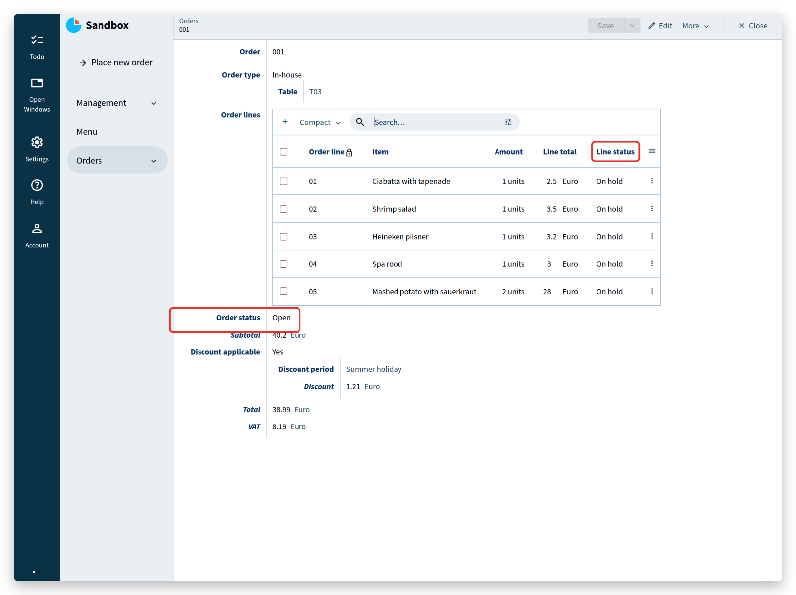

Add `@default: auto-increment` to the key attributes of `Orders` and `Order lines`:
```js

```
This is a ***GUI annotation***: an instruction to the generated user interface, always written with an ***@*** prefix.
This one fills in the next free number when a user adds an order or an order line, which saves typing for the rest of the tutorial.
GUI annotations deserve a topic of their own; the [documentation](/pages/docs/model/{{ page.model_version }}/application/grammar.html) lists them all.

Finally, group `Menu`, `Orders` and `Place new order` in a new group `Service`, next to `Management`.

Notice how cheap these changes are: moving a block of code, adding a derivation, regrouping attributes.
The compiler reports every place that a change affects, so a model can be reorganized without putting the data at risk.

> <tutorial folder: `./_docs/tutorials/restaurant1/{{ page.platform_version }}/step_07/`>


## State machines
`Line status` exists now, but nothing changes it yet.
In the restaurant, the status follows a fixed course: service takes an order at a table, customers may still change it, the lines are placed for preparation, and the prepared lines are served.
A line should never skip a step — a dish cannot be served before it is prepared.

A stategroup whose states change one step at a time is a **state machine**, and commands are what move it forward:
```js

```
Each state gets a command that moves it to the next one.
These commands take no parameters, because they need no input: the current state determines what happens.

Build the model, open `Orders` in the app, select order 001, and open its first order line:
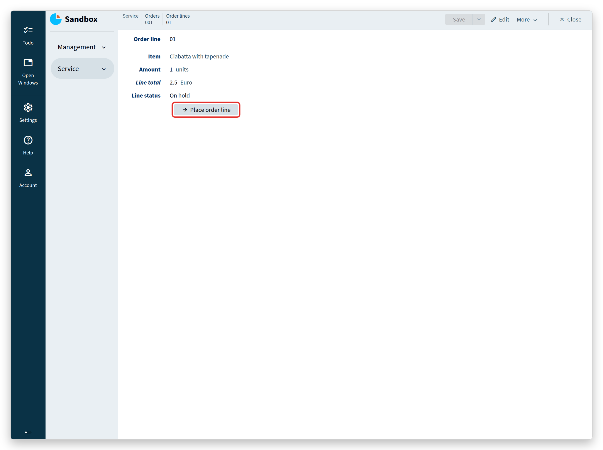
Below `Line status`, the button `Place order line` appears (a line you entered yourself starts in state `On hold`).
Click it: the line moves to `Placed`, the button disappears, and `Ready for service` takes its place.
Click that one too and watch the status advance.

The buttons are exactly the operations that a state allows, which is also the basis for permissions: different roles in the restaurant — service, kitchen, management — can be given access to different parts of the model, so that each of them sees only the buttons that belong to their job.
The [Users & Authentication guide](/pages/tutorials/model/{{ page.platform_version }}/application-users.html) is the starting point for that.

Clicking every line separately is tedious, so add a command that places all lines of an order that are still `On hold`:
```js

```

This command goes below `Order lines`, inside `Orders`.
Its implementation reads: do this (`=>`) — `walk` the collection `Order lines`, which visits every node in it, and store each node under the name `$'line'`.
For each of those nodes, `switch` on `Line status`: in state `On hold`, `update` the node by creating the state `Placed`; in any other state, `ignore` it and do nothing.

In short: walk all order lines, and set the lines that are `On hold` to `Placed`.

Build the model and open order `001` again:
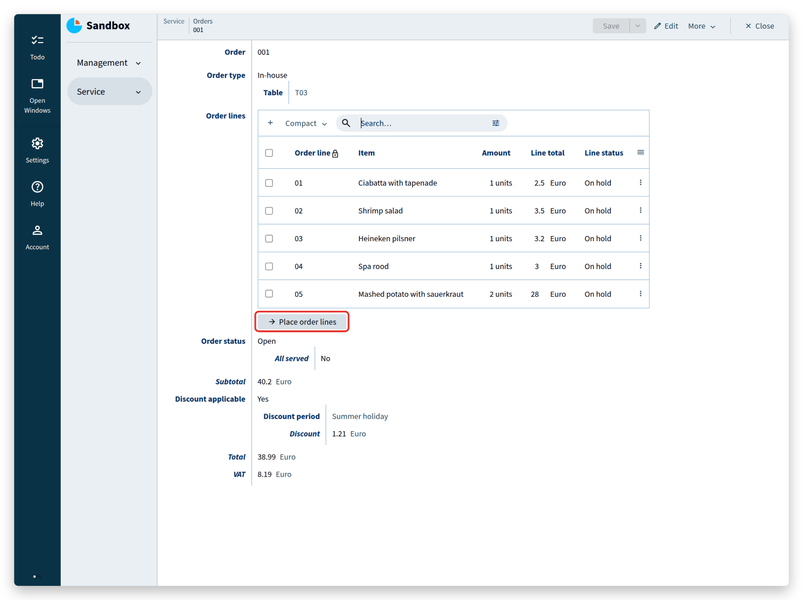
Click the button and refresh the order lines. Only the lines that were `On hold` changed.

The last part of the process: when the customer leaves, all lines have to be served and the bill has to be paid before the order can be closed.
Add these lines to the state `Open` of `Order status`:
```js

```

How does the model determine that *all* lines are served, without knowing how many lines an order has?
By checking that no line is in any of the other three states.
Note the difference between switching on a state and switching on the existence of nodes:
- `switch .'Line status' ( ... )` switches on the state of one order line,
- `switch .'Order lines'* .'Line status'?'On hold' ( ... )` switches on whether *any* order line is in state `On hold`.

<sup>(`^` steps are left out of these two lines, so that they can be compared directly.)</sup>

The second line reads: take all nodes (`*`) of `Order lines`, keep those whose `Line status` is `On hold`, and switch on the result — either there are such nodes (`nodes`) or there are none (`none`).
When there are none, the same check follows for `Placed` and for `Service`.
Only when all three checks yield `none` are all lines served, because every line always has exactly one of the four states.

Once `All served` is `Yes`, the model offers a button for the moment the customer pays, which sets `Order status` to `Closed`:
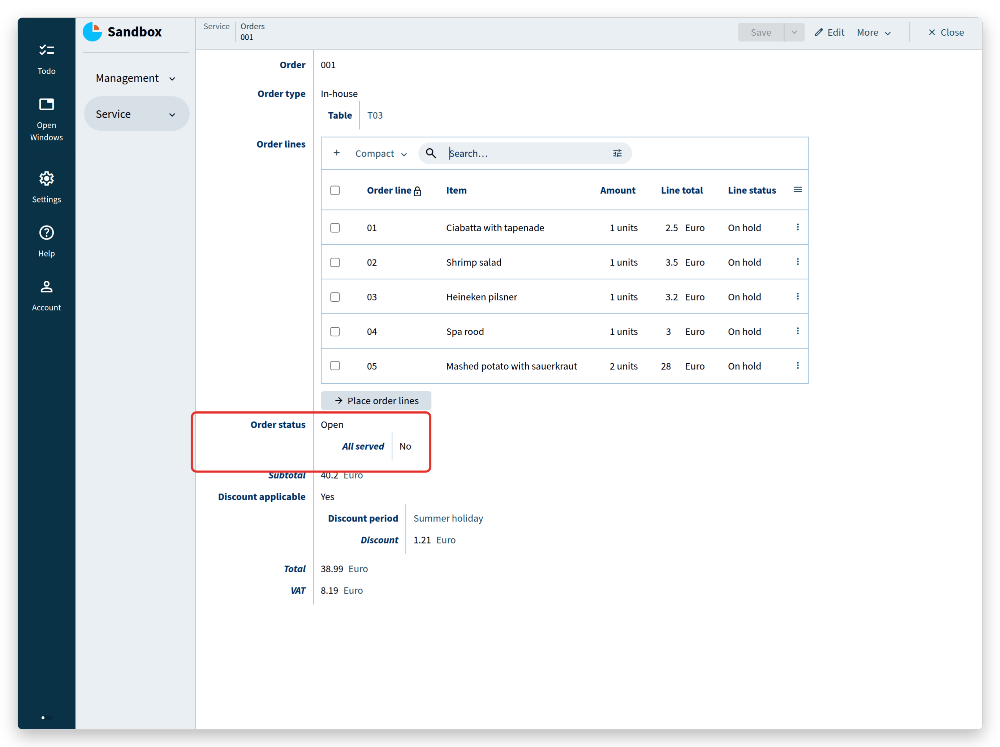
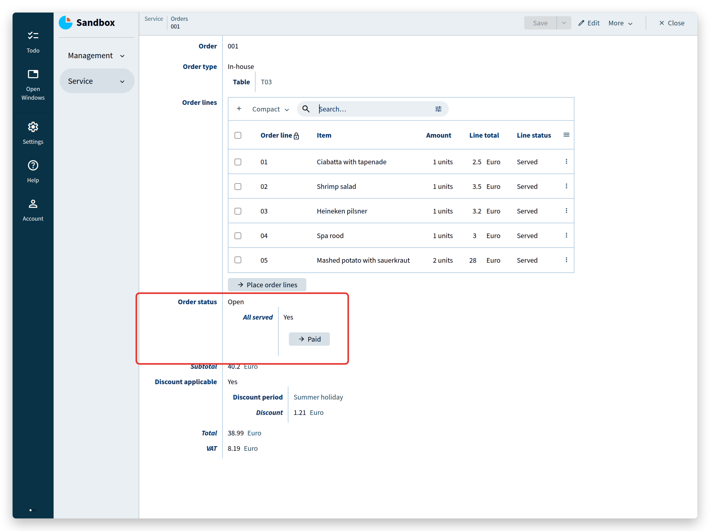

> <tutorial folder: `./_docs/tutorials/restaurant1/{{ page.platform_version }}/step_08/`>

## Advanced references
Service staff need more than a list of prepared lines: they need to know which line to take first, and where to bring it.
Add that information in two steps, starting from the overview of `Order lines` with the view set to `Full`:
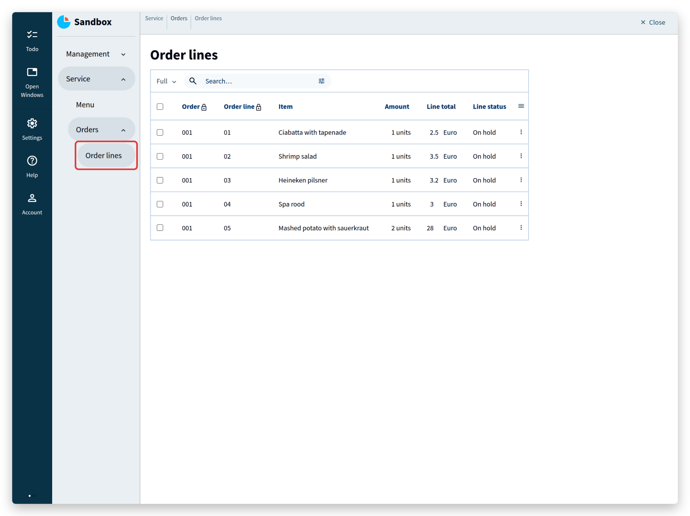

First, a `Priority` in the state `Service` of `Line status`:
```js

```
This resembles the derivation of `All served` in the previous topic, except that it switches on the state of a stategroup instead of on the existence of nodes.
To keep the model simple: desserts get a low priority (mostly cold), appetizers a medium one, and main courses a high one (mostly warm food that should not wait).
The result is an extra column:
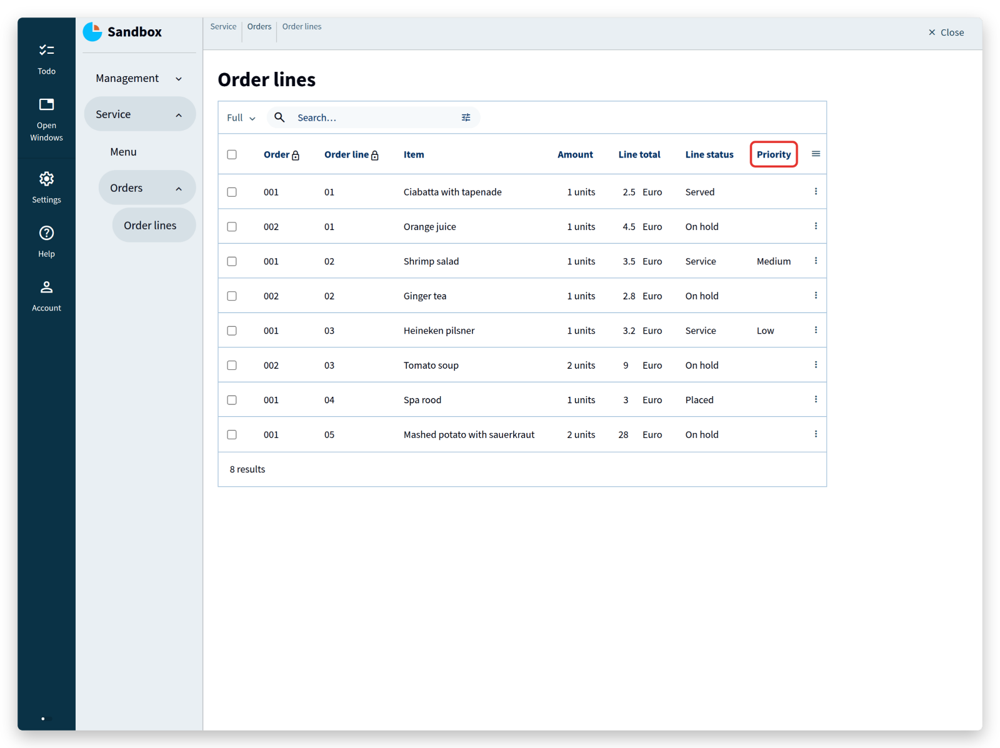

Second, the table to serve to — but only for `In-house` orders, and only when the line is ready for service.
That means looking at the states of two stategroups at once, `Order type` and `Line status`:
```js

```
This shows the table when `To serve` is `Yes`:
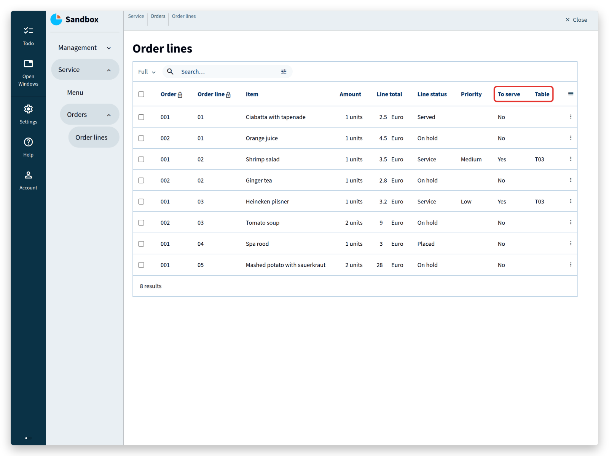

The structure is familiar — state switches on stategroups — but the parentheses after the state `Yes` are new.
They declare a ***state parameter***: a piece of information that a state carries, comparable to a command parameter.
Here the state `Yes` carries the `Table` of the order.

The node of state `In-house` is stored as `$'in-house'`, and a few lines further down its `Table` reference is passed to the state parameter.
Inside the state `Yes`, the text property `Table` is then derived from that parameter.
Its declaration also states which collection the text refers to: the collection `Tables` in the group `Management`.
That reference closes the loop: the value derived from the parameter must come from the same collection that `Table` refers to.
The compiler checks this while building, so pointing at a different collection by accident is caught immediately, instead of producing an app with dangling references.

Now suppose the priority should also be visible when `To serve` is `Yes`.
The model this produces is not clean — the priority ends up in the table twice — but the structure it needs is worth seeing.

The priority lives on the node of state `Service` of `Line status`, so that node has to be reachable.
Store it as `$'service'` in the state switch of `To serve`:
```js

```
Building this model fails: the compiler cannot find the named object `in-house`.
`$'service'` was stored one level below `$'in-house'`, and at that level only the nearest named object is visible.
Think of the named objects as notes stacked on top of each other: only the top one can be read.
Reaching a named object from a higher level takes a step up — not the regular `^`, which steps up in the data, but `$^`, which steps up through the named objects.
Their names, by the way, exist for the reader only; the compiler is just as happy with `$`.

With that step added, the model builds:
```js

```
It builds, but `$'service'` is not used yet, so put it to work:
```js

```
The keyword `where` declares a ***reference rule***: it narrows down what a reference may point at.
Here it further constrains the state `Yes`, which now holds a reference to a node of state `Service`.

Zooming out on the structure:
```js

```
It contains:
- a state derivation inside a state derivation (two nested `switch`es),
- in the case of state `Service`: store the node and initialize the state `Yes`,
- the state `Yes` with a `where` rule, a reference that closes the loop, and a node type definition (`{ ... }`).

The node of state `Service` is now available inside the state `Yes`, so `Priority` can be derived from the `Priority` of that node:
```js

```
A reference rule is addressed with the ***&-symbol***: `.&'Service' .'Priority'` reads the stategroup `Priority` of the node reached through the `Service` rule, and the rest is an ordinary state derivation.

Why the `&`? Reference rules are more often used on a text property, as in this example:
```js

```
The property `Car` has a reference rule `fast` — a `Car` can only be an electric vehicle that is also `Fast` — and `Top speed` is derived through that rule, written as `.'property'&'where'`: first the property, then the rule.
A state is not a property and has no property name to put in front, so for a state the notation shortens to `.&'where'`.

The result in the app:
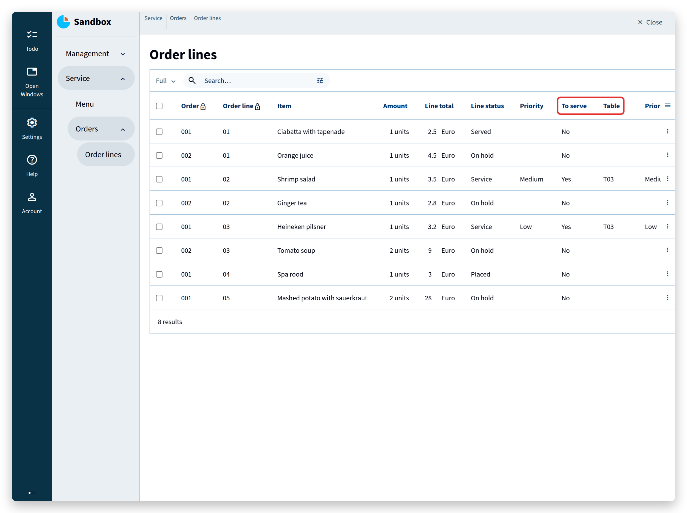

The example is contrived on purpose: it shows, in a few lines, how far a model can reach into its own structure when a real application needs it.

> <tutorial folder: `./_docs/tutorials/restaurant1/{{ page.platform_version }}/step_09/`>

## More advanced references
The kitchen has not been modeled yet.
It is where ingredients become dishes: basic ingredients have to be in stock, and their purchase prices determine what a dish costs.

Start with a group `Kitchen` between `Management` and `Service`, a collection `Products`, and a stategroup that says whether a product is a basic ingredient or a composed product such as a dish:
```js

```
For a basic ingredient, the purchase price is registered together with the amount it was bought for — 1000 grams of potatoes for 5 euro, for instance:
```js

```
That needs a new numerical type, `thousandth eurocent`:
```js

```
A number such as 500000 is then shown as "Euro 5.00000".
Dividing that by the 1000 grams bought gives "Euro 0.00500" per gram, which stays accurate enough for the calculations that follow.

A composed product consists of other composed products and of basic ingredients.
Mashed potato with sauerkraut, for example, consists of the composed product potato mash and the basic ingredient sauerkraut, and potato mash consists of potato, milk and butter.
All of them are nodes of the same collection `Products`:
- Mashed potato with sauerkraut (composed product)
- Sauerkraut (basic ingredient)
- Potato mash (composed product)
- Potato (basic ingredient)
- Milk (basic ingredient)
- Butter (basic ingredient)

A composed product should have a cost price: the prices of its ingredients, in proportion to the amounts used.
First express that composed products consist of products from the same collection:
```js

```
Building this model produces an error:
>'property' `Products` is a self-reference, but a reference to a sibling is required.

A self-reference is exactly the intention, but the compiler wants it stated as a reference to a *sibling*.
All nodes of one collection are siblings: they live at the same level.
Referring from one node to another node of the same collection uses the keyword `sibling`:
```js

```
Note that this navigation goes up two levels instead of three.
A sibling reference points at the level of the collection's key, not at the level of the collection itself.

Next, the price — first without amounts, to keep the steps small.
The group `Kitchen` so far, including the cost price computations:
```js

```

The price of an ingredient is the cost price of the product it refers to, so `'Price' ... = ... >'Product' .'Cost price'` points here:
```js

```

And the cost price of a product depends on its state: a basic ingredient uses its `Purchase price`, a composed product sums the prices of its ingredients with `sum $'composed' .'Ingredients'* .'Price'`.

For mashed potato with sauerkraut, the structure of that computation is:
- Mashed potato with sauerkraut (composed product)
	- Sauerkraut (basic ingredient)
	- Potato mash (composed product)
		- Potato (basic ingredient)
		- Milk (basic ingredient)
		- Butter (basic ingredient)

which comes down to:

€<sub>mashed potato with sauerkraut</sub> = €<sub>sauerkraut</sub> + €<sub>potato mash</sub> = €<sub>sauerkraut</sub> + ( €<sub>potato</sub> + €<sub>milk</sub> + €<sub>butter</sub> )

Reading a value from a sibling in a derivation, however, is not something the compiler accepts as it stands.
Building the model produces a second error:
>cyclic dependency detected for inference 'dependencies'

pointing at `Cost price` in this line:
```js

```

The keyword `sibling` in `'Product': text -> ^ ^ sibling` solved one problem — a user can now say that potato mash consists of potato, milk and butter — and created another: nothing stops a user from saying that potato mash consists of potato, and potato of potato mash, or even that potato mash consists of potato mash.
Computing the price of potato mash would then never finish.

Computations that use their own result are called ***recursive computations***.
They are useful, but only when something guarantees that they end.
The Alan platform provides that guarantee with ***graph constraints***: constraints on the relations (***edges***) between the nodes of a collection.

The platform has two of them.
An ***acyclic-graph*** constraint forbids cycles: a node may link to other nodes, but no chain of links may lead back to where it started.
An ***ordered-graph*** constraint is stricter and puts all nodes in a single chain, from a first node (***source***) to a last one (***sink***) — the way the months of a year follow one another.


These constraints restrict the *relations* between nodes, not their content.
Neither of them prevents a user from entering nonsense such as "potatoes consist of eggs and grapefruit" in an acyclic graph, or "the year starts in October and ends in April" in an ordered one.
A computer has no concept of potatoes, grapefruit or chicken soup; it only knows which node points at which.

The `Products` collection needs an acyclic-graph constraint:
```js

```
The sibling reference has to become part of that graph, `Assembly`:
```js

```
The graph `Assembly` records the edges between the products and keeps them acyclic.
In the app, a user can no longer select a product that would close a cycle: the app either leaves it out of the list or refuses to save.

Finally, the derivations have to state which graph they follow, so that the platform knows the computation terminates.
The keyword `recurse` does that:
```js

```
and:
```js

```

The app now shows the products:
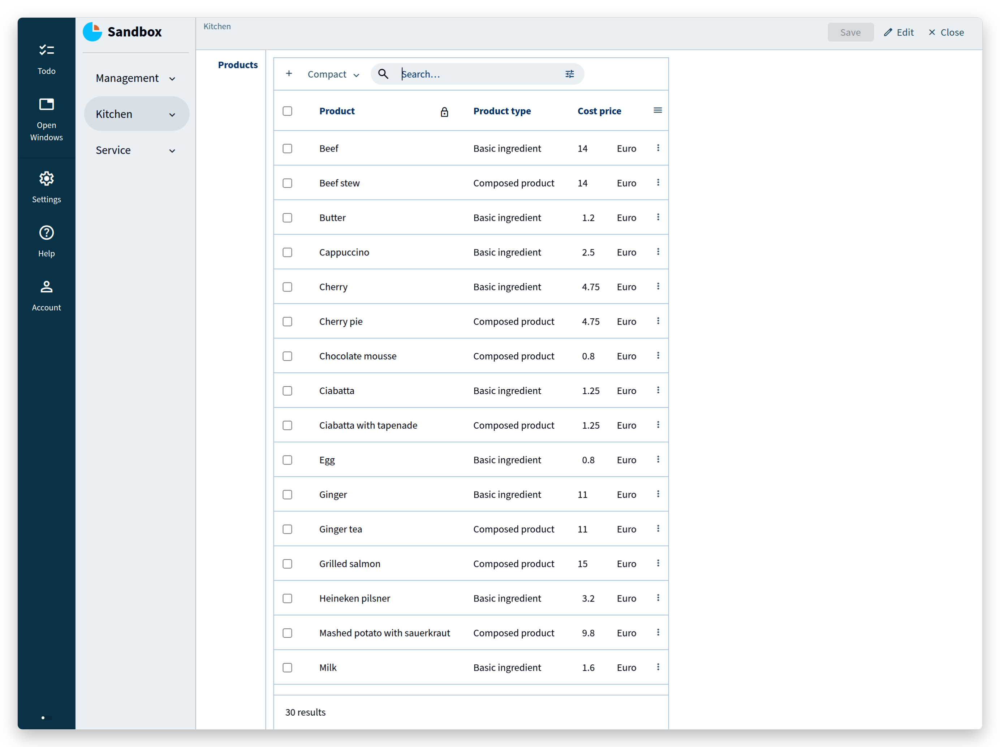

Open `Potato mash`:
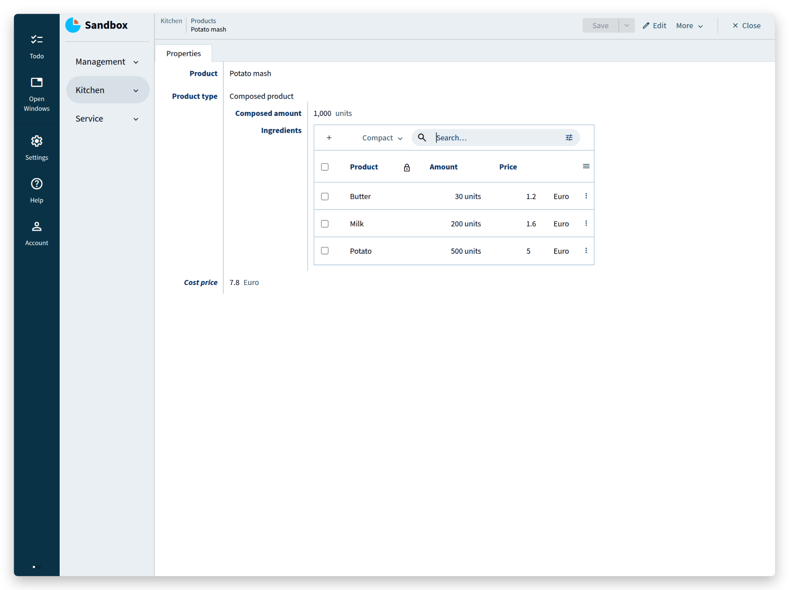
It consists of butter, milk and potato, each of them a product in the same collection.
The price is not right yet: it ignores the amounts.

The price of an ingredient should be the price of the amount used in the composed product.
Change the computation of `Price` and add a `Price per unit` in the collection `Ingredients`:
```js

```
`Price per unit` refers to the `Amount` of a product, which still has to be added.
Its derivation has the same shape as the one for `Cost price`:
```js

```
`Price per unit` is the cost price of a product divided by the amount it was bought for.
`Price` is that price per unit multiplied by the amount the recipe uses.
`Cost price` stays what it was: the `Purchase price` for basic ingredients, the sum of the ingredient prices for composed products.

Amounts all use the numerical type `units`, which can stand for grams, litres, pieces, and so on.
Deriving the amount of a composed product from its ingredients would require the volume or mass of every ingredient; that is beyond this tutorial, so a user enters the amount of a composed product.

The numerical type `thousandth eurocent` needs a product and a division conversion rule, in that order:
```js

```

Potato mash is cheaper now, because its ingredients are counted per unit:
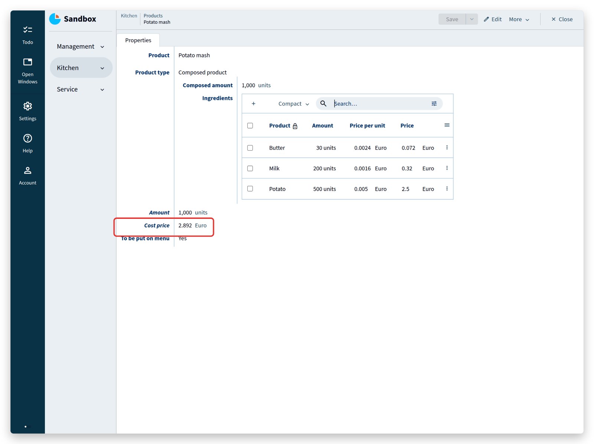

One more addition closes the circle between the kitchen and the menu.
A stategroup `To be put on menu` in `Products` records which products a customer can order:
```js

```

The key `Item name` of the `Menu` can then refer to `Products`, restricted to products whose `To be put on menu` is `Yes`:
```js

```
<sup>(NOTE: `as $` is implicit after the reference constraint in the first line.)</sup>

The definition of `Item name` is extended with a reference to `Products` and a `where` rule that admits only products in state `Yes`.
Adding an item to the menu now means selecting one from that list:
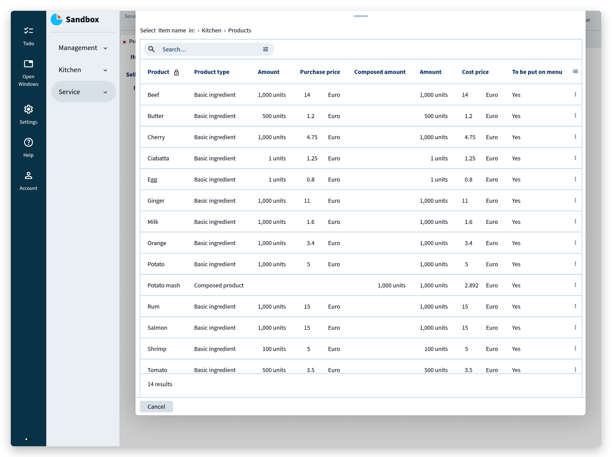

> <tutorial folder: `./_docs/tutorials/restaurant1/{{ page.platform_version }}/step_10/`>

## The End
The restaurant app now covers the whole story: a menu built from the products of the kitchen, orders that are placed, prepared, served and paid, prices and taxes computed from the data itself, and a kitchen that assembles products from other products without ever running in circles.

Three ideas carried all of it:
- **the model is the application** — describe the data and the rules, and the app follows;
- **the compiler is your reviewer** — a structural change is safe because every place it affects is reported before the app runs;
- **states model processes** — what a user may do next follows from the state the data is in.

Where to go next:
- [Users & Authentication](/pages/tutorials/model/{{ page.platform_version }}/application-users.html) adds real users, passwords, and with them the permissions that decide who may push which button.
- The [application language documentation](/pages/docs/model/{{ page.model_version }}/application/grammar.html) covers every feature of the language, with examples.
- The tutorial folders in `_docs/tutorials/restaurant1/{{ page.platform_version }}/` contain the complete model of each step, to compare against.

Then build something of your own: begin with the end in mind, and experiment.
The [forum](https://forum.alan-platform.com/) is the place for questions about the language, the platform, or a model you are working on.
