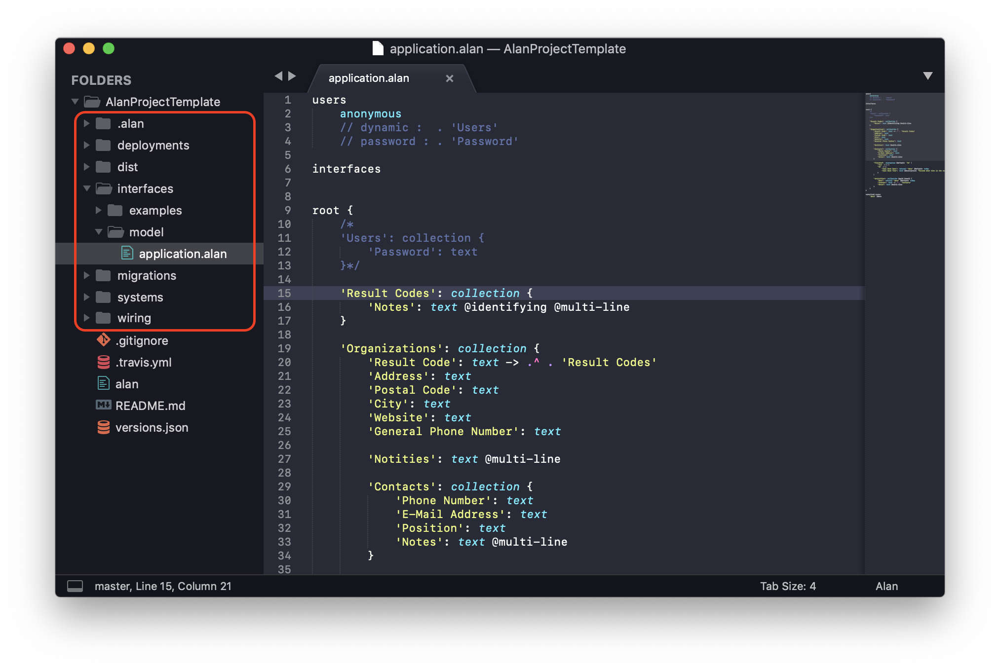
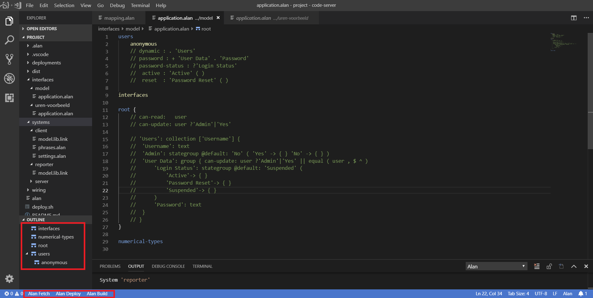
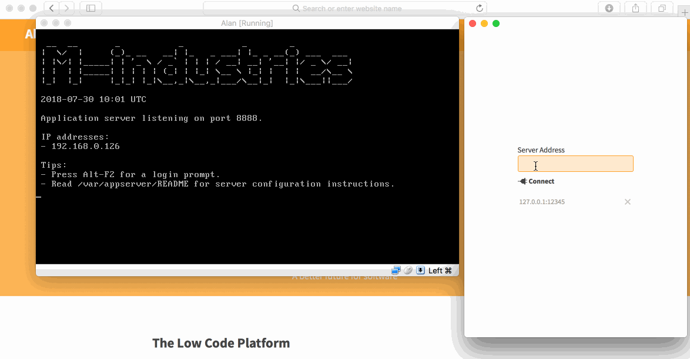

> Take a look at the [Reference Guide](reference.html) for an overview of the bits, pieces and commands used throughout this tutorial. 

In this tutorial we'll take you through the steps going from a blank model to a small application. 

- [Project Layout](#project-layout)
- [Application Model](#application-model)
- [Run It](#run-it)
- [Build It](#build-it)
- [Your own application model](#your-own-application-model)
  - [Add users](#add-users)
  - [Add some collections](#add-some-collections)
  - [Numbers](#numbers)
  - [References](#references)
  - [Compiling](#compiling)
- [Next steps](#next-steps)


<hr>


To get you up and running we've created a [project template](https://github.com/M-industries/AlanProjectTemplate). The build system we're going to use expects a layout with files and folders in a particular structure, and this template sets you right on track for anything but the most complicated things you can build with Alan (like connecting to external databases).  
So, [download](https://github.com/M-industries/AlanProjectTemplate/archive/master.zip) or fork and clone that template to get started.

Several steps involve entering commands on a Unix-like **command line**. Use whatever you like on Linux or macOS (as long you've got [bash](https://en.wikipedia.org/wiki/Bash_shell)). On Windows you can use [WSL](https://docs.microsoft.com/en-us/windows/wsl/about) or [Git Bash via Git For Windows](https://gitforwindows.org), as long as you don't mix the two.

On Linux and macOS you can [run the server](/docs/#get-the-alan-server) and connect to it via the command line. In this tutorial we'll use a virtual machine and a desktop application, which should work for everyone.


## Project Layout

You'll notice some top level directories here.



- **deployments**  
	Contains environment specific configuration like IP addresses, in addition to stuff that will be different from one deployment to another like your datasets.
- **interfaces**  
	Systems talk to each other over interfaces. For instance, the client talks to the server over an interface defined by the application model. 
- **migrations**  
	Data needs to match the application model specification. Migrations help you move your data from one version of that specification to another. 
- **systems**  
	Contains the configuration of each system that will be running for your project. Most projects have a server, a client and a reporter. 
- **wiring**  
	Defines how the systems and interfaces are wired together. For most projects the default here already defines everything you need, but if you want to add custom clients or external databases this is where you describe how they're connected.

For now, you can ignore deployments, migrations, systems and wiring. We'll touch on some of those later, but we've got defaults set up there that will work for most basic projects. 

First, lets take a look at the application model, as for most projects you'll spend most time editing this file.


## Application Model

Open the **interfaces/model/application.alan** file in an editor. We'll be using Sublime Text in the screenshots, but [you can use whatever you like](https://github.com/M-industries?utf8=✓&q=AlanFor). 



The template already has a little model set up that covers some basics. Let's walk through it before we wipe it clean and start our own.

The model is a nested structure not unlike [JSON](https://json.org). At the first level you'll see some keywords:
- [users](https://github.com/M-industries/AlanProjectTemplate/blob/bb862edd3be27df167400cbbc405aa3509d47da4/interfaces/model/application.alan#L1)  
	There is some boiler plate here that currently allows anonymous users, so you can use the application without logging in. 
- [roles](https://github.com/M-industries/AlanProjectTemplate/blob/bb862edd3be27df167400cbbc405aa3509d47da4/interfaces/model/application.alan#L6)  
	Permissions are currently set using roles. Users are assigned to roles to give them read and/or write access to parts of the data.
- [root](https://github.com/M-industries/AlanProjectTemplate/blob/bb862edd3be27df167400cbbc405aa3509d47da4/interfaces/model/application.alan#L12)  
	This is where your model really starts. Note the basic write and read permissions that are set here.
- [numerical-types](https://github.com/M-industries/AlanProjectTemplate/blob/bb862edd3be27df167400cbbc405aa3509d47da4/interfaces/model/application.alan#L55)  
	Numbers have types, like "date" or units like "kg". Number types can be converted between for calculations (e.g. to get "meters per second") etc. 

So, in **root**, you describe the data model of your application. You do so by combining properties of certain types. Essentially there are 5 data types in Alan:
- **number** (integer or natural)  
	Numbers are things you can count, or do math with. [Dates and date-time values](https://github.com/M-industries/AlanProjectTemplate/blob/bb862edd3be27df167400cbbc405aa3509d47da4/interfaces/model/application.alan#L42) are numbers too. Numbers are usually an integer, or a [natural](https://en.wikipedia.org/wiki/Natural_number) when they can't be zero or negative. Alan doesn't have floats, but uses conversions to maintain a specific accuracy.
- **text**  
	Text is mostly just text, e.g. a "Name", or any other value that doesn't adhere to any rules. So [phone numbers](https://github.com/M-industries/AlanProjectTemplate/blob/bb862edd3be27df167400cbbc405aa3509d47da4/interfaces/model/application.alan#L33) are `text`, not `number`.
	You *can* put some [input rules](/pages/docs/model/33/application/grammar.html#node) on text for the user interface, e.g. minimum length or a specific pattern.
	Text can also refer to an [entry in another collection](https://github.com/M-industries/AlanProjectTemplate/blob/bb862edd3be27df167400cbbc405aa3509d47da4/interfaces/model/application.alan#L49) (like a [foreign key](https://en.wikipedia.org/wiki/Foreign_key)).
- **file**  
	When you connect file storage to your server (documentation about this will follow), you can store files as well. They can be viewed in the client, or downloaded.
- **collection**  
	You could (but [shouldn't](https://en.wikipedia.org/wiki/Graph_database) 😉 ) think of these as your tables. If you want to describe a bunch of "things" that are mostly the same, e.g. "Contacts", that's a collection.
	Keys in a collection are just like a text property, but you don't have to define it explicitly. Like text properties, keys can also refer to keys in another collection. 
- **stategroup**  
	[State groups](https://github.com/M-industries/AlanProjectTemplate/blob/bb862edd3be27df167400cbbc405aa3509d47da4/interfaces/model/application.alan#L39) represent a choice. With state groups things in one state have different properties from things in another state. E.g. road bikes and fixies are both bikes, but one has gears and shifters, whereas the other doesn't. Or finished processes have and end time, unfinished processes don't.

There is a fifth type called **group**, which is just a construct to create  grouping and name spaces: groups don't actually hold any data by themselves.


## Run It

Let's quickly try to actually boot up this example project, before we go back to making our own application.

The workflow here is that you've got a server running somewhere (on your system, on the local network, or in the cloud) and you upload your application to it. The server then runs the application and you can use it via your webbrowser.

### Get the server 
- Get [VirtualBox](https://www.virtualbox.org/wiki/Downloads) for your computer.
- Get our [server appliance](/docs/#get-the-alan-server).

Double click the **Alan.ova** appliance package to import it into VirtualBox. It has all the configuration already set up to Just Work™. Then hit the green Start button. When it's done going through the boot sequence it will report the IP address (probably 192.168.xx.xx) and port number (probably 8888) you can use to connect to it.

### Connect to the server
- Get the [Alan Connect](/docs/#get-the-alan-connect-management-app) app.
- Install and then start it.
- Enter the server's IP address and port (IP:port, e.g. 192.168.1.1:8888).


## Build It 

Let's get ready to send the application to the server. The project holds the source code, but it needs to be compiled before the server can use it. There are a few step to this:

- Open your command line of choice (see the note at the start of this article) at the root directory of your project.
- Run the following commands:
	- `./alan bootstrap`
	- `./alan build`
	- `./alan build -C migrations`
	- `cp dist/from_scratch.migration deployments/default/instances/server.migration`
	- `./alan package dist/project.pkg deployments/default`


> Tip: Run `./alan --help` for a breakdown of what these commands do.

This results in a **default.image** file in the dist folder (all output is put in the dist folder by default). You can drag that file to the Alan Connect application and it'll upload it to the server. Once that's done you'll see the application listed and you can hit the green "Start" button to start it. 🍾!

You can now open a browser and go to the ip address of the server, followed by the [port the client is available on](https://github.com/M-industries/AlanProjectTemplate/blob/bb862edd3be27df167400cbbc405aa3509d47da4/deployments/default/deployment.alan#L20) (it's *not* the 8888 we just used to connect to the server). For this template it'll look like this:

http://192.168.xx.xx:7584 




## Your own application model

While getting an application for free is nice, it's even nicer to build your own. For that, lets start by whiping the **application.alan** file and then start over with this:

```
users
	dynamic :  . 'Users'
	password : . 'Password'

roles
	'User' : dynamic

root #writer 'User' #reader 'User' {

}

numerical-types
```

This clean slate for an application that has "users" and requires logging in. 

### Add users
Now let's add those users to the model:

```
root #writer 'User' #reader 'User' {
	'Users': collection { }
}
```

We specified that for each user we store their password in the `'Password'`property, so let's add that too:

```
root #writer 'User' #reader 'User' {
	'Users': collection {
		'Password': text
	}
}
```

So, we've defined a 'Users' collection, where each key in the collection will serve as the "username" and there is a password they'll need to provide to log in. The default user interface will pick this up and present the login form next time you run the application.

### Add some collections
That should work, but our app lacks purpose right now. Why not build a little multi-user todo app (when not sure what to do, make a todo app right?). So, let's say our users are involved in projects and each project has stuff that needs to be done.

```
root #writer 'User' #reader 'User' {
	'Users': collection {
		'Password': text
	}
	'Projects': collection {
		'Todos': collection { }
	}
}
```

We should probably have a little more information for each todo, like when it was created, or to which user it was assigned. It probably doesn't hurt to be able to write down some details about the todo either.

```
'Todos': collection {
	'Created': natural 'date and time'
	'Description': text
	'Assignee': text -> .^ .^ .'Users'
}
```

Now we've already done some things I need to explain. Let's take them one by one.


### Numbers
```
'Created': natural 'date and time'
```

This creates a number property, typically a "natural": meaning it can't be zero or negative, which won't make sense for a timestamp. We also give it the type of 'date and time'. Properties that are the same kind of number (a "date", or "kilograms", or "minutes") all have the same numerical type. This makes sure that when you're making calculations, you also end up with the correct numerical type for the result value. More on that later, right now you need to register that numerical type:

```
numerical-types
	'date and time'
```

To help the user interface interpret this and serve up a nice date-time picker, we need to annotate this.

```
numerical-types
	'date and time' @date-time
```

### References
The other thing that's special here is the 'Assignee'. 

```
'Assignee': text -> .^ .^ .'Users'
```

It's a text property, but we want it to refer to one of the users of the application. Let's break down the syntax here:

- `->`: says "hey, this should refer to something"
- `.^`: this is the first step in what we call the **path** to the thing we want to refer to. It tells the program to step "up" (`^`) out of the current collection (`.`).
- `.^`: the first step took us from 'Todos' to 'Project', so we take another step up.
- `.'Users'`: now that we've arrived at the root of the model, we can simply point to the 'Users' collection.


### Compiling
To verify that our new model is correct, let's try to compile it:

`./alan build`

This fails because the client application is still configured to allow anonymous users, and we've just created an application that requires users to log in. Luckily the compiler tells us where to go to fix this. 
- Open `systems/client/settings.alan`.
- On line 3, change `anonymous login: enabled` to `anonymous login: disabled`.
- Run `./alan build` again to verify.

If that's successful we're almost ready to run it. To do so, we first need to update our initial data definition by modifying the files in `migrations/from_scratch`. Luckily, we have a script to do this for us:

```
./.alan/dataenv/system-types/datastore/scripts/generate_migration.sh migrations/from_scratch systems/server/model.lib.link --bootstrap
```

We can then continue with the same steps as before:
- `./alan build -C migrations`
- `cp dist/from_scratch.migration deployments/default/instances/server.migration`
- `./alan package dist/project.pkg deployments/default`

In the Alan Connect app you can stop and delete the old application, and then upload and start this one.

When you refresh the browser, you're now greeted with the login screen. You can log in as user "root" with password "welcome", and 🎉 there is your application!


## Next steps

The project template has an model filled with [examples](https://github.com/M-industries/AlanProjectTemplate/blob/bb862edd3be27df167400cbbc405aa3509d47da4/interfaces/examples/application.alan) that cover what we call **derivations**: ways to do math with numbers or derive state groups from other data.

You can [annotate your model](/pages/docs/model/33/application/grammar.html#node) to set default values and [number formats](/pages/docs/model/33/application/grammar.html#numerical-types). Check the [model language docs](/pages/docs/model/33/application/grammar.html) for more details.

Migrations can be edited by hand, for instance to bootstrap your application with more data than is automatically generated. Learn more about it in the [migrations tutorial](migration.html).

If you want to learn more, check our [documentation](/docs) or ask on [the forums](https://forum.alan-platform.com/)!
