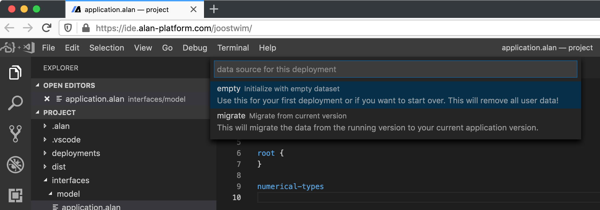
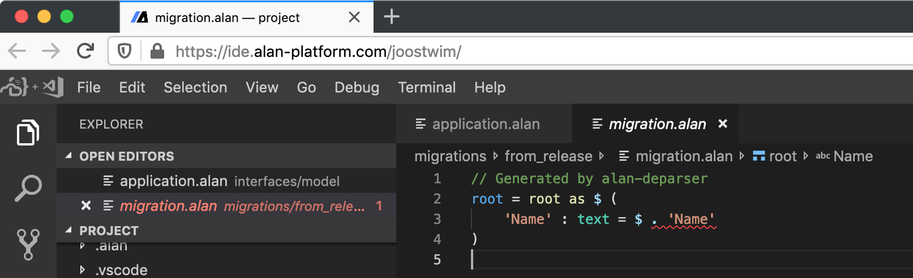

In this tutorial we'll take you through the steps of going from a blank model to a small application.

- [Project Layout](#project-layout)
- [Application Model](#application-model)
- [Build It & Run It](#build-it--run-it)
- [Upgrade with a migration](#upgrade-with-a-migration)
- [Your own application model](#your-own-application-model)
  - [Add users](#add-users)
  - [Add some collections](#add-some-collections)
  - [Numbers](#numbers)
  - [References](#references)
- [Next steps](#next-steps)


<hr>

## Project Layout

To get you up and running we've set up a project template in your online ide. The build system we're going to use expects a layout with files and folders in a particular structure, and this template sets you right on track for anything but the most complicated things you can build with Alan (like connecting to external databases).

You'll notice some top level directories here.


- **.alan**
  Contains downloaded alan executables
- **.vscode**
  Contains project specific vscode settings
- **deployments**
	Contains environment specific configuration like IP addresses, in addition to stuff that will be different from one deployment to another like your datasets.
- **interfaces**
	Systems talk to each other over interfaces. For instance, the client talks to the server over an interface defined by the application model.
- **migrations**
	Data needs to match the application model specification. Migrations help you move your data from one version of that specification to another.
- **systems**
	Contains the configuration of each system that will be running for your project. Most projects have a server, a client and a reporter.
- **wiring**
	Defines how the systems and interfaces are wired together. For most projects the default here already defines everything you need, but if you want to add custom clients or external databases this is where you describe how they're connected.

For now, you can ignore .alan, .vscode, deployments, migrations, systems and wiring. We'll touch on some of those later, but we've got defaults set up there that will work for most basic projects.

First, lets take a look at the application model, as for most projects you'll spend most time editing this file.


## Application Model

Open the **interfaces/model-hours/application.alan** file in an editor. We'll be using Visual Studio Code in the screenshots, but [you can use whatever you like](https://github.com/alan-platform?utf8=✓&q=AlanFor).


The template already has an example model set up that covers some basics. Let's walk through it:

The model is a nested structure not unlike [JSON](https://json.org). At the first level you'll see some keywords starting different sections of your model:
- **users** configures authentication for your application. If you specify `anonymous` in this section, you can use the application without signing in.
- **interfaces** declares the interfaces that your application consumes. You can define interface permissions in your data model, such that another application can update specific pieces of data via an interface (instead of an application user).
- **root** is where your data model really starts. Here you define the structure of your application data, constraints, computations, authorization, validation, and so on.
- **numerical-types** defines the different numerical types that numbers in your application can have, such as `date` or a unit type `kg`. For computations with numbers, the section also defines conversions between numerical types.
	For example, from `kilogrammes` to `grammes` or from `meters` and `seconds` to `meters per second`.

So, starting at the **root**, you describe the data model of your application. You compose a data model from properties of the 6 built-in data types that Alan defines:
- **number** (integer or natural)
	Numbers are things you can count, or do math with. Dates and date-time values are numbers as well. Numbers are usually an integer, or a [natural](https://en.wikipedia.org/wiki/Natural_number) when they can't be zero or negative. Alan doesn't have floats; Alan requires explicit numerical type annotations to ensure a *predefined* accuracy for numbers.
- **text**
	Text properties hold plain, unbounded textual values like a name, a phone number, a license plate number, or remarks.
	You can define [validation rules](/pages/docs/model/89/application/grammar.html#user-interface-annotations) on text values for the user interface, e.g. minimum length or a specific pattern.
	Also, a text value can reference an entry in another collection (like a [foreign key](https://en.wikipedia.org/wiki/Foreign_key)).
- **file**
	When you connect file storage to your server (documentation about this will follow), you can store files as well. Files can be viewed directly in the client or downloaded to your local machine.
- **collection**
	You could (but [shouldn't](https://en.wikipedia.org/wiki/Graph_database) 😉) think of these as your tables. If you want to describe a bunch of 'things' that are mostly the same like `Users`, that's a collection.
	Collection entries are key-value pairs, where the key has to be unique for each different entry in the collection.
	At a `collection` property, you define which text property holds the key of each entry in the collection, like the property `Name` for a collection of `Users`.
- **stategroup** Stategroups represent a choice. With state groups things in one state have different properties from things in another state.
	For example, road bikes and fixies are both bikes, but one has gears and shifters, whereas the other doesn't. Or finished processes have and end time, unfinished processes don't.
- **group** Groups are for grouping properties that you think belong together: groups don't actually hold any data by themselves.


## Build It & Run It

While getting an application for free is nice, it's even nicer to build your own. Open the **interfaces/model/application.alan** file in your editor. You will notice that it is almost completely empty.
Let's quickly try to actually boot up this example project, before we proceed to make our own application.

This should be fairly easy:
- Use the button 'Alan Fetch' at the bottom left to download the latest version of the Alan developer tools. You will need to do this once.
- Use the button 'Alan Build' at the bottom left to run a build. It should complete without any errors.
- If it builds, you should be able to deploy it, by using the 'Alan Deploy' button at the bottom.

## Upgrade with a migration
When clicking the button 'Alan Deploy', you get a list from which you can choose a deployment type.
For your first deployment, choose the **empty** option from the list.
This will initialize your application with an empty dataset.



After you have completed at least one successful deployment, you can make changes to your application model and you can choose for a deployment of the **migrate** type which enables you to migrate your existing application data to your new application version:


This will generate a default migration 'from_release' which should be updated until you have specified a data source for every property in your model:



Complete [documentation of the migration language](/pages/docs/datastore/85/migration_mapping/grammar.html) is available online. This is an example where a static value is provided for a text property:

```js
root = root as $ (
	'Name' : text = "John Doe"
)
```

After this, 'migrate' deployments can be repeated iteratively. After every successful deployment, you will need to update your migration to match your latest application model version.

At some point, it might be useful to have newly generated migration based on your latest application model. You can do this by opening the file `migration.alan` in the directory `migrations/from_release` and executing the 'Generate migration' command from your editor. Choose `from_release` as migration name, `server/model.lib.link` as target model and "mapping from target conformant dataset" to generate a migration that expects the source and target models to be the same while preserving your application data.

## Your own application model

Let's start over with this in your **application.alan** file:

```js
users
	dynamic : .'Users'
		password : +'User Data'.'Password'
		password-status : ?'Login Status'
			active : 'Active' ( )
			reset  : 'Password Reset' ( )

interfaces

root {

}

numerical-types
```

This is a clean slate for an application that has `users` and requires authentication.

### Add users
Now let's add those users to the data model:

```js
root {
	'Users': collection ['Username'] {
		'Username': text
	}
}
```

But we're not there yet. In the `users` section, we specified that we store user passwords in the `'Password'` property and the login status in a `'Login Status'` stategroup.
Let's also add `Type` to the `Users`, such that we can configure some basic authorization rules.
```js
root {
	'Users': collection ['Username'] {
		'Username': text
		'User Data': group {
			'Login Status': stategroup @default: 'Suspended' (
				'Active'-> { }
				'Password Reset'-> { }
				'Suspended'-> { }
			)
			'Password': text
		}
		'Type': stategroup (
			'Admin'-> { }
			'Reader'-> { }
		)
	}
}
```

Now, let's press 'Alan Build' to see if everything is ok.
There should be exactly one error: something is wrong in our client settings.
Press `F8` to quickly go to the error, or navigate to `./systems/client/settings.alan` in the explorer.
In `settings.alan` it says: `anonymous login: enabled`.
But wait... we removed `anonymous` from `users` section in our application model, so that is no longer ok.
To fix it, simply change `enabled` to `disabled`, and you should now be able to build the project successfully.


#### Add permissions
We only want `Admin` users to create and delete `Users`.
Also, the password (hash) and login status are personal data that should not be updated by other users.
To achieve that, we need to configure some permissions:

```js
root {
	can-read: any user
	can-update: any user ?'Type'|'Admin'

	'Users': collection ['Username'] {
		'Username': text
		'User Data': group { can-update: user == ^
			'Login Status': stategroup @default: 'Suspended' (
				'Active'-> { }
				'Password Reset'-> { }
				'Suspended'-> { }
			)
			'Password': text
		}
		'Type': stategroup (
			'Admin'-> { }
			'Reader'-> { }
		)
	}
}
```

So, now we've defined a `'Users'` collection, where each key in the collection will serve as the 'username' and there is a password they'll need to provide to log in.
Below we will give you some specifics about how this works, but first: let's take a look at what we have built.

Click 'Alan Deploy', and select the **empty** deployment type from this list.
This will inject a default username and password for first time use.
When it's done deploying, open your application and sign in with these credentials:
- username: **root**
- password: **welcome**

Set your password, attempt a password reset, and add an account for a family member if you like.

So, what just happened... how does this work?
First, some context.
The `user` keyword is special: it refers to an authenticated user.
An authenticated user is an entry from the collection of `Users` because we specified `dynamic : .'Users'` in the `users` section.

With `can-read: any user` at the root type, we have specified that any authenticated `user` can read data downwards from the root node.
Similarly, `can-update: any user ?'Type'|'Admin'` specifies that only admins can update data downwards from the `root`.
That is, until overridden by a redefinition of `can-read` or `can-update`.

For the `User Data`, that is exactly what we want to do: the `User Data` should only be updated when the signed in `user` equals the to-be-updated user.
The expression `user == ^` takes care of that: the runtime takes the authenticated user node and ensures that it equals the parent (`^`) node of the to-be-updated `User Data` node.


### Add some collections
We have authentication and authorization, but our app lacks purpose right now.
Why not build a little multi-user todo app (when not sure what to do, make a todo app right?).
So, let's say our users are involved in projects and each project has stuff that needs to be done.

```js
root {
	can-read: any user
	can-update: any user

	'Users': collection ['Username'] {...}
	'Projects': collection ['Project Name'] {
		'Project Name': text
		'Todos': collection ['Todo'] {
			'Todo': text
		}
	}
}
```

We should probably have a little more information for each todo, like when it was created, or to which user it was assigned.
It probably doesn't hurt to be able to write down some details about the todo either.

```js
'Todos': collection ['Todo'] {
	'Todo': text
	'Created': natural 'date and time'
	'Description': text
	'Assignee': text -> ^ ^ .'Users'
}
```

Now we have written several things that need some explaining. Let's take them one by one.


### Numbers
```js
'Created': natural 'date and time'
```

The property `Created` is a `natural` number property, which holds a value greater than zero. We also specified a numerical type: `date and time`. Properties that are the same kind of number (a 'date', 'kilograms', or 'minutes') all have the same numerical type. This ensures that when you're defining computations, you will end up with the correct numerical type for the resulting value. More on that later, right now you need to register that numerical type:

```js
numerical-types
	'date and time'
```

To help the user interface interpret this and serve up a nice date-time picker, we need to annotate this.

```js
numerical-types
	'date and time' @date-time
```

### References
The other thing that's special here is the 'Assignee'.

```js
'Assignee': text -> ^ ^ .'Users'
```

An `Assignee` property holds a text value, but we want to ensure that it refers to an entry from the `Users` collection. Let's break down the syntax here:

- `->`: says "hey, this should refer to something"
- `^`: this is the first step in what we call the **path** to the thing we want to refer to. It tells the program to step "up" (`^`) out of the current collection.
- `^`: the first step took us from 'Todos' to 'Project', so we take another step up.
- `.'Users'`: now that we've arrived at the root of the model, we can simply point to the 'Users' collection.

To check your new additions, build the project again. If all is well, just deploy it to see how it works in practice.

## Next steps

The project template has a model filled with examples that cover what we call **derivations**: ways to do math with numbers or derive state groups from other data.

You can [annotate your model](/pages/docs/model/89/application/grammar.html#user-interface-annotations) to set default values and [number formats](/pages/docs/model/89/application/grammar.html#numerical-types). Check the [model language docs](/pages/docs/model/89/application/grammar.html) for more details.

Migrations can be edited by hand, for instance to bootstrap your application with more data than is automatically generated. Learn more about it in the [migrations tutorial](migration.html).

If you want to learn more, check our [documentation](/docs) or ask us directly!
