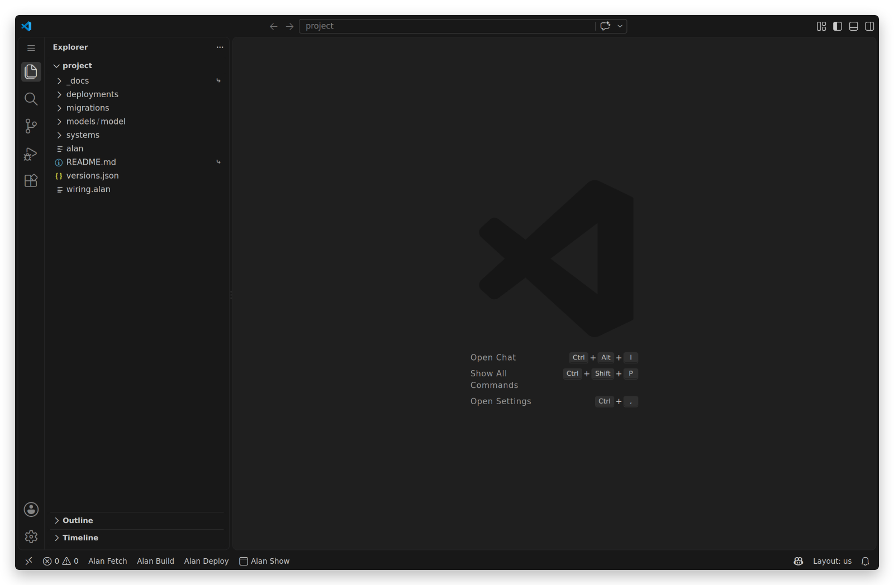
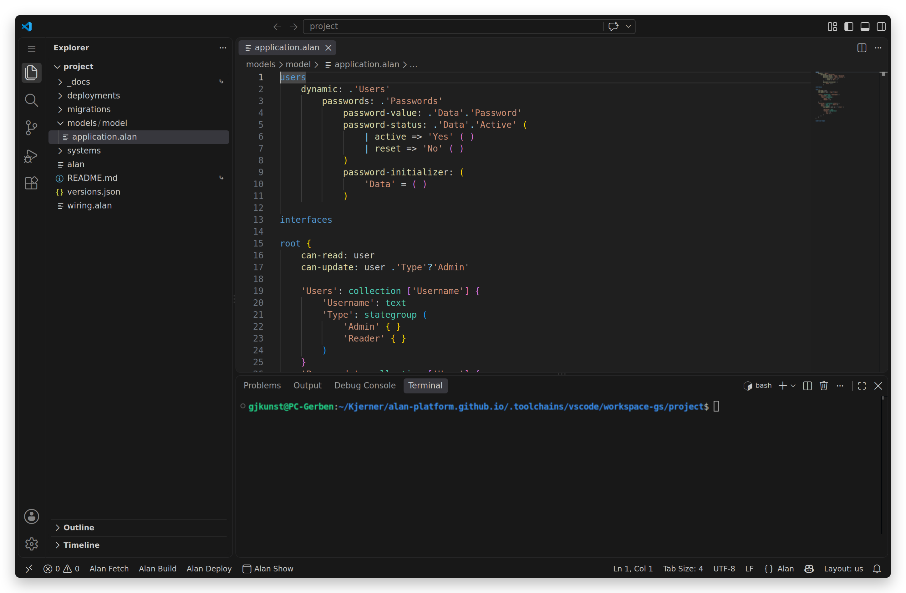
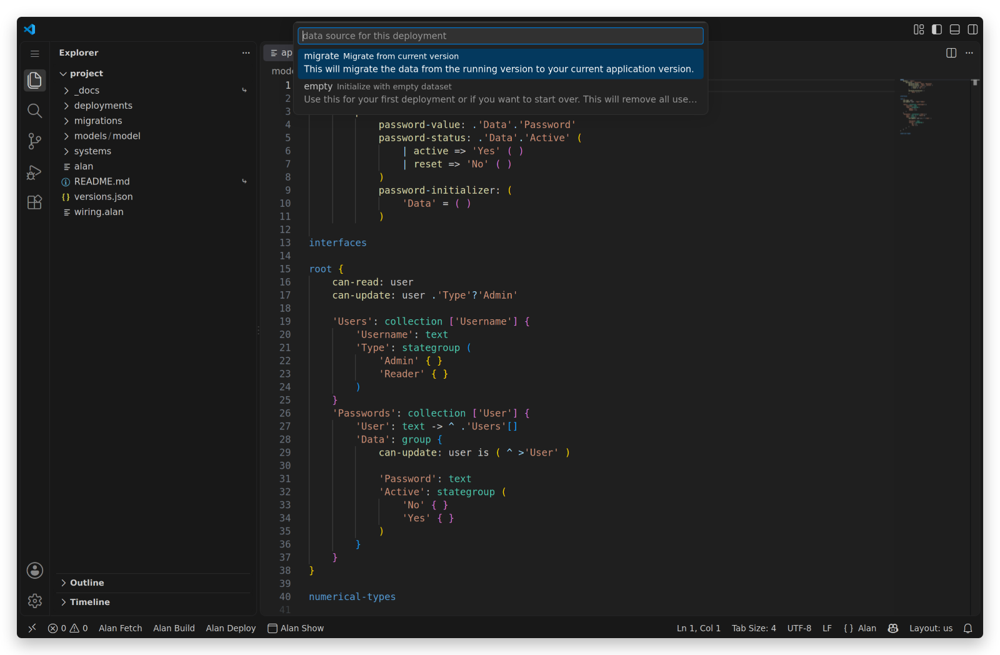
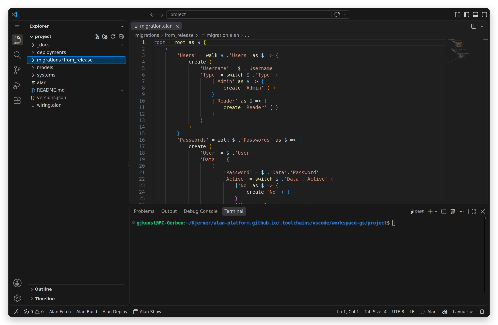







This tutorial takes you from a blank model to a small application with users, authorization, and data of your own.
It uses the project template that the online Alan IDE sets up for you, and the buttons of the Alan extension for VS Code.
For a guided tour of the IDE itself, read the [IDE tutorial](/pages/tutorials/ide/ide-tutorial.html) first.

- [Project layout](#project-layout)
- [Application model](#application-model)
- [Build it and run it](#build-it-and-run-it)
- [Deploy and migrate](#deploy-and-migrate)
- [Your own application model](#your-own-application-model)
  - [Add users](#add-users)
  - [Add permissions](#add-permissions)
  - [Add some collections](#add-some-collections)
  - [Numbers](#numbers)
  - [References](#references)
- [Next steps](#next-steps)


<hr>

## Project layout

The template in your online IDE gives you a project with the structure that the build system expects.
It covers everything except the most involved setups, such as connections to external databases.



- **models**
	Your application models. `models/model/application.alan` is the model of your app, and the file you will spend most of your time in.
- **systems**
	The configuration of each system that runs for your project: a server, a client, and a session manager for logging in.
- **deployments**
	Configuration per deployment: where the app runs, and which data it starts from.
- **migrations**
	Data has to match the model. A migration moves the data of a running app to a new version of the model. This folder appears after your first deployment.
- **_docs**
	The tutorials and their example models, so that they are available inside your project.
- **wiring.alan**
	How the systems and interfaces are connected. The default covers most projects; custom clients or external databases are described here.
- **versions.json**
	The platform version and the system type versions your project uses.
- **alan**
	The script that fetches the tools, builds and deploys, and that the buttons in VS Code call.

Two more folders are hidden by the project settings: **.alan**, which holds the downloaded platform tools, and **.vscode**, which holds project-specific editor settings.

Start with the application model, since that is where an Alan project begins.

## Application model

Open **models/model/application.alan**.
The template model is nearly empty: four sections and nothing in them.

The model is a nested structure, not unlike [JSON](https://json.org).
At the outermost level are the sections:

- **users** configures who can use the application. `anonymous` means no sign-in at all; a `dynamic` collection of users means people sign in, as later in this tutorial.
- **interfaces** declares the interfaces the application consumes, so that another application can read or update specific data through them.
- **root** is where the data model starts: the structure of the application data, its constraints, computations, authorization, and validation.
- **numerical-types** declares the numerical types that numbers in the application have, such as `date` or `kg`, and the conversions between them — from `kilogrammes` to `grammes`, or from `meters` and `seconds` to `meters per second`.



Inside **root**, the data model is composed of properties of the six built-in types:

- **number**
	Something you can count or compute with. Dates and date-times are numbers too. Alan has no floats: every number property has a numerical type that fixes its accuracy.
- **text**
	A plain, unbounded text value: a name, a phone number, a licence plate, a remark.
	Text values can carry [validation rules](/pages/docs/model/{{ model_version }}/application/grammar.html#user-interface-annotations) for the user interface, such as a minimum length or a pattern, and a text value can reference an entry of a collection, like a [foreign key](https://en.wikipedia.org/wiki/Foreign_key).
- **file**
	With file storage connected to your server, a property can hold a file, which the client shows or downloads.
- **collection**
	A set of things that are mostly alike, such as `Users`. Each entry is identified by a key that is unique within the collection, and the model states which text property holds that key.
- **stategroup**
	A choice between states, where each state can hold its own properties. A road bike and a fixie are both bikes, but only one of them has gears; a finished process has an end time, an unfinished one does not.
- **group**
	A way to group properties that belong together, or that share permissions. A group holds no data of its own.

## Build it and run it

Three buttons at the bottom left of the IDE do the work:

- **Alan Fetch** downloads the platform tools listed in `versions.json`. You need this once, and again after changing that file.
- **Alan Build** compiles the whole project. It should finish without errors for the template model.
- **Alan Deploy** publishes the project as a running app.

While you edit, the Alan language server checks every `.alan` file in the project and reports problems in the **Problems** panel, so most mistakes surface before you press a button at all.

## Deploy and migrate

`Alan Deploy` asks which data the deployment should start from:



Choose **empty** for the first deployment: the app starts with an empty dataset.

Once an app is running, its data has to survive the next version of your model, and that is what a **migrate** deployment does.
Choosing **migrate** generates `migrations/from_release`, which describes where every piece of data in the new model comes from:



A generated migration covers everything that the platform can map by itself: properties that kept their name and type are copied across.
The parts it cannot decide are left for you — a property that is new in your model has no data to come from, so you say what it should hold.

Migrations are written in the connector processor language, which is [documented here](/pages/docs/connector/{{ connector_version }}/processor/grammar.html); the [migrations tutorial](/pages/tutorials/migrations/{{ version }}/migrations.html) walks through writing one.
This is the shape of a migration that walks a collection and creates its entries in the new dataset:

```js
root = root as $ {
	(
		'Users' = walk $ .'Users' as $ => {
			create (
				'Username' = $ .'Username'
			)
		}
	)
}
```

After that, deployments of type **migrate** can be repeated as often as you like: change the model, update the migration to match, deploy.

To start from a freshly generated migration for your current model, delete `migrations/from_release` and run `Alan Deploy` with the **migrate** option again, or run the command `Alan: Generate Migration` from the command palette.

## Your own application model

Time to replace the example with an application of your own: a small multi-user todo app.
It needs people who sign in, so it starts with users.

### Add users

An application with sign-in has a collection of users and a collection of passwords, and the `users` section ties the two together.
Replace the contents of `models/model/application.alan` with:

```js
users
	dynamic: .'Users'
		passwords: .'Passwords'
			password-value: .'Data'.'Password'
			password-status: .'Data'.'Active' (
				| active => 'Yes' ( )
				| reset => 'No' ( )
			)
			password-initializer: (
				'Data' = ( )
			)

interfaces

root {
	'Users': collection ['Username'] {
		'Username': text
		'Type': stategroup (
			'Admin' { }
			'Reader' { }
		)
	}
	'Passwords': collection ['User'] {
		'User': text -> ^ .'Users'[]
		'Data': group {
			'Password': text
			'Active': stategroup (
				'No' { }
				'Yes' { }
			)
		}
	}
}

numerical-types
```

`dynamic: .'Users'` says that an authenticated user is an entry of the `Users` collection.
`passwords: .'Passwords'` points at the collection that stores password data: `password-value` is where the password hash lives, `password-status` says which state means the password is usable and which means it has to be reset, and `password-initializer` states what to create alongside a new password.
The `Type` of a user is not needed for signing in; it is there for the permissions in the next step.

Press `Alan Build`. It reports exactly one error, in the client settings:

```
systems/client/settings.alan: state constraint violation for 'yes'.
Unexpected state for 'allow anonymous user'
```

The template app allowed anonymous visitors, and this model no longer does.
Press `F8` to jump to the error, or open `systems/client/settings.alan`, and change `anonymous login: enabled` to `anonymous login: disabled`.
The project now builds.

### Add permissions

Everybody who signs in may read the data, only administrators may change it, and a password is nobody's business but its owner's.
Three lines express that:

```js
root {
	can-read: user
	can-update: user .'Type'?'Admin'

	'Users': collection ['Username'] {
		'Username': text
		'Type': stategroup (
			'Admin' { }
			'Reader' { }
		)
	}
	'Passwords': collection ['User'] {
		'User': text -> ^ .'Users'[]
		'Data': group {
			can-update: user is ( ^ >'User' )

			'Password': text
			'Active': stategroup (
				'No' { }
				'Yes' { }
			)
		}
	}
}
```

The keyword `user` refers to the authenticated user — an entry of `Users`, because of the `users` section.

`can-read: user` at the root grants read access to everyone who is signed in, for all data below the root.
`can-update: user .'Type'?'Admin'` restricts updates to users whose `Type` is `Admin`, again for everything below the root — until a node type states something else.

`Data` does state something else: `can-update: user is ( ^ >'User' )` allows an update only when the authenticated user *is* the user this password belongs to.
Read the expression from the inside out: `^` is the password entry, `>'User'` follows its reference to the `Users` collection, and `user is ( ... )` compares that with whoever is signed in.

Build, then click `Alan Deploy` and choose **empty**.
That deployment injects an initial account, so open the app and sign in with:

> | **username:** | `root` |
> | **password:** | `welcome` |

The app asks for a new password on first sign-in.
Add an account for someone else, make it a `Reader`, and see what that account may and may not do.

### Add some collections

Authentication and authorization are in place, but the app has nothing to do yet.
A todo app, then: users work on projects, and a project has things that need doing.

```js
	'Projects': collection ['Project name'] {
		'Project name': text
		'Todos': collection ['Todo'] {
			'Todo': text
		}
	}
```

A todo deserves more than a name — when it was created, what it involves, and who is going to do it:

```js
		'Todos': collection ['Todo'] {
			'Todo': text
			'Created': number 'date and time'
			'Description': text
			'Assignee': text -> ^ ^ .'Users'[]
		}
```

Two of those lines need explaining.

### Numbers

```js
'Created': number 'date and time'
```

`Created` is a number, and `'date and time'` is its numerical type.
Properties that hold the same kind of number — a date, kilograms, minutes — share a numerical type, which is how the compiler can check that a computation over them produces a sensible result.
Every numerical type used in the model has to be declared:

```js
numerical-types
	'seconds'
	'date and time' in 'seconds'
```

`in 'seconds'` states the unit the value counts: a date-time is a number of seconds.
The user interface shows it as a plain number until you annotate it:

```js
numerical-types
	'seconds'
	'date and time' in 'seconds' @date-time
```

`@date-time` gives the property a date and time picker in the app.

### References

```js
'Assignee': text -> ^ ^ .'Users'[]
```

`Assignee` holds a text value, and that value has to be the key of an entry in `Users`.
Piece by piece:

- `->` says: this value refers to something.
- `^` steps up out of the `Todos` collection, to the project the todo belongs to.
- `^` steps up once more, from the project to the root.
- `.'Users'[]` looks the value up in the `Users` collection at the root.

The app turns that into a picker: an `Assignee` can only be an existing user, and the reference can be followed from the todo to that user.

Together with the users and permissions from before, the model now reads:

```js
users
	dynamic: .'Users'
		passwords: .'Passwords'
			password-value: .'Data'.'Password'
			password-status: .'Data'.'Active' (
				| active => 'Yes' ( )
				| reset => 'No' ( )
			)
			password-initializer: (
				'Data' = ( )
			)

interfaces

root {
	can-read: user
	can-update: user .'Type'?'Admin'

	'Users': collection ['Username'] {
		'Username': text
		'Type': stategroup (
			'Admin' { }
			'Reader' { }
		)
	}
	'Passwords': collection ['User'] {
		'User': text -> ^ .'Users'[]
		'Data': group {
			can-update: user is ( ^ >'User' )

			'Password': text
			'Active': stategroup (
				'No' { }
				'Yes' { }
			)
		}
	}
	'Projects': collection ['Project name'] {
		'Project name': text
		'Todos': collection ['Todo'] {
			'Todo': text
			'Created': number 'date and time'
			'Description': text
			'Assignee': text -> ^ ^ .'Users'[]
		}
	}
}

numerical-types
	'seconds'
	'date and time' in 'seconds' @date-time
```

Build the project, deploy it with the **migrate** option, and the accounts you created survive into the version with projects and todos.

## Next steps

The `_docs` folder of your project holds the models of the [application tutorial](/pages/tutorials/model/{{ version }}/application-tutorial.html), which builds a restaurant app in three parts and covers computations, processes, and references in depth.

From here:

- [Users & Authentication](/pages/tutorials/model/{{ version }}/application-users.html) explains user sign-up and the session manager settings behind the sign-in page.
- The [model language documentation](/pages/docs/model/{{ model_version }}/application/grammar.html) describes every feature of the language, including [user interface annotations](/pages/docs/model/{{ model_version }}/application/grammar.html#user-interface-annotations) for default values and number formats.
- The [migrations tutorial](/pages/tutorials/migrations/{{ version }}/migrations.html) covers writing migrations by hand, for instance to bootstrap an app with data of your own.

Questions are welcome on the [forum](https://forum.alan-platform.com/).
