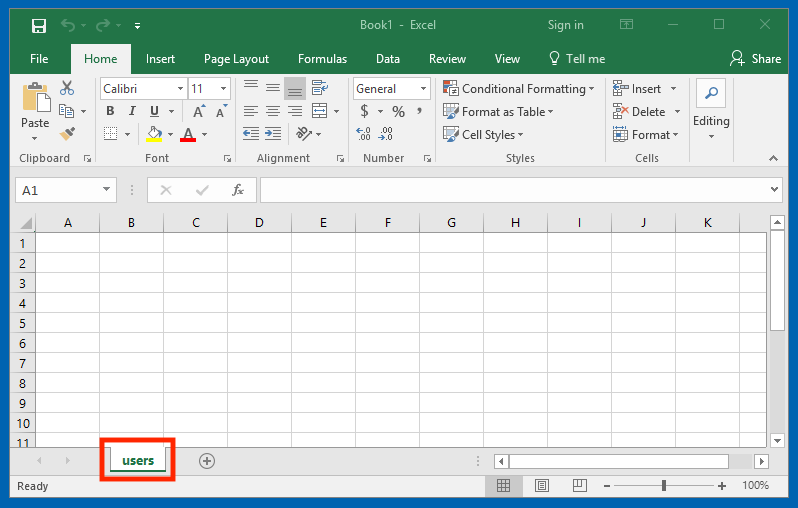
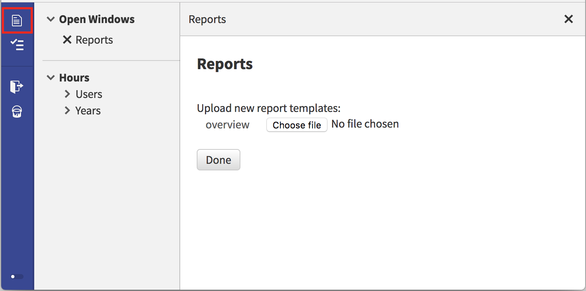

In this tutorial, we will add a custom Excel report to the [M-industries Hours application](https://github.com/M-industries/Hours).

To get started, we assume you have a local copy of the Hours repository set up using [the instructions](https://alan-platform.com/pages/tuts/readme.html).

## Creating a report definition

We will create an Excel report named **overview** with one sheet named **users** containing a list of users. From the project root directory:

```
cd systems/reporter
mkdir -p reports/overview/sheets/users
```

We will now create two files to define which data will queried and saved in the **users** sheet of the **overview** report:

```
cd reports/overview/sheets/users
touch query.alan mapping.alan
```

Now we open `query.alan` and we add this query definition:

```
collection select . 'Users'
	'Name' -> text : 'Name'

limit 1048576 // Excel row limit
```

This selects the 'Name' property for all entries in the root 'Users' collection. We limit the amount of results to the maximum row limit for an Excel sheet. The file `query.alan` follows the [`client_request`](https://alan-platform.com/pages/docs/model/32/client_request/grammar.html#root) type. We set the root type to `collection query`.

After that we fill `mapping.alan` with:

```
collection query
	"Name" -> select 'Name' as text
```

The file `mapping.alan` follows the [`collection_query_to_table`](https://alan-platform.com/pages/docs/model/32/collection_query_to_table/grammar.html#root) type. Again, we set the root type to `collection query`. As you can see from the type definition, this mapping file allows us to map Alan types to Excel types.

## Creating an Excel report template

Next, create an Excel file in the XLSX format with one sheet named 'users':



The "users" sheet will be replaced with data from the "overview/sheets/**users**" query. So don't put anything in this sheet, but put calculations etc. in a separate sheet.

Save this file and keep it for the next step.

## Uploading our template & downloading our report

After these steps, we build, package & upload our project to the application server and we open the application. From the main screen, we click the reports button, highlighted red in the following screenshot:



After clicking the 'Edit' button, we click 'Choose file' for the 'overview' report definition. At this point, we upload the Excel file that we created in the previous step. After clicking Done, the Excel file will now serve as our report template. Multiple templates can be uploaded for the same report definition.
